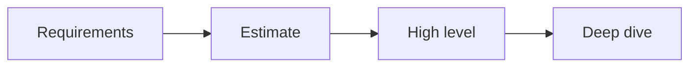

# 시스템 디자인 인터뷰

> Developer Career 101 시리즈 (6/10)

<!-- a-grade-intro:begin -->

**핵심 질문**: *시스템 디자인 인터뷰* 에서 *면접관* 은 *무엇* 을 *보나요*?

> *요구사항 정의*, *트레이드오프*, *확장* *전략*.

<!-- a-grade-intro:end -->

## 이 글에서 배울 것

- *4단계* 절차
- *요구사항* 도출
- *대략* *추정*
- *컴포넌트* 설계
- *심화* 와 *트레이드오프*

## 왜 중요한가

*디자인* 은 *시니어* *판별* 의 *기준* 입니다.

## 개념 한눈에 보기



## 핵심 용어 정리

- **functional**: *기능* *요구*.
- **non-functional**: *성능, 가용성*.
- **estimate**: *대략* *계산*.
- **trade-off**: *선택* 의 *대가*.
- **bottleneck**: *병목*.

## Before/After

**Before**: "*그림* 만 *그린다*."

**After**: "*요구* → *추정* → *설계* → *심화* 순으로 *말한다*."

## 실습: URL 단축기 설계

### 1단계 — 요구사항

```text
기능: 단축, 리다이렉트, 분석
비기능: 100M URL, 99.99% 가용
```

### 2단계 — 추정

```text
QPS: 1000 reads/s, 10 writes/s
스토리지: 100M * 500 bytes = 50 GB
```

### 3단계 — 컴포넌트

```text
LB → API → KV store
analytics → Kafka → DW
```

### 4단계 — 심화

```text
- 충돌 회피: base62 + counter
- 캐시: redis (LRU)
- 재해: multi-AZ
```

### 5단계 — 트레이드오프

```text
SQL vs KV: 일관성 vs 성능
```

## 이 코드에서 주목할 점

- *요구* 가 *시작*.
- *추정* 이 *근거*.
- *심화* 가 *시니어*.

## 자주 하는 실수 5가지

1. ***요구* 를 *건너뛴다*.**
2. ***추정* 이 *없다*.**
3. ***트레이드오프* 를 *말하지* *않는다*.**
4. ***병목* 을 *모른다*.**
5. ***시간* 을 *못 맞춘다*.**

## 실무에서는 이렇게 쓰입니다

기업도 *RFC* 작성 시 *동일* 한 *틀* 을 *사용* 합니다.

## 시니어 엔지니어는 이렇게 생각합니다

- *디자인* 은 *대화*.
- *추정* 이 *근육*.
- *트레이드오프* 가 *언어*.
- *심화* 가 *깊이*.
- *시간* 이 *훈련*.

## 체크리스트

- [ ] *기능/비기능* 분리.
- [ ] *추정* 명시.
- [ ] *트레이드오프* 진술.
- [ ] *병목* 1개 *심화*.

## 연습 문제

1. *QPS* 한 줄 정의.
2. *non-functional* *예* 한 줄.
3. *bottleneck* *예* 한 줄.

## 정리 및 다음 단계

다음 글은 *첫 직장 적응* 입니다.

<!-- toc:begin -->
- [개발자 커리어란 무엇인가](./01-what-is-developer-career.md)
- [직무 이해하기](./02-understanding-roles.md)
- [학습 계획 세우기](./03-learning-plan.md)
- [이력서와 포트폴리오](./04-resume-and-portfolio.md)
- [코딩 인터뷰 준비](./05-coding-interview.md)
- **시스템 디자인 인터뷰 (현재 글)**
- 첫 직장 적응 (예정)
- 사이드 프로젝트와 학습 (예정)
- 멘토링과 네트워킹 (예정)
- 시니어로 가는 길 (예정)
<!-- toc:end -->

## 참고 자료

- [Designing Data-Intensive Applications](https://dataintensive.net/)
- [System Design Primer](https://github.com/donnemartin/system-design-primer)
- [Grokking the System Design Interview](https://www.educative.io/courses/grokking-the-system-design-interview)
- [High Scalability](http://highscalability.com/)
