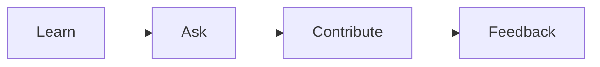

# 첫 직장 적응

> Developer Career 101 시리즈 (7/10)


## 이 글에서 다룰 문제

*첫인상* 이 *18개월* 을 *결정* 합니다.

## 전체 흐름


## Before/After

**Before**: "*혼자* *공부* 만 *한다*."

**After**: "*매주* *질문* 을 *모으고* *PR* 을 *낸다*."

## 첫 90일 플랜

### 1단계 — 30일: 학습

```text
- 코드베이스 탐색
- 온콜 shadow
- 용어집 작성
```

### 2단계 — 60일: 질문 정리

```markdown
## 질문 노트
- 왜 X 가 Y 보다 빠른가?
- Z 의 retention 정책은?
```

### 3단계 — 90일: 첫 PR

```bash
git checkout -b first-fix
# small, scoped change
```

### 4단계 — 1:1 활용

```text
주 1회 매니저, 격주 mentor
```

### 5단계 — 회고

```markdown
- 잘한 것: 코드 리딩
- 부족한 것: 질문 빈도
- 다음: 매일 1개 질문
```

## 이 코드에서 주목할 점

- *질문* 이 *학습* 가속.
- *작은 PR* 이 *신뢰*.
- *1:1* 이 *피드백*.

## 자주 하는 실수 5가지

1. ***모르는* *것* 을 *숨긴다*.**
2. ***질문* 이 *너무* *크다*.**
3. ***PR* 이 *없다*.**
4. ***1:1* 을 *비운다*.**
5. ***기록* 이 *없다*.**

## 실무에서는 이렇게 쓰입니다

기업도 *90일* *목표* 와 *첫 PR* 을 *공식* *지표* 로 *삼는* 경우가 많습니다.

## 체크리스트

- [ ] *용어집* 작성.
- [ ] *질문 노트*.
- [ ] *첫 PR*.
- [ ] *1:1* 정착.

## 정리 및 다음 단계

다음 글은 *사이드 프로젝트와 학습* 입니다.

<!-- toc:begin -->
- [개발자 커리어란 무엇인가](./01-what-is-developer-career.md)
- [직무 이해하기](./02-understanding-roles.md)
- [학습 계획 세우기](./03-learning-plan.md)
- [이력서와 포트폴리오](./04-resume-and-portfolio.md)
- [코딩 인터뷰 준비](./05-coding-interview.md)
- [시스템 디자인 인터뷰](./06-system-design-interview.md)
- **첫 직장 적응 (현재 글)**
- 사이드 프로젝트와 학습 (예정)
- 멘토링과 네트워킹 (예정)
- 시니어로 가는 길 (예정)
<!-- toc:end -->

## 참고 자료

- [The First 90 Days](https://hbr.org/books/watkins)
- [Stripe Engineering Onboarding](https://stripe.com/blog/engineering-principles)
- [Will Larson — Onboarding](https://lethain.com/onboarding-checklist/)
- [Psychological Safety](https://rework.withgoogle.com/blog/five-keys-to-a-successful-google-team/)
