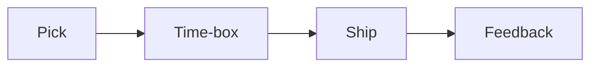

# 사이드 프로젝트와 학습

> Developer Career 101 시리즈 (8/10)

<!-- a-grade-intro:begin -->

**핵심 질문**: *본업* 과 *병행* *가능* 한 *사이드 프로젝트* 는 *어떤* *모습* 인가요?

> *작은* *범위*, *명확* 한 *목적*, *지속* *가능한* *시간*.

<!-- a-grade-intro:end -->

## 이 글에서 배울 것

- *프로젝트* *선정*
- *시간 박스*
- *공개* 와 *피드백*
- *직장* 과의 *분리*
- *지속 전략*

## 왜 중요한가

*사이드 프로젝트* 는 *학습* 과 *증거* 를 *동시* 에 *남깁니다*.

## 개념 한눈에 보기



## 핵심 용어 정리

- **side project**: *부업* 성격의 *프로젝트*.
- **time-box**: *시간* *상자*.
- **MVP**: *최소* *기능*.
- **moonlighting**: *몰래* *부업*.
- **conflict of interest**: *이해* *상충*.

## Before/After

**Before**: "*아이디어* 만 *많고* *마무리* 가 *없다*."

**After**: "*분기* 마다 *작은* *MVP* 1개 *공개*."

## 실습: 사이드 프로젝트 운영

### 1단계 — 아이디어 선정

```text
기준:
- 흥미
- 학습 효과
- 본업 비충돌
```

### 2단계 — 시간 박스

```text
주 4시간 (토 09-13)
```

### 3단계 — MVP 정의

```markdown
- 1 핵심 기능
- 1 명령어
- 1 README
```

### 4단계 — 공개

```bash
gh repo create --public
# README + LICENSE + first release
```

### 5단계 — 분리 정책

```text
- 회사 자산 사용 금지
- 회사 IP 검토
```

## 이 코드에서 주목할 점

- *시간 박스* 가 *지속*.
- *MVP* 가 *완주*.
- *분리* 가 *안전*.

## 자주 하는 실수 5가지

1. ***회사 코드* 를 *섞는다*.**
2. ***시간* 을 *무한* *쓴다*.**
3. ***MVP* 가 *너무* *크다*.**
4. ***라이선스* 가 *없다*.**
5. ***공개* 를 *안* *한다*.**

## 실무에서는 이렇게 쓰입니다

기업도 *오픈소스* *기여* 를 *고용* *계약* 에 *명시* 합니다.

## 시니어 엔지니어는 이렇게 생각합니다

- *작게* *시작*.
- *공개* 가 *동기*.
- *시간 박스* 가 *건강*.
- *분리* 가 *직업 안전*.
- *지속* 이 *복리*.

## 체크리스트

- [ ] *주 4시간* 박스.
- [ ] *MVP* 정의.
- [ ] *공개* 절차.
- [ ] *IP 검토*.

## 연습 문제

1. *moonlighting* 한 줄 정의.
2. *conflict of interest* *예* 한 줄.
3. *MVP* 의 *기준* 한 줄.

## 정리 및 다음 단계

다음 글은 *멘토링과 네트워킹* 입니다.

<!-- toc:begin -->
- [개발자 커리어란 무엇인가](./01-what-is-developer-career.md)
- [직무 이해하기](./02-understanding-roles.md)
- [학습 계획 세우기](./03-learning-plan.md)
- [이력서와 포트폴리오](./04-resume-and-portfolio.md)
- [코딩 인터뷰 준비](./05-coding-interview.md)
- [시스템 디자인 인터뷰](./06-system-design-interview.md)
- [첫 직장 적응](./07-first-job.md)
- **사이드 프로젝트와 학습 (현재 글)**
- 멘토링과 네트워킹 (예정)
- 시니어로 가는 길 (예정)
<!-- toc:end -->

## 참고 자료

- [Side Project Marketing](https://sideprojectmarketing.com/)
- [Indie Hackers](https://www.indiehackers.com/)
- [Open Source IP policy](https://opensource.guide/legal/)
- [Time blocking](https://todoist.com/productivity-methods/time-blocking)
