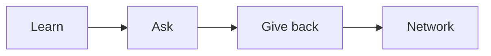

# 멘토링과 네트워킹

> Developer Career 101 시리즈 (9/10)


## 이 글에서 다룰 문제

*혼자* *배우는* *속도* 는 *한계* 가 *있습니다*. *연결* 은 *지름길* 입니다.

## 전체 흐름


## Before/After

**Before**: "*혼자* *문서* 만 *읽는다*."

**After**: "*월* 1회 *멘토* *세션* + *주* 1회 *커뮤니티* *글*."

## 네트워크 만들기

### 1단계 — 멘토 후보 리스트

```text
- 직장 선배
- 오픈소스 메인테이너
- 블로그 저자
```

### 2단계 — 정중한 첫 메시지

```text
안녕하세요, X에 관심이 있어 Y를 시도 중입니다.
30분 시간 내주시면 Z를 묻고 싶습니다.
```

### 3단계 — 커뮤니티 참여

```text
- Discord/Slack 1개 선택
- 주 2회 답변 1개
```

### 4단계 — 컨퍼런스 후기

```bash
# 컨퍼런스 후 24시간 안에 후기 1편
```

### 5단계 — 온라인 프레즌스

```text
- GitHub README
- 블로그 1편/월
- LinkedIn 업데이트
```

## 이 코드에서 주목할 점

- *질문* 이 *준비* *되어야* *답* 이 *옵니다*.
- *기여* 가 *먼저* 가야 *연결* 이 *생깁니다*.
- *지속* 이 *신뢰* 입니다.

## 자주 하는 실수 5가지

1. ***대뜸* *멘토* *해달라*고 *한다*.**
2. ***질문* 이 *모호* *하다*.**
3. ***답례* 가 *없다*.**
4. ***감정* 만 *얹는다*.**
5. ***공개* *글* 이 *없다*.**

## 실무에서는 이렇게 쓰입니다

기업도 *멘토십* *프로그램* 과 *내부* *길드* 를 *운영* 합니다.

## 체크리스트

- [ ] *멘토* *후보* 3명.
- [ ] *커뮤니티* 1곳.
- [ ] *블로그* 1편/월.
- [ ] *답례* *습관*.

## 정리 및 다음 단계

다음 글은 *시니어로 가는 길* 입니다.

<!-- toc:begin -->
- [개발자 커리어란 무엇인가](./01-what-is-developer-career.md)
- [직무 이해하기](./02-understanding-roles.md)
- [학습 계획 세우기](./03-learning-plan.md)
- [이력서와 포트폴리오](./04-resume-and-portfolio.md)
- [코딩 인터뷰 준비](./05-coding-interview.md)
- [시스템 디자인 인터뷰](./06-system-design-interview.md)
- [첫 직장 적응](./07-first-job.md)
- [사이드 프로젝트와 학습](./08-side-projects.md)
- **멘토링과 네트워킹 (현재 글)**
- 시니어로 가는 길 (예정)
<!-- toc:end -->

## 참고 자료

- [The Mentor's Guide](https://www.lindajzachary.com/)
- [How to ask good questions](https://jvns.ca/blog/good-questions/)
- [CNCF Mentoring](https://github.com/cncf/mentoring)
- [Pay it Forward](https://en.wikipedia.org/wiki/Pay_it_forward)
