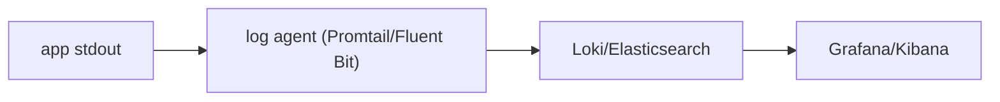

# 로그 수집과 분석

> DevOps 101 시리즈 (8/10)


## 이 글에서 다룰 문제

서버 *한 대* 에 *ssh* 해서 *grep* 하는 시대는 끝났습니다. 분산 시스템에서는 *수많은 인스턴스의 로그* 를 *한곳* 에서 봐야 합니다.

> 로그는 *지금* 보다 *3주 후* 에 더 자주 봅니다.

## 전체 흐름


## Before/After

**Before (print 로그)**

```python
print("user logged in", user_id)
# ssh server-01 && grep "logged in" /var/log/app.log
```

**After (구조화 + 중앙 수집)**

```python
import structlog
log = structlog.get_logger()
log.info("user.login", user_id=user_id, request_id=req_id)
# Grafana에서 {service="api"} |= "user.login" 으로 검색
```

## 로깅 5단계

### 1단계 — JSON 로그로 전환

```python
import structlog
structlog.configure(
    processors=[structlog.processors.JSONRenderer()],
)
log = structlog.get_logger()
```

### 2단계 — 상관관계 ID 주입

```python
import uuid
@app.middleware("http")
async def add_request_id(request, call_next):
    rid = request.headers.get("X-Request-ID", str(uuid.uuid4()))
    structlog.contextvars.bind_contextvars(request_id=rid)
    return await call_next(request)
```

### 3단계 — stdout으로 출력

```text
컨테이너 시대 원칙: *파일이 아니라 stdout*.
런타임이 알아서 수집합니다.
```

### 4단계 — Promtail로 Loki에 전송

```yaml
scrape_configs:
  - job_name: containers
    docker_sd_configs:
      - host: unix:///var/run/docker.sock
```

### 5단계 — 의미 있는 쿼리

```text
{service="api", level="error"} | json | line_format "{{.user_id}} {{.msg}}"
```

## 이 코드에서 주목할 점

- *Request ID* 가 있으면 *프론트엔드 → API → DB* 까지 *한 줄로* 추적됩니다.
- *Stdout* 로 보내고 *수집은 인프라* 에 맡깁니다.
- *PII* 는 *마스킹* 합니다.

## 자주 하는 실수 5가지

1. **DEBUG 로그를 *프로덕션* 에서 다 켜둠.** 비용 폭발 + 노이즈.
2. **PII (개인정보) 를 *그대로* 로그.** *컴플라이언스 위반*.
3. **로그 *retention* 미설정.** 30일 이상 쌓여 *비용* 폭발.
4. **상관관계 ID 없음.** 디버깅 시 *건너뛰며* 찾아야 함.
5. **에러 로그에 *스택트레이스 없음*.** 원인 추정 불가능.

## 실무에서는 이렇게 쓰입니다

성숙한 팀은 *trace_id* 를 *로그 + 메트릭 + trace* 에 *공통 키* 로 둡니다. 한 ID로 *세 신호* 를 *교차 분석* 합니다.

## 체크리스트

- [ ] 로그가 *JSON 구조* 다.
- [ ] *Request ID* 가 모든 로그에 있다.
- [ ] *PII 마스킹* 이 적용된다.
- [ ] *Retention 정책* 이 정해져 있다.

## 정리 및 다음 단계

로그는 *시간을 거슬러 보는 도구* 입니다. 다음 글에서는 모든 신호를 종합해 *장애에 대응* 하는 법을 다룹니다.

<!-- toc:begin -->
- [DevOps란 무엇인가?](./01-what-is-devops.md)
- [CI 파이프라인](./02-ci-pipeline.md)
- [CD와 배포 전략](./03-cd-and-deployment.md)
- [환경 분리와 설정 관리](./04-environments-and-config.md)
- [Infrastructure as Code](./05-infrastructure-as-code.md)
- [컨테이너와 빌드](./06-containers-and-build.md)
- [모니터링과 알림](./07-monitoring-and-alerting.md)
- **로그 수집과 분석 (현재 글)**
- 장애 대응과 on-call (예정)
- 운영 가능한 DevOps 흐름 (예정)
<!-- toc:end -->

## 참고 자료

- [structlog](https://www.structlog.org/)
- [Grafana Loki](https://grafana.com/docs/loki/latest/)
- [Elastic Stack](https://www.elastic.co/elastic-stack)
- [OpenTelemetry Logs](https://opentelemetry.io/docs/specs/otel/logs/)
