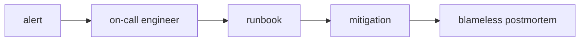

# 장애 대응과 on-call

> DevOps 101 시리즈 (9/10)

<!-- a-grade-intro:begin -->

**핵심 질문**: 새벽 3시에 알림이 울렸을 때, *누가 / 무엇을 / 어떻게* 합니까?

> *장애는 일어납니다.* 차이는 *얼마나 빨리 / 차분하게* 회복하느냐 입니다.

<!-- a-grade-intro:end -->

## 이 글에서 배울 것

- *장애 심각도(SEV)* 분류
- *On-call 로테이션* 설계
- *런북(runbook)* 작성법
- *Blameless 포스트모템* 구조
- *MTTR/MTTD* 의 의미

## 왜 중요한가

장애는 *기술* 보다 *조직* 의 문제입니다. *역할* 과 *절차* 가 없으면 사람들은 *허둥대고* 같은 실수를 *반복* 합니다.

> *프로세스* 는 *기억력* 을 대체합니다.

## 개념 한눈에 보기



## 핵심 용어 정리

- **SEV1~SEV4**: 심각도 *1(전사 다운)* ~ *4(사소)*.
- **On-call**: 일정 시간 *알림을 받는* 당번.
- **Runbook**: *증상 → 진단 → 조치* 절차서.
- **Incident commander**: 장애 *지휘* 역할.
- **Postmortem**: 장애 *사후 분석* 문서.
- **MTTD/MTTR**: 평균 *탐지/복구* 시간.

## Before/After

**Before**: 알림이 울리면 *Slack에 "누가 봐요?"* 외치고 *각자 고치다가* 더 망가진다.

**After**: *On-call 한 명* 이 *런북* 으로 *완화* 한 뒤 *IC* 가 상황을 정리하고 *포스트모템* 을 연다.

## 실습: 장애 대응 5단계

### 1단계 — 심각도(SEV) 정의

```text
SEV1: 전사 서비스 중단         | 즉시 대응
SEV2: 핵심 기능 일부 장애       | 30분 내
SEV3: 부분 기능 장애            | 영업일 내
SEV4: 영향 적은 버그            | 백로그
```

### 2단계 — On-call 로테이션

```yaml
rotation:
  schedule: weekly
  primary: [alice, bob, carol]
  secondary: [dave, erin]
  handoff: "월요일 10:00, 미해결 이슈 인수인계"
```

### 3단계 — 런북 템플릿

```markdown
# Runbook: API 500 급증

## 증상
- /api/* 5xx 비율 5% 초과

## 진단
1. Grafana "API Errors" 대시보드 확인
2. {service="api", level="error"} 최근 로그 확인

## 조치
- 직전 배포가 의심되면 `kubectl rollout undo deploy/api`

## 에스컬레이션
- 30분 내 해결 안 되면 #incident 채널에 IC 호출
```

### 4단계 — Incident commander 역할

```text
IC = 결정자. 직접 고치지 않습니다.
- 의사소통 창구 통일
- 역할 배정 (조사자/소통담당/기록자)
- 외부 공지 결정
```

### 5단계 — Blameless 포스트모템

```markdown
# Postmortem: 2026-05-04 API 장애

- 영향: 12분간 5xx 30%
- 타임라인: 03:11 알림 → 03:18 롤백 → 03:23 회복
- 근본 원인: feature flag 기본값 오타
- 재발 방지: PR 템플릿에 flag 검증 체크리스트 추가
```

## 이 코드에서 주목할 점

- *사람을 비난하지 않고* 시스템과 절차를 고칩니다.
- *런북은 코드 옆에서 살아있어야* 합니다.
- *행동 항목* 에는 *담당자* 와 *기한* 이 있어야 합니다.

## 자주 하는 실수 5가지

1. **포스트모템에 *사람* 을 적음.** 신뢰가 무너집니다.
2. **런북이 *위키 깊은 곳* 에 있음.** 새벽 3시에 못 찾습니다.
3. **알림이 *너무 많음*.** 알림 피로로 *진짜 알림을 놓칩니다*.
4. **On-call에 *주니어 혼자* 둠.** 페어를 항상 둡니다.
5. **장애 후 *행동 항목* 이 없음.** 같은 장애가 *반복* 됩니다.

## 실무에서는 이렇게 쓰입니다

성숙한 팀은 *알림 → 런북 링크* 를 자동으로 붙여 *클릭 한 번* 으로 절차를 시작합니다. PagerDuty/Opsgenie 의 *runbook URL* 필드를 활용합니다.

## 시니어 엔지니어는 이렇게 생각합니다

- *알림 품질* 이 *팀 수면 시간* 을 결정한다.
- *모든 SEV1* 은 *반드시 포스트모템*.
- *Blameless* 가 협상의 여지가 없다.
- *행동 항목* 은 *티켓으로* 관리된다.
- *MTTR* 은 *측정해야* 줄어든다.

## 체크리스트

- [ ] *SEV 정의* 가 문서화됐다.
- [ ] *On-call 로테이션* 이 자동화됐다.
- [ ] *런북* 이 알림에 링크돼 있다.
- [ ] *포스트모템 템플릿* 이 있다.

## 연습 문제

1. 가장 흔한 장애 한 건의 *런북* 을 작성하세요.
2. *SEV 정의* 를 팀과 합의해 문서로 만드세요.
3. 최근 장애 한 건을 *blameless 포스트모템* 으로 정리하세요.

## 정리 및 다음 단계

장애 대응은 *기술 + 조직* 의 종합 능력입니다. 마지막 글에서는 *전체 DevOps 흐름* 을 한 장으로 묶습니다.

<!-- toc:begin -->
- [DevOps란 무엇인가?](./01-what-is-devops.md)
- [CI 파이프라인](./02-ci-pipeline.md)
- [CD와 배포 전략](./03-cd-and-deployment.md)
- [환경 분리와 설정 관리](./04-environments-and-config.md)
- [Infrastructure as Code](./05-infrastructure-as-code.md)
- [컨테이너와 빌드](./06-containers-and-build.md)
- [모니터링과 알림](./07-monitoring-and-alerting.md)
- [로그 수집과 분석](./08-logging-and-analysis.md)
- **장애 대응과 on-call (현재 글)**
- 운영 가능한 DevOps 흐름 (예정)
<!-- toc:end -->

## 참고 자료

- [Google SRE Book — Managing Incidents](https://sre.google/sre-book/managing-incidents/)
- [PagerDuty Incident Response](https://response.pagerduty.com/)
- [Atlassian Postmortem Template](https://www.atlassian.com/incident-management/postmortem/templates)
- [Blameless Postmortems (Etsy)](https://www.etsy.com/codeascraft/blameless-postmortems/)
