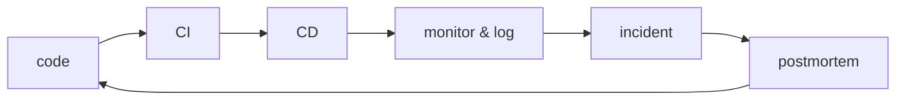

# 운영 가능한 DevOps 흐름

> DevOps 101 시리즈 (10/10)

<!-- a-grade-intro:begin -->

**핵심 질문**: *Code → CI → CD → Monitor → Incident → Postmortem* 이 *피드백 루프* 로 돌고 있습니까?

> *DevOps* 는 *도구* 가 아니라 *흐름* 입니다.

<!-- a-grade-intro:end -->

## 이 글에서 배울 것

- 시리즈를 한 장으로 묶는 *전체 흐름*
- *DORA 4대 지표* 와 측정법
- *팀 의식(rituals)* 으로 흐름을 유지하는 법
- *다음 학습 경로* (Observability / SRE / Kubernetes)

## 왜 중요한가

도구를 *각자* 도입하면 *섬* 이 됩니다. *흐름* 으로 연결될 때 비로소 *속도와 안정성* 을 동시에 얻습니다.

> *측정되지 않는 것* 은 *개선되지 않습니다*.

## 개념 한눈에 보기



## 핵심 용어 정리

- **DORA metrics**: Google 연구가 제시한 *4대 지표*.
- **Deploy frequency**: *얼마나 자주* 배포하는가.
- **Lead time for changes**: 코드 머지 → 운영 배포 시간.
- **Change failure rate**: 배포 중 *장애를 유발한 비율*.
- **MTTR**: 평균 *복구 시간*.
- **Ritual**: 정기적인 *팀 의식*.

## Before/After

**Before**: 빌드, 배포, 모니터링이 *각자* 운영되고 누구도 *전체* 를 보지 않는다.

**After**: *한 페이지 대시보드* 가 *DORA 4지표* 를 보여주고 팀이 매주 함께 본다.

## 실습: 5단계로 흐름 만들기

### 1단계 — 흐름을 그림으로 그린다

```text
종이 한 장에:
PR -> CI -> staging -> prod -> alert -> on-call -> postmortem
각 단계의 *책임자* 와 *도구* 를 적습니다.
```

### 2단계 — DORA 4지표 측정 시작

```python
# 가장 단순한 시작: 배포마다 GitHub Release 생성
# 매주 다음 4개를 손으로 적어도 충분합니다.
metrics = {
    "deploy_frequency": "주 5회",
    "lead_time": "평균 6시간",
    "change_failure_rate": "8%",
    "mttr": "22분",
}
```

### 3단계 — 주간 의식: 배포 리뷰 (30분)

```text
- 지난주 배포 횟수
- 지난주 장애 1건 요약
- 이번 주 위험 배포 후보
```

### 4단계 — 월간 의식: 포스트모템 읽기 (60분)

```text
- 한 달치 포스트모템을 함께 읽는다
- 행동 항목 처리율을 본다
- 패턴이 보이면 *시스템* 을 바꾼다
```

### 5단계 — 분기별: 다음 단계 결정

```text
- 다음 시리즈로의 학습 경로 결정
- 도구 추가/제거 결정
- 조직 구조 변경 제안
```

## 이 코드에서 주목할 점

- *지표는 손으로 시작* 해도 됩니다. *자동화* 는 그다음입니다.
- *의식* 은 *짧고 정기적* 으로 합니다.
- *피드백 루프* 가 닫히는 순간 *팀이 학습* 합니다.

## 자주 하는 실수 5가지

1. ***도구* 부터 도입.** 흐름이 없으면 도구는 *섬* 이 됩니다.
2. **DORA 4지표 중 *MTTR만* 본다.** 4개를 *함께* 봐야 균형.
3. **포스트모템을 *읽지 않음*.** 같은 장애가 *반복*.
4. **의식이 *길고 형식적*.** 짧고 *데이터 중심* 이어야 합니다.
5. **개선 책임이 *없음*.** 누가 *흐름의 오너* 인지 정합니다.

## 실무에서는 이렇게 쓰입니다

성숙한 팀은 *플랫폼 팀* 이 *내부 개발자 플랫폼(IDP)* 으로 흐름을 *셀프 서비스* 로 제공합니다. 모든 새 서비스가 *동일한 흐름* 을 무료로 받습니다.

## 시니어 엔지니어는 이렇게 생각합니다

- *흐름이 곧 아키텍처* 다.
- *지표가 없으면 토론은 의견 싸움*.
- *작은 의식* 이 *큰 변화* 를 만든다.
- *플랫폼화* 가 다음 단계.
- *학습은 끝이 없다* — 다음 시리즈로.

## 체크리스트

- [ ] *전체 흐름* 이 *한 그림* 으로 그려졌다.
- [ ] *DORA 4지표* 를 매주 본다.
- [ ] *주간/월간 의식* 이 정해졌다.
- [ ] *흐름의 오너* 가 있다.

## 연습 문제

1. 본인 팀의 *Code → Postmortem* 흐름을 그려보세요.
2. *DORA 4지표* 를 한 주 동안 손으로 측정해 보세요.
3. *주간 배포 리뷰* 30분을 한 번 진행해 보세요.

## 정리 및 다음 단계

DevOps 101 시리즈를 마칩니다. 다음 학습 경로:

- **Observability 101** — 메트릭, 로그, trace 의 통합
- **SRE 101** — SLO/SLI/Error budget 으로 안정성 운영
- **Kubernetes 101** — 컨테이너 오케스트레이션 본격 입문

> *DevOps* 는 *도구의 모음* 이 아니라 *팀이 학습하는 방식* 입니다.

<!-- toc:begin -->
- [DevOps란 무엇인가?](./01-what-is-devops.md)
- [CI 파이프라인](./02-ci-pipeline.md)
- [CD와 배포 전략](./03-cd-and-deployment.md)
- [환경 분리와 설정 관리](./04-environments-and-config.md)
- [Infrastructure as Code](./05-infrastructure-as-code.md)
- [컨테이너와 빌드](./06-containers-and-build.md)
- [모니터링과 알림](./07-monitoring-and-alerting.md)
- [로그 수집과 분석](./08-logging-and-analysis.md)
- [장애 대응과 on-call](./09-incident-and-oncall.md)
- **운영 가능한 DevOps 흐름 (현재 글)**
<!-- toc:end -->

## 참고 자료

- [DORA Research Program](https://dora.dev/)
- [Google SRE Workbook](https://sre.google/workbook/table-of-contents/)
- [Accelerate (book)](https://itrevolution.com/product/accelerate/)
- [Team Topologies](https://teamtopologies.com/)
