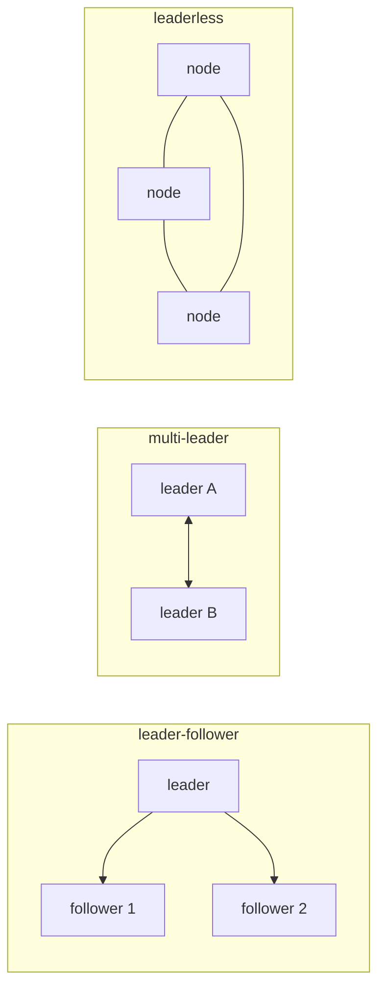

# replication

> Distributed Systems 101 시리즈 (5/10)

<!-- a-grade-intro:begin -->

**핵심 질문**: 같은 데이터를 여러 노드에 두는 가장 단순한 일이 왜 그렇게 많은 모드와 옵션을 만들까요?

> replication은 durability와 availability를 위한 기본 도구입니다. 그러나 sync/async, leader 수, quorum 설정에 따라 직접 보이는 동작이 크게 달라집니다.

<!-- a-grade-intro:end -->

## 이 글에서 배울 것

- replication의 동기, 종류, 트레이드오프
- leader-follower, multi-leader, leaderless 모델
- sync/async replication과 데이터 손실 위험
- quorum 읽기/쓰기와 R+W>N 의미
- replication lag을 측정하고 다루는 법

## 왜 중요한가

replication은 모든 분산 데이터 시스템의 가장 아래 층입니다. 이 층에서의 결정이 4편(consistency)과 6편(consensus)에서 보이는 동작을 만듭니다. "내 DB가 왜 이런 행동을 하지?"의 답은 보통 replication 설정에 있습니다.

> replication 설정은 데이터의 안전과 속도의 환율입니다.

## 개념 한눈에 보기



세 가지 토폴로지가 90% 이상의 시스템을 설명합니다.

## 핵심 용어 정리

- **Leader/follower**: 쓰기는 leader 한 곳, 읽기는 여러 follower.
- **Multi-leader**: 여러 leader가 쓰기를 받고 서로 동기화.
- **Leaderless**: 모든 노드가 동등, quorum으로 결정.
- **Sync replication**: leader가 follower 응답을 기다림.
- **Quorum (R, W, N)**: N replica 중 R 읽고 W 쓸 때 R+W>N이면 latest 보장.

## Before/After

**Before — single primary, async replica**

```text
fast write, but data loss possible on crash
```

**After — sync to majority + read from leader**

```text
slower write, near-zero loss, linearizable read 가능
```

같은 시스템도 옵션 한 줄 차이로 보장이 달라집니다.

## 실습: 모델별 차이를 코드로

### 1단계 — async leader-follower

```python
# 1_async.py
import threading, time
leader = []
follower = []
def write(x):
    leader.append(x)
    threading.Thread(target=lambda: (time.sleep(0.5), follower.append(x))).start()
```

쓰기는 빠르지만 leader가 죽으면 0.5초치 데이터가 사라질 수 있습니다.

### 2단계 — sync leader-follower

```python
# 2_sync.py
def write(x):
    leader.append(x)
    follower.append(x)   # 같이 쓰고 반환
```

write가 두 노드를 다 거쳐야 끝납니다. latency는 늘지만 손실은 거의 없습니다.

### 3단계 — quorum write

```python
# 3_quorum.py
nodes = [[], [], []]   # N=3
def write(x, w=2):
    acks = 0
    for n in nodes:
        n.append(x); acks += 1
        if acks >= w: return "ok"
def read(x_id, r=2):
    seen = []
    for n in nodes:
        if any(item["id"] == x_id for item in n):
            seen.append(n)
            if len(seen) >= r: return "found"
```

R+W>N이면 적어도 한 노드는 둘 다 봤음이 보장됩니다. Dynamo 계열의 핵심입니다.

### 4단계 — multi-leader (간단한 last-write-wins)

```python
# 4_mlw.py
A, B = {}, {}
def write_a(k, v): A[k] = (time.time(), v)
def write_b(k, v): B[k] = (time.time(), v)
def merge():
    for k in set(A) | set(B):
        ta, va = A.get(k, (0, None))
        tb, vb = B.get(k, (0, None))
        winner = (va if ta >= tb else vb)
        A[k] = B[k] = (max(ta, tb), winner)
```

LWW는 구현이 간단하지만 시계가 어긋나면 사용자 입력을 잃을 수 있습니다.

### 5단계 — replication lag 측정

```python
# 5_lag.py
def lag(): return leader_lsn - follower_lsn
print("replication lag rows:", lag())
```

대부분의 DB는 LSN/GTID/offset을 노출합니다. lag을 SLO로 추적하면 stale read를 사전에 잡을 수 있습니다.

## 이 코드에서 주목할 점

- async replication은 빠르지만 손실 위험이 있습니다.
- sync는 느리지만 안전합니다 — 둘 다 옳지 않고 워크로드별 선택입니다.
- quorum은 R/W를 조정해 trade-off를 dial로 만듭니다.
- multi-leader는 충돌 해결을 사람이 정해야 합니다.

## 자주 하는 실수 5가지

1. **read-from-replica가 항상 빠르다고 가정한다.** lag으로 stale read가 옵니다.
2. **sync replica를 한 곳에만 둔다.** 그 한 곳이 느려지면 leader도 멈춥니다.
3. **multi-leader에서 LWW만 쓴다.** 시계 어긋나면 데이터가 사라집니다.
4. **quorum의 R+W>N 조건을 어긴다.** 최신 보장이 깨집니다.
5. **lag을 모니터링하지 않는다.** 사용자에게 stale read가 보일 때까지 모릅니다.

## 실무에서는 이렇게 쓰입니다

PostgreSQL/MySQL은 leader-follower 모델이 기본입니다. Cassandra, DynamoDB는 leaderless quorum입니다. CRDTs를 쓰는 시스템은 multi-leader입니다. Cloud의 multi-AZ DB는 보통 sync to one AZ + async to another 하이브리드입니다.

## 시니어 엔지니어는 이렇게 생각합니다

- replication 설정을 explicit하게 docs에 적습니다.
- read-from-replica는 staleness 한계를 가진 별도 endpoint로 둡니다.
- sync replica는 두 곳 이상 두어 단일 장애점을 피합니다.
- LWW 대신 application-level merge를 설계합니다.
- lag을 SLO로 본 후 alert를 답니다.

## 체크리스트

- [ ] sync와 async replication의 차이를 한 줄로 말할 수 있는가?
- [ ] R+W>N의 의미를 답할 수 있는가?
- [ ] multi-leader의 충돌 해결 방법을 두 가지 말할 수 있는가?
- [ ] 우리 DB의 replication topology를 그릴 수 있는가?
- [ ] replication lag을 어떻게 측정할지 아는가?

## 연습 문제

1. 우리 서비스의 read traffic 중 stale read가 안전한 화면을 두 개 골라 보세요.
2. quorum (N=5, W=3, R=3) 설정의 가용성과 일관성을 평가해 보세요.
3. multi-leader에서 같은 key에 동시 write가 들어왔을 때 application-level resolution을 설계해 보세요.

## 정리 및 다음 단계

replication은 분산 데이터의 토대입니다. 다음 글에서는 여러 노드가 "어떤 값이 다음 값인가"에 동의하는 알고리즘 — consensus와 Raft — 를 다룹니다.

<!-- toc:begin -->
- [분산 시스템이란 무엇인가?](./01-what-is-a-distributed-system.md)
- [failure model](./02-failure-model.md)
- [RPC와 message passing](./03-rpc-and-message-passing.md)
- [consistency와 CAP](./04-consistency-and-cap.md)
- **replication (현재 글)**
- consensus와 Raft (예정)
- leader election (예정)
- message queue와 event sourcing (예정)
- distributed transaction (예정)
- 운영 가능한 분산 시스템 패턴 (예정)
<!-- toc:end -->

## 참고 자료

- [Replication (computing) — Wikipedia](https://en.wikipedia.org/wiki/Replication_(computing))
- [Quorum (distributed computing) — Wikipedia](https://en.wikipedia.org/wiki/Quorum_(distributed_computing))
- [Amazon Dynamo paper](https://www.allthingsdistributed.com/files/amazon-dynamo-sosp2007.pdf)
- [Designing Data-Intensive Applications — chapter 5](https://dataintensive.net/)
