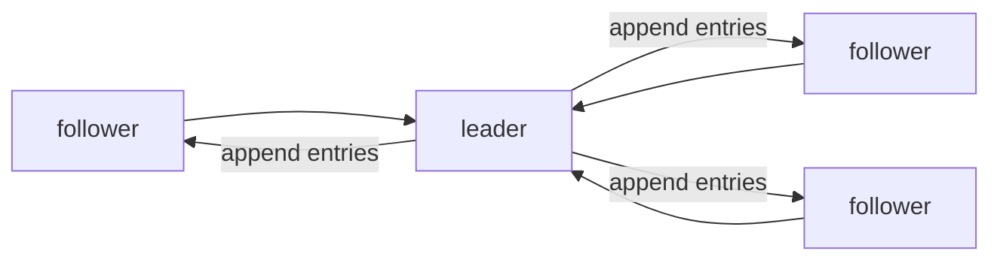

# consensus와 Raft

> Distributed Systems 101 시리즈 (6/10)

<!-- a-grade-intro:begin -->

**핵심 질문**: 노드 다섯이 한 결정에 동의하려면 정확히 무엇이 필요한가요?

> consensus는 분산 시스템의 가장 단단한 문제이고, Raft는 그 답을 사람이 읽을 수 있게 만든 알고리즘입니다.

<!-- a-grade-intro:end -->

## 이 글에서 배울 것

- consensus 문제의 정의와 안전성/생존성
- Raft의 세 역할 (leader, follower, candidate)
- term, log, index, commit의 의미
- majority(quorum)가 왜 필요한가
- Paxos와 Raft를 한 줄로 비교

## 왜 중요한가

etcd, ZooKeeper, Consul, CockroachDB의 핵심에는 모두 consensus 알고리즘이 있습니다. Kubernetes의 control plane도 etcd 위에 서 있습니다. consensus를 이해하면 "왜 이 시스템이 이렇게 동작하는가"의 절반은 풀립니다.

> consensus는 분산 시스템에서 동의의 값입니다.

## 개념 한눈에 보기



leader 한 명이 log를 받고 follower에게 복제합니다. 다수가 받은 entry만 commit으로 인정됩니다.

## 핵심 용어 정리

- **Consensus**: N개의 노드가 같은 값에 동의하는 문제.
- **Term**: 단조 증가하는 epoch. 새 leader마다 새 term.
- **Log**: 순차 entry. index로 식별.
- **Commit**: 다수 노드가 받은 entry는 영구적으로 약속됨.
- **Quorum**: 2f+1 중 f+1, 보통 majority.

## Before/After

**Before — leader가 혼자 결정**

```text
빠르지만 leader가 거짓이면 일관성 깨짐
```

**After — majority의 동의**

```text
조금 느리지만 한 노드가 죽거나 거짓말해도 안전
```

majority가 분산 시스템의 안전 장치입니다.

## 실습: Raft의 핵심을 짧은 코드로

### 1단계 — 상태 정의

```python
# 1_state.py
from dataclasses import dataclass, field
@dataclass
class Node:
    role: str = "follower"
    term: int = 0
    log: list = field(default_factory=list)
    commit_index: int = -1
    voted_for: int | None = None
```

term, log, commit_index — Raft 페이퍼의 첫 페이지에 나오는 변수들입니다.

### 2단계 — election (간단화)

```python
# 2_election.py
def election_timeout(self, peers):
    self.term += 1
    self.role = "candidate"
    self.voted_for = self.id
    votes = 1
    for p in peers:
        if p.request_vote(self.term, self.id):
            votes += 1
    if votes > len(peers) // 2 + 1:
        self.role = "leader"
```

timeout이 먼저 끝난 노드가 candidate가 되어 표를 모읍니다. majority를 모으면 leader.

### 3단계 — log replication

```python
# 3_replicate.py
def append_entries(self, term, prev_index, entries):
    if term < self.term: return False
    if prev_index >= 0 and self.log[prev_index]["term"] != term:
        return False  # 불일치
    self.log = self.log[:prev_index+1] + entries
    return True
```

leader는 자기 log를 follower에게 보내고, follower는 일치하지 않으면 거부합니다. 일치 보장은 prev index/term으로.

### 4단계 — commit

```python
# 4_commit.py
def maybe_commit(self, peers):
    for i in range(self.commit_index + 1, len(self.log)):
        acks = 1 + sum(1 for p in peers if p.match_index >= i)
        if acks > len(peers) // 2 + 1:
            self.commit_index = i
```

majority가 받았으면 commit. 이 시점부터 그 entry는 절대 사라지지 않습니다.

### 5단계 — 정전 시나리오

```python
# 5_partition.py (의사코드)
# 5 노드, leader 포함 2 노드만 한쪽 partition
# - 그쪽엔 majority가 없으니 새 leader 선출 못 함 → 쓰기 못 함
# - 반대쪽 3 노드는 majority 확보 → 새 leader 선출 → 정상 동작
```

majority가 없는 쪽은 의도적으로 멈춥니다. split-brain을 방지하는 핵심 설계.

## 이 코드에서 주목할 점

- term은 단조 증가합니다. 오래된 term의 메시지는 모두 거부됩니다.
- log는 순서가 본질입니다 — index와 term의 쌍으로 일치를 검사합니다.
- commit은 "다수가 받았다"의 약속이지 "모두가 받았다"가 아닙니다.
- partition된 쪽은 멈추는 것이 정답입니다.

## 자주 하는 실수 5가지

1. **leader 한 명만 있으면 안전하다고 본다.** election이 정확해야 안전합니다.
2. **commit을 단순 "leader가 받았다"로 본다.** majority가 받은 시점이 commit입니다.
3. **timeout 값을 모두 같게 한다.** split vote가 자주 일어납니다 (Raft는 randomized timeout).
4. **로그 일치 검사를 건너뛴다.** 잘못된 entry가 commit됩니다.
5. **partitioned 쪽이 동작 가능하다고 가정한다.** majority 없으면 멈춰야 합니다.

## 실무에서는 이렇게 쓰입니다

etcd (Kubernetes의 데이터 저장소), Consul, ZooKeeper(ZAB, Paxos 변형), CockroachDB, TiKV가 모두 consensus 알고리즘 위에 서 있습니다. 데이터베이스의 leader election, 분산 락, configuration 저장이 전형적 use case입니다.

## 시니어 엔지니어는 이렇게 생각합니다

- consensus는 자주 호출하지 않습니다 (비싸므로 metadata에만).
- timeout은 측정에 기반해 randomize 합니다.
- node 수는 홀수로 둡니다 (3, 5, 7).
- leader change를 안전하게 다루는 client retry를 설계합니다.
- read를 leader-only로 강제할지 lease로 풀지 의식합니다.

## 체크리스트

- [ ] consensus의 정의를 한 줄로 말할 수 있는가?
- [ ] term, log, commit의 관계를 설명할 수 있는가?
- [ ] 5 노드 cluster에서 몇 개가 죽어도 동작하는지 답할 수 있는가?
- [ ] split vote를 어떻게 막는지 아는가?
- [ ] etcd가 consensus 위에 있다는 사실을 시스템 설계에 반영하는가?

## 연습 문제

1. 3 노드 / 5 노드 cluster의 fault tolerance를 비교해 보세요.
2. Raft의 randomized election timeout이 어떻게 split vote를 줄이는지 설명해 보세요.
3. 분산 락을 etcd로 구현하는 방법을 한 문단으로 적어 보세요.

## 정리 및 다음 단계

consensus는 분산 시스템의 가장 단단한 문제이고, Raft는 그 해법의 사람-친화적 형태입니다. 다음 글에서는 consensus 위에서 leader를 정하는 더 큰 그림 — leader election — 을 다룹니다.

<!-- toc:begin -->
- [분산 시스템이란 무엇인가?](./01-what-is-a-distributed-system.md)
- [failure model](./02-failure-model.md)
- [RPC와 message passing](./03-rpc-and-message-passing.md)
- [consistency와 CAP](./04-consistency-and-cap.md)
- [replication](./05-replication.md)
- **consensus와 Raft (현재 글)**
- leader election (예정)
- message queue와 event sourcing (예정)
- distributed transaction (예정)
- 운영 가능한 분산 시스템 패턴 (예정)
<!-- toc:end -->

## 참고 자료

- [Raft consensus algorithm](https://raft.github.io/)
- [In Search of an Understandable Consensus Algorithm (Raft paper)](https://raft.github.io/raft.pdf)
- [Paxos (Wikipedia)](https://en.wikipedia.org/wiki/Paxos_(computer_science))
- [etcd documentation](https://etcd.io/docs/)
