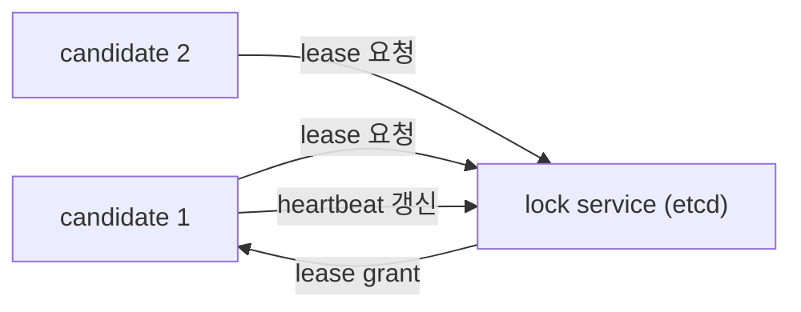

# leader election

> Distributed Systems 101 시리즈 (7/10)

<!-- a-grade-intro:begin -->

**핵심 질문**: 죽은 줄 알았던 리더가 돌아오면 어떻게 되나요?

> leader election은 단순히 "누가 리더인가"를 정하는 일이 아니라, 옛 리더의 영향력을 안전하게 끊는 일입니다.

<!-- a-grade-intro:end -->

## 이 글에서 배울 것

- leader election이 필요한 이유와 안전성 조건
- lease와 heartbeat의 역할
- fencing token으로 옛 리더를 막는 방법
- split-brain 시나리오와 방지 설계
- etcd, ZooKeeper로 리더를 뽑는 실무 패턴

## 왜 중요한가

분산 시스템의 많은 문제가 "리더가 둘"인 순간에 발생합니다. 두 리더가 같은 자원에 동시에 쓰면 데이터가 깨집니다. 옳은 election은 한 시점에 한 리더만 권한을 갖도록 보장합니다.

> 잘 만든 election은 "리더가 둘인 순간이 없음"을 보장하는 약속입니다.

## 개념 한눈에 보기



여러 candidate가 lock service에 lease를 요청합니다. 한 명만 받아 leader가 되고, heartbeat로 lease를 갱신합니다.

## 핵심 용어 정리

- **Leader**: 한 시점에 쓰기 권한을 가진 노드.
- **Lease**: 시간이 지나면 자동 만료되는 임시 권한.
- **Heartbeat**: lease를 갱신하기 위한 주기적 신호.
- **Fencing token**: 단조 증가하는 ID로 옛 리더의 요청을 거부하는 장치.
- **Split-brain**: 두 노드가 동시에 자기를 리더로 믿는 상태.

## Before/After

**Before — heartbeat만으로 리더 판정**

```text
GC pause로 멈춘 옛 리더가 돌아와 같은 자원에 쓰기를 시도
```

**After — lease + fencing token**

```text
옛 리더의 요청은 작은 token 값으로 거부, 새 리더만 통과
```

token 한 줄이 split-brain을 막아 줍니다.

## 실습: 리더 뽑기와 fencing

### 1단계 — lease 기반 election (의사코드)

```python
# 1_lease.py
import time
class Lease:
    def __init__(self, ttl): self.ttl, self.expires = ttl, 0
    def acquire(self, now):
        if now >= self.expires:
            self.expires = now + self.ttl
            return True
        return False
```

만료된 lease만 새로 얻을 수 있습니다. TTL이 안전선입니다.

### 2단계 — heartbeat로 갱신

```python
# 2_heartbeat.py
def renew(lease, now):
    lease.expires = now + lease.ttl
```

리더는 TTL의 1/3마다 갱신합니다. 한두 번 놓쳐도 안전한 마진을 둡니다.

### 3단계 — fencing token

```python
# 3_fence.py
counter = 0
def grant_leader():
    global counter
    counter += 1
    return counter   # 단조 증가하는 token
```

새 리더가 뽑힐 때마다 token이 커집니다. 자원 서버는 작은 token의 요청을 거부합니다.

### 4단계 — 자원 서버의 거부 로직

```python
# 4_resource.py
last_token = 0
def write(token, data):
    global last_token
    if token < last_token:
        return "rejected (stale leader)"
    last_token = token
    return "ok"
```

이 한 줄이 옛 리더의 쓰기를 막습니다.

### 5단계 — split-brain 시나리오

```python
# 5_split.py (의사코드)
# 옛 리더 A: token=5, GC pause 30초
# 그 사이 새 리더 B: token=6 발급
# A가 깨어나 token=5로 쓰기 시도 -> 자원 서버가 거부
# B의 token=6 쓰기는 통과
```

token이 없는 설계에서는 A의 쓰기가 그대로 들어가 데이터가 깨집니다.

## 이 코드에서 주목할 점

- lease는 시간이 지나면 자동 만료됩니다 — 네트워크 단절을 자연스럽게 다룹니다.
- heartbeat는 TTL보다 자주 보냅니다 — margin을 둡니다.
- token은 단조 증가가 본질입니다.
- 거부는 자원 서버의 책임입니다 — 클라이언트를 믿지 않습니다.

## 자주 하는 실수 5가지

1. **heartbeat만으로 충분하다고 본다.** GC pause/네트워크 지연이 무시됩니다.
2. **TTL을 너무 짧게 둔다.** false failover가 자주 일어납니다.
3. **token 검증을 자원 서버에 두지 않는다.** 옛 리더가 쓰기를 성공시킵니다.
4. **token을 랜덤 값으로 둔다.** 단조 증가가 깨져 비교가 무의미해집니다.
5. **split-brain을 수동으로 회복한다.** 자동 회복이 가능하도록 설계해야 합니다.

## 실무에서는 이렇게 쓰입니다

Kubernetes의 `kube-controller-manager`, `kube-scheduler`는 etcd lease로 leader election을 합니다. ZooKeeper의 ephemeral znode도 같은 패턴입니다. Kafka의 controller, HDFS NameNode HA, 분산 cron 모두 lease + fencing의 변형입니다.

## 시니어 엔지니어는 이렇게 생각합니다

- TTL은 GC pause + 네트워크 RTT의 최댓값보다 충분히 큽니다.
- election 이벤트를 metric으로 노출합니다 — 잦은 election은 버그 신호.
- fencing token을 자원 서버 API의 첫 번째 인자로 둡니다.
- 리더 변경 시 in-flight 요청의 처리 방식을 명세에 적습니다.
- 테스트로 split-brain 시나리오를 강제 재현해 둡니다.

## 체크리스트

- [ ] lease와 heartbeat의 역할을 한 줄로 설명할 수 있는가?
- [ ] fencing token이 왜 단조 증가해야 하는지 답할 수 있는가?
- [ ] split-brain 시나리오를 한 문장으로 적을 수 있는가?
- [ ] TTL을 정하는 기준을 가지고 있는가?
- [ ] etcd/ZooKeeper로 election을 구현하는 방법을 떠올릴 수 있는가?

## 연습 문제

1. TTL이 5초, 한 번의 GC pause가 8초인 시스템에서 어떤 일이 벌어질지 분석해 보세요.
2. fencing token 없이 안전한 election이 가능한 조건을 한 줄로 적어 보세요.
3. 분산 cron을 etcd lease로 구현하는 의사코드를 적어 보세요.

## 정리 및 다음 단계

leader election은 "한 시점에 한 리더"라는 약속을 lease와 fencing으로 지키는 일입니다. 다음 글에서는 리더 없이도 일을 분배하는 도구 — message queue와 event sourcing — 을 봅니다.

<!-- toc:begin -->
- [분산 시스템이란 무엇인가?](./01-what-is-a-distributed-system.md)
- [failure model](./02-failure-model.md)
- [RPC와 message passing](./03-rpc-and-message-passing.md)
- [consistency와 CAP](./04-consistency-and-cap.md)
- [replication](./05-replication.md)
- [consensus와 Raft](./06-consensus-and-raft.md)
- **leader election (현재 글)**
- message queue와 event sourcing (예정)
- distributed transaction (예정)
- 운영 가능한 분산 시스템 패턴 (예정)
<!-- toc:end -->

## 참고 자료

- [Leader election (Wikipedia)](https://en.wikipedia.org/wiki/Leader_election)
- [How to do distributed locking — Martin Kleppmann](https://martin.kleppmann.com/2016/02/08/how-to-do-distributed-locking.html)
- [etcd lease and leader election](https://etcd.io/docs/v3.5/learning/lock/)
- [Kubernetes leader election library](https://pkg.go.dev/k8s.io/client-go/tools/leaderelection)
