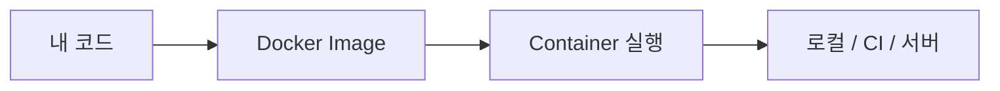

# Docker란 무엇인가?

> Docker 101 시리즈 (1/10)


## 이 글에서 다룰 문제

*환경 차이* 는 신입에게 가장 큰 좌절입니다. *Docker 한 줄* 로 *팀 전체가 같은 환경* 을 가지면, 디버깅 시간의 절반이 사라집니다.

> *환경 문제는 *개인의 실력 문제가 아니라 *시스템의 설계 문제* 입니다.*

## 전체 흐름


## Before/After

**Before**: "내 노트북에선 돌아가요." 새 팀원 셋업에 *반나절*.

**After**: `docker run myapp` 한 줄. *5분이면 동일 환경*.

## 첫 컨테이너 5단계

### 1단계 — Docker 설치 확인

```bash
docker --version
# Docker version 25.x.x
docker run hello-world
```

### 2단계 — 공식 image 실행

```bash
docker run -it --rm python:3.12-slim python -c "print('hi')"
```

### 3단계 — 백그라운드 실행

```bash
docker run -d --name web -p 8080:80 nginx
curl http://localhost:8080
```

### 4단계 — 상태 확인

```bash
docker ps              # 실행 중
docker logs web        # 로그
docker stop web && docker rm web
```

### 5단계 — Image 검색과 받기

```bash
docker pull redis:7-alpine
docker images
```

## 이 코드에서 주목할 점

- *image* 는 *실행 직전의 사진*, *container* 는 *살아 있는 프로세스*.
- *`-p 8080:80`* 은 *호스트:컨테이너* 포트 매핑.
- *`--rm`* 는 종료 후 자동 정리.

## 자주 하는 실수 5가지

1. **Docker 와 가상머신을 *동일시*.** 컨테이너는 *호스트 커널 공유*.
2. **`latest` tag 를 *프로덕션* 에 사용.** 어느 날 *조용히 깨짐*.
3. **`docker rm` 없이 컨테이너 *방치*.** 디스크가 *가득 찬다*.
4. **`-p` 없이 띄우고 *접속 안 됨* 으로 당황.** 포트 매핑이 필수.
5. **root 로 컨테이너 실행 후 *프로덕션* 으로 진출.** 보안 사고.

## 실무에서는 이렇게 쓰입니다

대부분의 회사가 *서비스 = container* 가정 위에 운영합니다. 로컬 개발, CI, 스테이징, 프로덕션이 *동일한 image* 를 씁니다.

## 체크리스트

- [ ] `docker run hello-world` 가 동작한다.
- [ ] *image* 와 *container* 의 차이를 설명할 수 있다.
- [ ] *포트 매핑* 의 의미를 안다.
- [ ] 컨테이너를 *정리* 할 수 있다.

## 정리 및 다음 단계

Docker 는 *환경 표류* 를 없애는 가장 빠른 방법입니다. 다음 글에서는 *image 와 container* 의 내부를 더 깊이 봅니다.

<!-- toc:begin -->
- **Docker란 무엇인가? (현재 글)**
- Image와 Container (예정)
- Dockerfile 작성하기 (예정)
- Volume과 Network (예정)
- Docker Compose (예정)
- 환경변수와 설정 (예정)
- Python 앱 컨테이너화 (예정)
- 데이터베이스와 함께 실행하기 (예정)
- Image 최적화 (예정)
- 배포용 Docker 구성 (예정)
<!-- toc:end -->

## 참고 자료

- [Docker overview](https://docs.docker.com/get-started/overview/)
- [Get Docker](https://docs.docker.com/get-docker/)
- [Docker Hub](https://hub.docker.com/)
- [What is a container?](https://www.docker.com/resources/what-container/)
