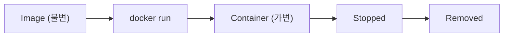

# Image와 Container

> Docker 101 시리즈 (2/10)

<!-- a-grade-intro:begin -->

**핵심 질문**: *image* 는 *불변* 인데 *container* 는 *변한다* 는 말은 *실제로* 무엇을 뜻합니까?

> *Image 는 *클래스*, container 는 *인스턴스* 입니다. 둘을 분리해 생각하면 디버깅이 쉬워집니다.*

<!-- a-grade-intro:end -->

## 이 글에서 배울 것

- *Image / Container* 의 *라이프사이클*
- *Layer* 와 *copy-on-write*
- 자주 쓰는 *10가지 명령*
- *컨테이너 안* 들여다보기
- 흔한 함정 5가지

## 왜 중요한가

*컨테이너의 동작* 을 이해하지 못하면 *디버깅이 운빨* 이 됩니다. layer 와 lifecycle 을 알면 *문제의 80%* 가 *예측 가능* 해집니다.

> *재현되지 않는 버그의 절반은 *컨테이너 상태에 대한 오해* 에서 옵니다.*

## 개념 한눈에 보기



## 핵심 용어 정리

- **Layer**: image 를 구성하는 *읽기 전용 파일 시스템 조각*.
- **Writable layer**: container 가 가진 *맨 위 쓰기 가능 layer*.
- **Lifecycle**: created -> running -> stopped -> removed.
- **Tag**: image 버전 라벨 (`nginx:1.27`).
- **Digest**: image 의 *불변 SHA256* 식별자.

## Before/After

**Before**: 컨테이너 안에서 `apt install` 한 뒤 *재시작 시 사라져* 당황.

**After**: 변경은 *Dockerfile 에 코드화*, container 는 *언제든 버려도 됨*.

## 실습: Image/Container 5단계

### 1단계 — Image 정보 보기

```bash
docker pull nginx:1.27
docker image inspect nginx:1.27 | jq '.[0].RootFS.Layers'
docker history nginx:1.27
```

### 2단계 — Container 생성과 실행

```bash
docker create --name web nginx:1.27   # 생성만
docker start web                       # 실행
docker ps
```

### 3단계 — Container 안 들어가기

```bash
docker exec -it web bash
# 컨테이너 안에서
ls /etc/nginx
exit
```

### 4단계 — 변경은 *휘발*

```bash
docker exec web touch /tmp/hello
docker stop web && docker rm web
docker run --name web2 nginx:1.27
docker exec web2 ls /tmp/hello   # No such file
```

### 5단계 — Image 정리

```bash
docker image prune -f          # dangling 제거
docker image rm nginx:1.27
```

## 이 코드에서 주목할 점

- `docker history` 는 *layer 별 명령* 을 보여 준다.
- *컨테이너 변경* 은 *commit 하지 않는 한* 사라진다.
- *digest* 는 tag 보다 *훨씬 신뢰할 수 있다*.

## 자주 하는 실수 5가지

1. **컨테이너 안에서 *파일 영구 저장*.** 재시작 시 *손실*.
2. **`docker commit` 으로 image 만들기.** *재현 불가능*.
3. **stopped 컨테이너 *방치*.** `docker ps -a` 가 *수백 줄*.
4. **`latest` 만 사용.** 어느 날 *호환성 깨짐*.
5. **layer 가 *너무 많은* image.** 빌드/풀이 *느려진다*.

## 실무에서는 이렇게 쓰입니다

CI 시스템은 *digest 핀* 으로 빌드해 *재현성* 을 보장하고, 운영에서는 *image 별 변경 이력* 을 *Datadog/Grafana* 와 묶어 *변경 사고* 를 추적합니다.

## 시니어 엔지니어는 이렇게 생각합니다

- *Image 는 빌드, container 는 실행*.
- *변경은 코드*, `commit` 은 *마지막 수단*.
- *digest 핀* 이 *프로덕션 기본*.
- *layer 캐시* 가 *빌드 속도* 를 결정.
- *컨테이너는 *언제든 버려도 좋게* 설계*.

## 체크리스트

- [ ] *image vs container* 를 설명할 수 있다.
- [ ] container 의 *변경이 휘발* 임을 안다.
- [ ] *layer / digest* 를 활용한다.
- [ ] stopped 컨테이너를 *정리* 한다.

## 연습 문제

1. `nginx:1.27` 의 *layer 수* 를 확인해 보세요.
2. 컨테이너 안에서 파일을 만든 뒤 *재시작* 후 사라짐을 확인하세요.
3. `docker image prune` 으로 *불필요한 image* 를 정리해 보세요.

## 정리 및 다음 단계

Image 와 container 의 분리가 Docker 사용의 *기본기* 입니다. 다음 글에서는 *Dockerfile* 로 image 를 *직접* 만듭니다.

<!-- toc:begin -->
- [Docker란 무엇인가?](./01-what-is-docker.md)
- **Image와 Container (현재 글)**
- Dockerfile 작성하기 (예정)
- Volume과 Network (예정)
- Docker Compose (예정)
- 환경변수와 설정 (예정)
- Python 앱 컨테이너화 (예정)
- 데이터베이스와 함께 실행하기 (예정)
- Image 최적화 (예정)
- 배포용 Docker 구성 (예정)
<!-- toc:end -->

## 참고 자료

- [Docker images](https://docs.docker.com/engine/reference/commandline/image/)
- [Docker container lifecycle](https://docs.docker.com/engine/reference/commandline/container/)
- [Storage drivers and layers](https://docs.docker.com/storage/storagedriver/)
- [Image digests](https://docs.docker.com/engine/reference/commandline/pull/#pull-an-image-by-digest-immutable-identifier)
