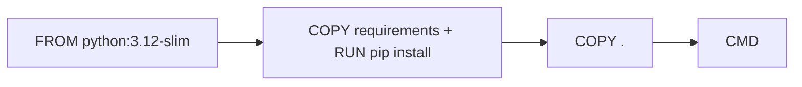

# Dockerfile 작성하기

> Docker 101 시리즈 (3/10)

<!-- a-grade-intro:begin -->

**핵심 질문**: image 를 *재현 가능하게* 만들려면 *어떤 명령* 을 *어떤 순서* 로 써야 합니까?

> *Dockerfile 은 *빌드 레시피* 이자 *문서* 입니다. 명령의 순서가 *캐시 효율* 과 *디버깅 난이도* 를 좌우합니다.*

<!-- a-grade-intro:end -->

## 이 글에서 배울 것

- *FROM / RUN / COPY / CMD* 의 의미
- *layer cache* 활용 *순서 전략*
- *.dockerignore* 의 중요성
- *non-root user* 로 실행
- 흔한 함정 5가지

## 왜 중요한가

*Dockerfile 한 줄의 순서* 가 *빌드 시간 5분 vs 30초* 를 만듭니다. 좋은 Dockerfile 은 팀 생산성을 *눈에 띄게* 바꿉니다.

> *느린 빌드는 *조용한 비용* 입니다. 매일 50번 빌드하면 *연간 수백 시간* 이 사라집니다.*

## 개념 한눈에 보기



## 핵심 용어 정리

- **FROM**: *베이스 image* 지정.
- **RUN**: 빌드 시 *명령 실행*.
- **COPY**: 파일 복사.
- **CMD**: container 시작 시 *기본 명령*.
- **ENTRYPOINT**: 항상 실행되는 *고정 진입점*.

## Before/After

**Before**: `COPY .` 가 맨 위에 있어 *코드 한 줄 수정* 시 전체 *재빌드*.

**After**: *변경 빈도가 낮은 단계* 가 위, *높은 단계* 가 아래. *캐시 적중률 90%+*.

## 실습: Dockerfile 5단계

### 1단계 — 최소 Dockerfile

```dockerfile
FROM python:3.12-slim
WORKDIR /app
COPY . .
RUN pip install -r requirements.txt
CMD ["python", "app.py"]
```

### 2단계 — Layer 순서 최적화

```dockerfile
FROM python:3.12-slim
WORKDIR /app

# 1) 변경 빈도 낮음
COPY requirements.txt .
RUN pip install --no-cache-dir -r requirements.txt

# 2) 변경 빈도 높음
COPY . .

CMD ["python", "app.py"]
```

### 3단계 — `.dockerignore`

```text
__pycache__/
.venv/
.git/
*.log
.env
node_modules/
```

### 4단계 — Non-root user

```dockerfile
RUN useradd -m -u 1000 appuser
USER appuser
```

### 5단계 — 빌드와 실행

```bash
docker build -t myapp:1.0 .
docker run --rm myapp:1.0
docker history myapp:1.0
```

## 이 코드에서 주목할 점

- *requirements 먼저 복사* -> *deps layer 캐시*.
- *.dockerignore* 가 없으면 *.git* 까지 통째로 복사.
- *USER* 생략 시 *root 로 실행*.

## 자주 하는 실수 5가지

1. **`COPY .` 를 *맨 위* 에 둠.** 모든 변경에 *전체 재빌드*.
2. **`apt update` 와 `install` 을 *다른 RUN* 으로 분리.** 캐시로 *오래된 패키지* 설치.
3. **`pip install` 후 *캐시 정리 안 함*.** image 가 *두 배*.
4. **`.dockerignore` 누락.** `.git`, `.env` 가 image 에 *포함*.
5. ***root 로 실행*.** 보안 사고.

## 실무에서는 이렇게 쓰입니다

성숙한 팀은 *멀티스테이지 빌드* 와 *BuildKit cache mount* 로 *빌드 시간 1/10* 을 만듭니다 (9화에서 다룸).

## 시니어 엔지니어는 이렇게 생각합니다

- *Dockerfile 은 *문서* 이기도 하다*.
- *변경 빈도순으로 *위에서 아래*.
- *.dockerignore 는 *보안* 이기도 하다*.
- *CMD 와 ENTRYPOINT* 의 차이를 *의식* 한다.
- *non-root* 는 *기본값*.

## 체크리스트

- [ ] *layer 순서* 가 *변경 빈도* 를 따른다.
- [ ] `.dockerignore` 가 있다.
- [ ] *non-root user* 로 실행한다.
- [ ] *deps 와 코드* 가 분리되어 있다.

## 연습 문제

1. `requirements.txt` 변경 없이 코드만 바꿔서 *캐시 적중* 을 확인하세요.
2. `.dockerignore` 를 추가해 image 크기를 줄여 보세요.
3. *non-root user* 로 실행되는 Dockerfile 을 만들어 보세요.

## 정리 및 다음 단계

좋은 Dockerfile 은 *팀의 시간을 매일 절약* 합니다. 다음 글에서는 *Volume 과 Network* 로 데이터와 통신을 다룹니다.

<!-- toc:begin -->
- [Docker란 무엇인가?](./01-what-is-docker.md)
- [Image와 Container](./02-image-and-container.md)
- **Dockerfile 작성하기 (현재 글)**
- Volume과 Network (예정)
- Docker Compose (예정)
- 환경변수와 설정 (예정)
- Python 앱 컨테이너화 (예정)
- 데이터베이스와 함께 실행하기 (예정)
- Image 최적화 (예정)
- 배포용 Docker 구성 (예정)
<!-- toc:end -->

## 참고 자료

- [Dockerfile reference](https://docs.docker.com/engine/reference/builder/)
- [Best practices for writing Dockerfiles](https://docs.docker.com/develop/develop-images/dockerfile_best-practices/)
- [Use a .dockerignore file](https://docs.docker.com/engine/reference/builder/#dockerignore-file)
- [BuildKit](https://docs.docker.com/build/buildkit/)
