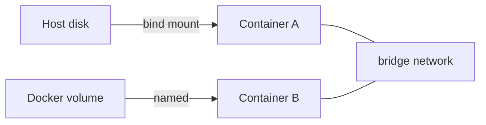

# Volume과 Network

> Docker 101 시리즈 (4/10)


## 이 글에서 다룰 문제

*데이터 손실* 과 *통신 실패* 는 컨테이너 운영의 *가장 흔한 사고* 입니다. *volume / network 모델* 을 알면 사고가 *예방* 됩니다.

> *상태 없는 컨테이너에 *상태가 새는 순간* 사고가 시작됩니다.*

## 전체 흐름


## Before/After

**Before**: container 재시작 시 *DB 데이터 사라짐*. `localhost` 로 다른 container 접근 *실패*.

**After**: *named volume* 으로 데이터 영속. *user-defined bridge* 위에서 *이름 통신*.

## Volume/Network 5단계

### 1단계 — Named volume

```bash
docker volume create app-data
docker run -d --name api -v app-data:/var/lib/data myapp
docker volume inspect app-data
```

### 2단계 — Bind mount (개발용)

```bash
docker run --rm -v "$PWD":/app -w /app python:3.12-slim python app.py
```

### 3단계 — User-defined bridge 생성

```bash
docker network create app-net
docker run -d --network app-net --name db postgres:16
docker run -d --network app-net --name api -e DB_HOST=db myapp
# api 안에서 'db' 호스트명으로 접근 가능
```

### 4단계 — 통신 확인

```bash
docker exec api ping -c 1 db
docker exec api curl http://db:5432
```

### 5단계 — Volume 백업

```bash
docker run --rm \
  -v app-data:/data \
  -v "$PWD":/backup \
  alpine tar czf /backup/data.tgz -C /data .
```

## 이 코드에서 주목할 점

- *named volume* 은 *컨테이너와 독립적* 으로 살아 있다.
- *user-defined bridge* 는 *DNS* 를 자동 제공.
- *bind mount* 는 *권한 문제* 가 자주 발생.

## 자주 하는 실수 5가지

1. **컨테이너 안 *경로 에 직접 저장*.** 재시작 시 *손실*.
2. ***default bridge* 사용.** *이름 해석* 안 됨.
3. **bind mount 권한 *root 로 고정*.** 호스트에서 *수정 불가*.
4. **volume 을 *백업하지 않음*.** 사고 시 *복구 불가*.
5. **`--network host` 남용.** 보안과 포트 충돌 위험.

## 실무에서는 이렇게 쓰입니다

오케스트레이터 (Kubernetes 등) 에서는 *PersistentVolume* 과 *Service DNS* 가 같은 개념을 확장합니다. Docker 에서 익히면 *이전이 자연스럽다*.

## 체크리스트

- [ ] *named volume* 으로 데이터를 영속화한다.
- [ ] *user-defined bridge* 를 사용한다.
- [ ] container 가 *이름* 으로 통신한다.
- [ ] *백업 절차* 가 있다.

## 정리 및 다음 단계

데이터와 통신은 컨테이너 운영의 *기둥* 입니다. 다음 글에서는 *Docker Compose* 로 여러 컨테이너를 *한 번에* 관리합니다.

<!-- toc:begin -->
- [Docker란 무엇인가?](./01-what-is-docker.md)
- [Image와 Container](./02-image-and-container.md)
- [Dockerfile 작성하기](./03-dockerfile.md)
- **Volume과 Network (현재 글)**
- Docker Compose (예정)
- 환경변수와 설정 (예정)
- Python 앱 컨테이너화 (예정)
- 데이터베이스와 함께 실행하기 (예정)
- Image 최적화 (예정)
- 배포용 Docker 구성 (예정)
<!-- toc:end -->

## 참고 자료

- [Manage data in Docker - Volumes](https://docs.docker.com/storage/volumes/)
- [Bind mounts](https://docs.docker.com/storage/bind-mounts/)
- [Networking overview](https://docs.docker.com/network/)
- [Use bridge networks](https://docs.docker.com/network/bridge/)
