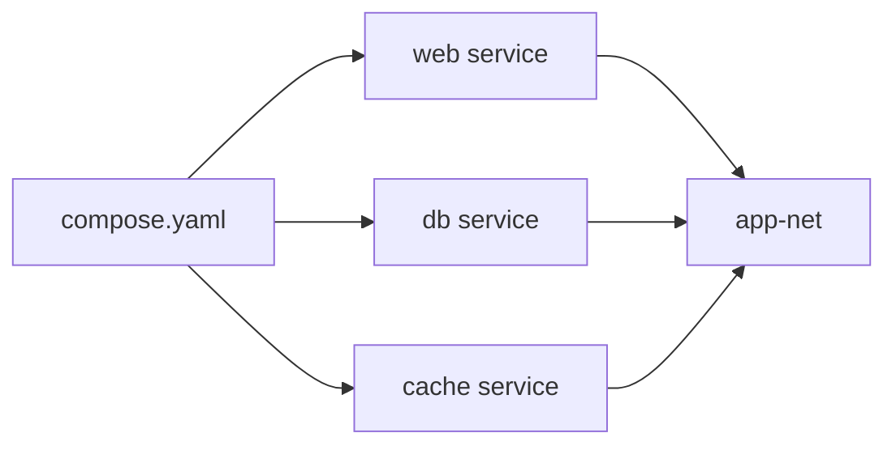

# Docker Compose

> Docker 101 시리즈 (5/10)

<!-- a-grade-intro:begin -->

**핵심 질문**: 여러 컨테이너를 *재현 가능* 하게 *한 번에* 띄우려면 어떻게 합니까?

> *Compose 는 *멀티 컨테이너 환경* 을 *YAML 한 파일* 로 *코드화* 합니다.*

<!-- a-grade-intro:end -->

## 이 글에서 배울 것

- *services / networks / volumes* 정의
- *depends_on* 과 헬스체크
- *profiles* 로 *선택 실행*
- *.env* 와 변수 보간
- 흔한 함정 5가지

## 왜 중요한가

신규 개발자 셋업이 *5분 안* 에 끝납니다. *README 의 셋업 섹션* 이 사라집니다.

> *Compose 는 *환경 = 코드* 의 가장 짧은 길입니다.*

## 개념 한눈에 보기



## 핵심 용어 정리

- **Service**: 동일한 image 를 가진 *컨테이너 그룹*.
- **Project**: Compose 가 관리하는 *논리 단위*.
- **Profile**: 특정 환경에서만 실행되는 *서비스 묶음*.
- **Healthcheck**: *준비 상태* 판단 기준.
- **Depends_on**: 시작 *순서* 와 *대기*.

## Before/As

**Before**: `docker run` 5번을 *셸 스크립트* 로 묶어 관리. 옵션은 *기억 의존*.

**After**: `docker compose up` 한 줄. *모든 옵션* 이 yaml 에 *명시적*.

## 실습: Compose 5단계

### 1단계 — `compose.yaml`

```yaml
services:
  web:
    build: .
    ports: ["8000:8000"]
    environment:
      DB_HOST: db
    depends_on:
      db:
        condition: service_healthy
  db:
    image: postgres:16
    environment:
      POSTGRES_PASSWORD: dev
    volumes: ["pgdata:/var/lib/postgresql/data"]
    healthcheck:
      test: ["CMD-SHELL", "pg_isready -U postgres"]
      interval: 5s
      timeout: 3s
      retries: 5
volumes:
  pgdata:
```

### 2단계 — 띄우기

```bash
docker compose up -d
docker compose ps
docker compose logs -f web
```

### 3단계 — 변수 (`.env`)

```bash
# .env
DB_PASSWORD=dev
APP_PORT=8000
```

```yaml
environment:
  POSTGRES_PASSWORD: ${DB_PASSWORD}
ports: ["${APP_PORT}:8000"]
```

### 4단계 — Profile

```yaml
services:
  worker:
    image: myapp:1.0
    profiles: ["worker"]
```

```bash
docker compose --profile worker up -d
```

### 5단계 — 정리

```bash
docker compose down            # 컨테이너 제거
docker compose down -v         # volume 까지 제거
```

## 이 코드에서 주목할 점

- *healthcheck + condition: service_healthy* 로 *진짜 준비 상태* 대기.
- *depends_on* 만 있으면 *기동만* 보장 (준비는 별도).
- *profiles* 는 *옵셔널 서비스* 의 표준.

## 자주 하는 실수 5가지

1. **`depends_on` 만 믿고 *DB 준비 전 접속*.** 헬스체크 필수.
2. **`docker compose up` 만 쓰고 *down -v 안 함*.** 데이터가 *오염된 채 남음*.
3. **`.env` 를 *커밋*.** secret 유출.
4. **profile 없이 *모든 서비스 항상 기동*.** 자원 낭비.
5. **여러 프로젝트가 *동일 포트* 사용.** 충돌.

## 실무에서는 이렇게 쓰입니다

대부분 회사의 *로컬 개발 환경* 은 Compose 입니다. CI 에서도 *통합 테스트 부트스트랩* 으로 자주 사용됩니다.

## 시니어 엔지니어는 이렇게 생각합니다

- *셋업은 *명령 하나* 로 끝나야 한다*.
- *healthcheck* 없는 depends_on 은 *거짓말*.
- *.env* 와 *.env.example* 을 분리한다.
- *profiles* 로 *복잡도를 분할* 한다.
- *down -v* 는 *복원 가능* 할 때만.

## 체크리스트

- [ ] *compose.yaml* 한 파일에 모든 서비스가 있다.
- [ ] 의존 서비스에 *healthcheck* 가 있다.
- [ ] *.env / .env.example* 분리.
- [ ] *profiles* 로 옵셔널 서비스 분리.

## 연습 문제

1. *web + db + redis* 3개를 *Compose* 로 띄워 보세요.
2. db 의 *healthcheck* 를 추가하고 *준비 후* web 이 시작되게 하세요.
3. *.env* 에 포트를 빼서 변수로 주입하세요.

## 정리 및 다음 단계

Compose 는 *팀의 첫 번째 인프라 코드* 입니다. 다음 글에서는 *환경변수와 설정* 의 패턴을 깊이 다룹니다.

<!-- toc:begin -->
- [Docker란 무엇인가?](./01-what-is-docker.md)
- [Image와 Container](./02-image-and-container.md)
- [Dockerfile 작성하기](./03-dockerfile.md)
- [Volume과 Network](./04-volume-and-network.md)
- **Docker Compose (현재 글)**
- 환경변수와 설정 (예정)
- Python 앱 컨테이너화 (예정)
- 데이터베이스와 함께 실행하기 (예정)
- Image 최적화 (예정)
- 배포용 Docker 구성 (예정)
<!-- toc:end -->

## 참고 자료

- [Compose specification](https://docs.docker.com/compose/compose-file/)
- [Overview of Compose](https://docs.docker.com/compose/)
- [Compose profiles](https://docs.docker.com/compose/profiles/)
- [Healthcheck in Compose](https://docs.docker.com/compose/compose-file/05-services/#healthcheck)
