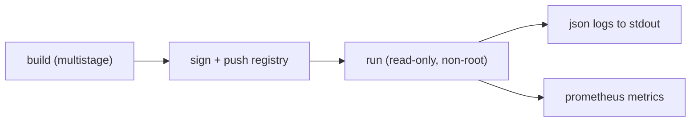

# 배포용 Docker 구성

> Docker 101 시리즈 (10/10)

<!-- a-grade-intro:begin -->

**핵심 질문**: 지금까지 배운 모든 것을 *프로덕션* 한 줄로 묶으려면 *무엇이 더* 필요합니까?

> *프로덕션 컨테이너는 *image, 보안, 로깅, registry, tagging* 의 *다섯 가지* 가 동시에 정렬되어야 합니다.*

<!-- a-grade-intro:end -->

## 이 글에서 배울 것

- *Image tag 정책* (semver + sha)
- *Registry* 와 *signed image*
- *runtime 보안* (read-only, capabilities)
- *로깅 / 메트릭* 의 표준
- 흔한 함정 5가지

## 왜 중요한가

지금까지의 모든 결정이 *프로덕션에서 한꺼번에 검증* 됩니다. 한 군데 약하면 *전체가 약합니다*.

> *프로덕션은 *체크리스트가 아니라 시스템* 입니다. 모든 항목이 *동시에* 동작해야 합니다.*

## 개념 한눈에 보기



## 핵심 용어 정리

- **Tag policy**: `semver` + `git sha` 이중 tagging.
- **Cosign**: image *서명* 도구.
- **Read-only rootfs**: 컨테이너 *FS 잠금*.
- **Capabilities**: 리눅스 *권한 세분화*.
- **Logging driver**: stdout 의 *수집/전달* 방식.

## Before/After

**Before**: `latest` 로 배포, root 실행, log 는 *컨테이너 내 파일*.

**After**: `1.4.2` + `sha-abc1234` 이중 tag, *non-root + read-only*, *json log -> 수집기*.

## 실습: 프로덕션 5단계

### 1단계 — Tag 와 push

```bash
TAG=1.4.2
SHA=$(git rev-parse --short HEAD)
docker build -t ghcr.io/me/myapp:${TAG} -t ghcr.io/me/myapp:sha-${SHA} .
docker push ghcr.io/me/myapp:${TAG}
docker push ghcr.io/me/myapp:sha-${SHA}
```

### 2단계 — Image 서명 (Cosign)

```bash
cosign sign --yes ghcr.io/me/myapp:${TAG}
cosign verify --certificate-identity-regexp '.*' \
              --certificate-oidc-issuer-regexp '.*' \
              ghcr.io/me/myapp:${TAG}
```

### 3단계 — Runtime 보안 옵션

```bash
docker run -d --name api \
  --read-only \
  --tmpfs /tmp \
  --cap-drop=ALL \
  --security-opt=no-new-privileges \
  --user 1000:1000 \
  -p 8000:8000 \
  ghcr.io/me/myapp:${TAG}
```

### 4단계 — Compose (production-style)

```yaml
services:
  web:
    image: ghcr.io/me/myapp:1.4.2
    read_only: true
    tmpfs: ["/tmp"]
    cap_drop: ["ALL"]
    user: "1000:1000"
    deploy:
      restart_policy: { condition: on-failure }
    logging:
      driver: json-file
      options: { max-size: "10m", max-file: "5" }
```

### 5단계 — 메트릭 (Prometheus)

```python
from prometheus_fastapi_instrumentator import Instrumentator
Instrumentator().instrument(app).expose(app, endpoint="/metrics")
```

## 이 코드에서 주목할 점

- *서명* 으로 *공급망 신뢰*.
- *read-only + cap-drop* 으로 *런타임 잠금*.
- *log/metric* 은 *stdout / endpoint* 만으로 충분.

## 자주 하는 실수 5가지

1. **`latest` 배포.** 어느 버전이 떠 있는지 *알 수 없음*.
2. ***서명되지 않은* image*.** 공급망 공격 *무방비*.
3. **컨테이너 안 *log 파일* 에 기록.** 회전/수집 실패.
4. **`--privileged` 사용.** 보안 *전소*.
5. **healthcheck 없음 + restart 정책 없음.** 죽은 채로 *조용히* 머무름.

## 실무에서는 이렇게 쓰입니다

대부분의 프로덕션은 *Kubernetes* 위에서 동작하지만, 위 5가지는 *그대로 K8s manifest* 의 옵션으로 옮겨집니다. *Docker 101* 의 학습이 *바로 K8s 자산* 이 됩니다.

## 시니어 엔지니어는 이렇게 생각합니다

- *프로덕션은 *기본값을 거꾸로 뒤집는다*: deny-by-default*.
- *image tag 는 *불변*, deploy 는 *디지스트 핀*.
- *log 는 stdout, metric 은 endpoint, trace 는 OTel*.
- *서명 없는 image 는 *모르는 사람의 코드*.
- *복구 시간 (MTTR) 이 모든 결정의 기준*.

## 체크리스트

- [ ] *semver + sha* 이중 tag.
- [ ] image *서명* 과 *검증*.
- [ ] *read-only / cap-drop / non-root*.
- [ ] *log* 와 *metric* 표준 채널.
- [ ] healthcheck + restart 정책.

## 연습 문제

1. 자신의 image 를 *semver + sha* 로 두 번 push 해 보세요.
2. *cosign* 으로 서명/검증을 수행해 보세요.
3. *read-only + cap-drop* 으로 컨테이너를 띄워 정상 동작을 확인하세요.

## 정리 및 다음 단계

여기까지 따라왔다면 *Docker 의 95%* 를 다룰 수 있습니다. 다음은 *Kubernetes 101* 으로 *컨테이너 오케스트레이션*, *SRE 101* 으로 *운영 신뢰성* 을 배우세요.

<!-- toc:begin -->
- [Docker란 무엇인가?](./01-what-is-docker.md)
- [Image와 Container](./02-image-and-container.md)
- [Dockerfile 작성하기](./03-dockerfile.md)
- [Volume과 Network](./04-volume-and-network.md)
- [Docker Compose](./05-docker-compose.md)
- [환경변수와 설정](./06-env-and-config.md)
- [Python 앱 컨테이너화](./07-python-app-containerize.md)
- [데이터베이스와 함께 실행하기](./08-database-with-app.md)
- [Image 최적화](./09-image-optimization.md)
- **배포용 Docker 구성 (현재 글)**
<!-- toc:end -->

## 참고 자료

- [Docker security](https://docs.docker.com/engine/security/)
- [Sigstore Cosign](https://docs.sigstore.dev/cosign/overview/)
- [Read-only filesystem](https://docs.docker.com/engine/reference/run/#read-only)
- [12-factor - logs](https://12factor.net/logs)
