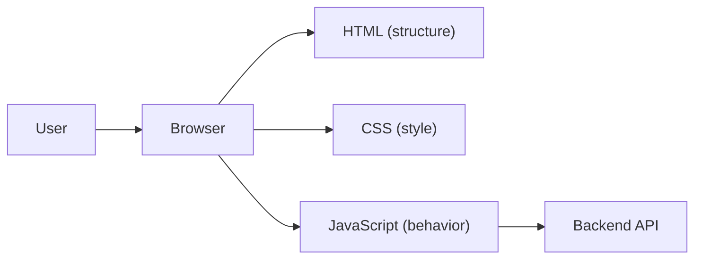

# 프론트엔드 개발이란 무엇인가?

> Frontend Development 101 시리즈 (1/10)


## 이 글에서 다룰 문제

사용자가 *느끼는 모든 것* 은 프론트엔드를 거칩니다. 백엔드가 아무리 완벽해도 프론트가 느리면 *제품이 느린 것* 으로 평가됩니다. 프론트엔드는 *제품의 첫인상이자 마지막 인상* 입니다.

> 좋은 프론트엔드는 *보이지 않습니다.* 사용자가 의식하지 않고 *그냥 쓰게* 만듭니다.

## 전체 흐름


브라우저가 세 언어를 *조합* 해 화면을 만듭니다.

## Before/After

**Before (정적 웹사이트, 1995)**

```html
<!-- 모든 페이지가 별도 .html 파일 -->
<a href="/about.html">About</a>
```

**After (현대 SPA, 2025)**

```javascript
// 한 페이지 안에서 라우터가 화면을 바꿈
<Link to="/about">About</Link>
```

## 첫 페이지 5단계

### 1단계 — index.html

```html
<!DOCTYPE html>
<html lang="ko">
<head><meta charset="utf-8"><title>Hi</title></head>
<body>
  <h1 id="t">안녕</h1>
  <button id="b">눌러</button>
  <script src="app.js"></script>
</body>
</html>
```

### 2단계 — style.css

```css
body { font-family: system-ui; padding: 2rem; }
button { padding: .5rem 1rem; cursor: pointer; }
```

### 3단계 — app.js

```javascript
document.getElementById("b").addEventListener("click", () => {
  document.getElementById("t").textContent = "안녕, 프론트엔드!";
});
```

### 4단계 — 로컬 서버

```bash
python3 -m http.server 8000
# 브라우저에서 http://localhost:8000
```

### 5단계 — DevTools 열기

`F12` → Elements / Console / Network 탭을 열어 *브라우저가 무엇을 받았는지* 확인합니다.

## 이 코드에서 주목할 점

- HTML이 *구조*, CSS가 *모양*, JS가 *행동* 입니다.
- 세 가지가 *분리* 되어 있어 각자 개선할 수 있습니다.
- DevTools가 프론트엔드 개발의 *최강 무기* 입니다.

## 자주 하는 실수 5가지

1. **HTML에 스타일을 인라인으로 박는다.** 유지보수가 *기하급수적* 으로 어려워집니다.
2. **JS 안에 비즈니스 로직과 DOM 조작을 섞는다.** 테스트가 불가능해집니다.
3. **DevTools를 무시한다.** 절반의 디버깅을 *눈 감고* 하게 됩니다.
4. **모든 곳에 framework를 도입한다.** *간단한 페이지에 React* 는 과합니다.
5. **모바일을 *마지막에* 고려한다.** 모바일 사용자가 절반 이상입니다.

## 실무에서는 이렇게 쓰입니다

대부분의 회사는 *React/Vue/Svelte* 같은 framework + *TypeScript* + *Vite/Next.js* 같은 빌드 도구를 사용합니다. 처음부터 모든 도구를 배우려 하지 말고, *순수 HTML/CSS/JS* 로 한 페이지를 만들어본 뒤 framework로 옮겨가는 것이 *훨씬 빠른 길* 입니다.

## 체크리스트

- [ ] HTML/CSS/JS의 역할을 구분할 수 있다.
- [ ] 로컬에서 정적 페이지를 띄울 수 있다.
- [ ] DevTools의 Elements/Console/Network 탭을 연다.
- [ ] DOM이라는 단어를 설명할 수 있다.
- [ ] SPA가 무엇인지 한 줄로 말할 수 있다.

## 정리 및 다음 단계

프론트엔드는 *브라우저 안에서 사용자와 만나는 layer* 입니다. 다음 글에서는 그 layer의 *기초인 HTML과 CSS* 를 본격적으로 다룹니다.

<!-- toc:begin -->
- **프론트엔드 개발이란 무엇인가? (현재 글)**
- HTML과 CSS 기본 (예정)
- JavaScript 기본 (예정)
- 컴포넌트와 상태 (예정)
- 라우팅과 페이지 (예정)
- API 호출과 비동기 (예정)
- 폼과 유효성 검사 (예정)
- 스타일링과 디자인 시스템 (예정)
- 빌드 도구와 번들링 (예정)
- 작은 프론트엔드 앱 만들기 (예정)
<!-- toc:end -->

## 참고 자료

- [MDN Web Docs](https://developer.mozilla.org/)
- [web.dev](https://web.dev/)
- [Frontend Roadmap](https://roadmap.sh/frontend)
- [HTML Living Standard](https://html.spec.whatwg.org/)
