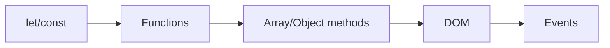

# JavaScript 기본

> Frontend Development 101 시리즈 (3/10)


## 이 글에서 다룰 문제

JS는 framework가 *바뀌어도* 똑같이 쓰입니다. React 컴포넌트 안에서도, Vue 안에서도, Node.js 백엔드에서도 *같은 문법* 입니다. 여기에 시간을 쓰면 *모든 framework가 빨라집니다.*

> 좋은 자바스크립트는 *작고 분리된 함수* 의 합입니다.

## 전체 흐름


## Before/After

**Before (var와 for문)**

```javascript
var arr = [1,2,3];
var doubled = [];
for (var i = 0; i < arr.length; i++) doubled.push(arr[i] * 2);
```

**After (modern JS)**

```javascript
const arr = [1, 2, 3];
const doubled = arr.map(n => n * 2);
```

## 할 일 목록 5단계

### 1단계 — HTML 골격

```html
<input id="todo">
<button id="add">추가</button>
<ul id="list"></ul>
```

### 2단계 — 상태 변수

```javascript
const todos = [];
```

### 3단계 — 함수로 분리

```javascript
function render() {
  const list = document.getElementById("list");
  list.innerHTML = todos.map(t => `<li>${t}</li>`).join("");
}
```

### 4단계 — 이벤트

```javascript
document.getElementById("add").addEventListener("click", () => {
  const input = document.getElementById("todo");
  if (!input.value) return;
  todos.push(input.value);
  input.value = "";
  render();
});
```

### 5단계 — Event delegation으로 삭제

```javascript
document.getElementById("list").addEventListener("click", (e) => {
  if (e.target.tagName === "LI") {
    const idx = [...e.target.parentNode.children].indexOf(e.target);
    todos.splice(idx, 1);
    render();
  }
});
```

## 이 코드에서 주목할 점

- 상태(`todos`)와 렌더링(`render`)이 *분리* 되어 있습니다.
- 모든 변경은 *상태 → 렌더링* 순서로 흐릅니다. (React 패러다임의 *맛보기*)
- 이벤트 리스너는 *부모에 하나* 만 달면 효율적입니다.

## 자주 하는 실수 5가지

1. **`var` 를 사용한다.** 스코프가 *함수 단위* 라 버그가 생깁니다. `const/let` 만 쓰세요.
2. **`==` 를 쓴다.** 타입 변환이 들어가 *예측 불가능* 합니다. `===` 만 쓰세요.
3. **상태와 DOM을 동시에 갱신한다.** 어떤 것이 *진짜 상태* 인지 알 수 없게 됩니다.
4. **모든 요소에 리스너를 단다.** 메모리와 성능 *낭비* 입니다.
5. **`async` 안에서 에러를 처리하지 않는다.** *조용히 실패* 하는 버그가 생깁니다.

## 실무에서는 이렇게 쓰입니다

대부분의 회사는 *TypeScript* + *ESLint* + *Prettier* 조합을 표준으로 사용합니다. JS의 자유로움이 팀 규모에서는 *위험* 이 되기 때문에 타입과 lint로 *경계* 를 만듭니다. 그러나 그 모든 도구도 *순수 JS 위에서* 돕니다.

## 체크리스트

- [ ] `let/const` 의 차이를 안다.
- [ ] arrow function을 쓸 수 있다.
- [ ] `map/filter/reduce` 로 for문을 대체한다.
- [ ] DOM을 조회/수정할 수 있다.
- [ ] event delegation을 한 번 써봤다.

## 정리 및 다음 단계

순수 JS만으로도 작은 앱이 만들어집니다. 그러나 화면이 커지면 *상태와 렌더링* 을 자동으로 묶어주는 도구가 필요합니다. 다음 글에서 *컴포넌트와 상태* 라는 개념을 다룹니다.

<!-- toc:begin -->
- [프론트엔드 개발이란 무엇인가?](./01-what-is-frontend-development.md)
- [HTML과 CSS 기본](./02-html-and-css-basics.md)
- **JavaScript 기본 (현재 글)**
- 컴포넌트와 상태 (예정)
- 라우팅과 페이지 (예정)
- API 호출과 비동기 (예정)
- 폼과 유효성 검사 (예정)
- 스타일링과 디자인 시스템 (예정)
- 빌드 도구와 번들링 (예정)
- 작은 프론트엔드 앱 만들기 (예정)
<!-- toc:end -->

## 참고 자료

- [MDN JavaScript Guide](https://developer.mozilla.org/en-US/docs/Web/JavaScript/Guide)
- [JavaScript.info](https://javascript.info/)
- [Eloquent JavaScript](https://eloquentjavascript.net/)
- [TC39 Proposals](https://github.com/tc39/proposals)
