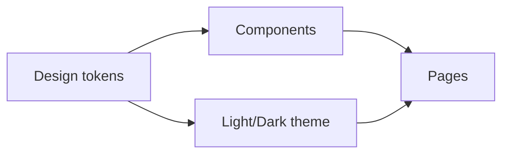

# 스타일링과 디자인 시스템

> Frontend Development 101 시리즈 (8/10)

<!-- a-grade-intro:begin -->

**핵심 질문**: 프로젝트가 커지면 *디자인의 일관성* 은 어떻게 지킬까요?

> 답은 *디자인 토큰* 과 *컴포넌트 라이브러리* 입니다. 모든 색, 간격, 타이포그래피를 *한 곳* 에서 관리합니다.

<!-- a-grade-intro:end -->

## 이 글에서 배울 것

- 스타일링 방식들(전역 CSS, CSS Modules, CSS-in-JS, Tailwind)의 *비교*
- 디자인 토큰(색, 간격, 폰트)의 *역할*
- 컴포넌트 라이브러리의 *내부 구조*
- 다크 모드와 테마
- 일관성을 *자동으로 강제하는* 방법

## 왜 중요한가

코드는 일관되어도 *디자인이 일관되지 않으면* 사용자는 *불안* 합니다. 같은 버튼이 페이지마다 다르면 *제품이 정돈되지 않은* 느낌을 줍니다. 디자인 시스템은 *팀 규모의 일관성* 입니다.

> 좋은 디자인 시스템은 *디자이너와 개발자가 같은 언어* 로 말하게 합니다.

## 개념 한눈에 보기



## 핵심 용어 정리

- **Design token**: 색/간격/폰트의 *원자 단위* (예: `color.primary.500`).
- **CSS Modules**: 클래스명을 *자동으로 고유하게* 만드는 방식.
- **CSS-in-JS**: 컴포넌트 *함수 안에서* CSS를 작성.
- **Utility-first CSS**: Tailwind처럼 *작은 클래스의 조합* 으로 스타일링.
- **Component library**: 디자인 시스템을 코드로 구현한 *재사용 가능한 컴포넌트 모음*.

## Before/After

**Before (페이지마다 다른 색)**

```css
.btn-a { background: #1d72ff; }   /* 페이지 A */
.btn-b { background: #1d70ff; }   /* 페이지 B (오타) */
```

**After (디자인 토큰)**

```css
:root { --color-primary: #1d72ff; }
.btn  { background: var(--color-primary); }
```

## 실습: Tailwind로 컴포넌트 5단계

### 1단계 — Tailwind 설치

```bash
npm install -D tailwindcss postcss autoprefixer
npx tailwindcss init -p
```

### 2단계 — 토큰 정의

```javascript
// tailwind.config.js
module.exports = {
  theme: {
    extend: {
      colors: { primary: "#1d72ff", surface: "#f8fafc" },
      spacing: { gutter: "1rem" },
    },
  },
};
```

### 3단계 — Button 컴포넌트

```jsx
function Button({ children, variant = "primary" }) {
  const base = "px-4 py-2 rounded font-medium transition";
  const variants = {
    primary:   "bg-primary text-white hover:opacity-90",
    secondary: "bg-surface text-gray-900 border border-gray-200",
  };
  return <button className={`${base} ${variants[variant]}`}>{children}</button>;
}
```

### 4단계 — 다크 모드

```jsx
// tailwind.config.js: { darkMode: "class" }
<button className="bg-primary dark:bg-primary/80 text-white">
  눌러
</button>
```

### 5단계 — 일관성 강제

```bash
# eslint-plugin-tailwindcss
# 임의의 클래스명, 잘못된 토큰을 lint로 잡습니다.
```

## 이 코드에서 주목할 점

- 모든 색이 `primary` 같은 *이름* 으로 등장합니다 — 변경이 *한 곳* 에서.
- `Button` 같은 컴포넌트가 *유일한 진실의 출처* 입니다.
- 다크 모드는 *별도 코드* 가 아니라 *별도 토큰* 입니다.

## 자주 하는 실수 5가지

1. **컴포넌트마다 색을 *직접* 적는다.** 디자이너가 색을 바꾸면 *지옥* 이 펼쳐집니다.
2. **버튼/입력의 변형을 *문서 없이* 만든다.** 디자이너와 *합의되지 않은* 컴포넌트가 늘어납니다.
3. **다크 모드를 *나중에* 추가한다.** 색 토큰이 흩어진 상태에서 추가하면 *전 컴포넌트* 를 손봐야 합니다.
4. **간격을 *모두 px* 로 박는다.** 반응형/접근성이 깨집니다.
5. **컴포넌트 라이브러리에 *비즈니스 로직* 을 넣는다.** 재사용이 불가능해집니다.

## 실무에서는 이렇게 쓰입니다

대부분의 회사는 *Storybook* 으로 컴포넌트를 카탈로그로 만들고, *Tailwind/CSS Modules + 디자인 토큰* 으로 스타일을 통일합니다. 큰 회사는 자체 *디자인 시스템 패키지* 를 npm으로 배포해 *여러 프로덕트가 같은 컴포넌트* 를 사용하게 합니다.

## 시니어 엔지니어는 이렇게 생각합니다

- *토큰 없는 색* 은 코드 리뷰에서 거른다.
- 디자인 시스템은 *디자이너와 함께* 만든다.
- 새로운 컴포넌트는 *왜 기존으로 안 되는지* 부터 묻는다.
- Storybook은 *컴포넌트의 단위 테스트* 다.
- 다크 모드는 *색 토큰만으로* 풀려야 한다.

## 체크리스트

- [ ] 디자인 토큰의 의미를 안다.
- [ ] CSS Modules 또는 Tailwind로 컴포넌트를 스타일링했다.
- [ ] Storybook을 한 번 써봤다.
- [ ] 다크 모드를 한 번 적용해봤다.
- [ ] 임의의 색/간격이 lint로 잡히는지 확인한다.

## 연습 문제

1. Tailwind 토큰에 자신만의 `primary` 색을 정의하고 Button 컴포넌트에 적용하세요.
2. Storybook을 설치해 Button의 두 가지 variant를 카탈로그로 만드세요.
3. `prefers-color-scheme` 또는 클래스 기반 다크 모드를 적용하세요.

## 정리 및 다음 단계

스타일도 *공유된 어휘* 가 있어야 일관됩니다. 다음 글에서는 그 모든 코드를 *브라우저가 읽을 수 있는 형태로* 만드는 빌드 도구를 봅니다.

<!-- toc:begin -->
- [프론트엔드 개발이란 무엇인가?](./01-what-is-frontend-development.md)
- [HTML과 CSS 기본](./02-html-and-css-basics.md)
- [JavaScript 기본](./03-javascript-basics.md)
- [컴포넌트와 상태](./04-components-and-state.md)
- [라우팅과 페이지](./05-routing-and-pages.md)
- [API 호출과 비동기](./06-api-calls-and-async.md)
- [폼과 유효성 검사](./07-forms-and-validation.md)
- **스타일링과 디자인 시스템 (현재 글)**
- 빌드 도구와 번들링 (예정)
- 작은 프론트엔드 앱 만들기 (예정)
<!-- toc:end -->

## 참고 자료

- [Tailwind CSS docs](https://tailwindcss.com/)
- [Storybook](https://storybook.js.org/)
- [Design Tokens W3C draft](https://www.w3.org/community/design-tokens/)
- [Material Design](https://m3.material.io/)
