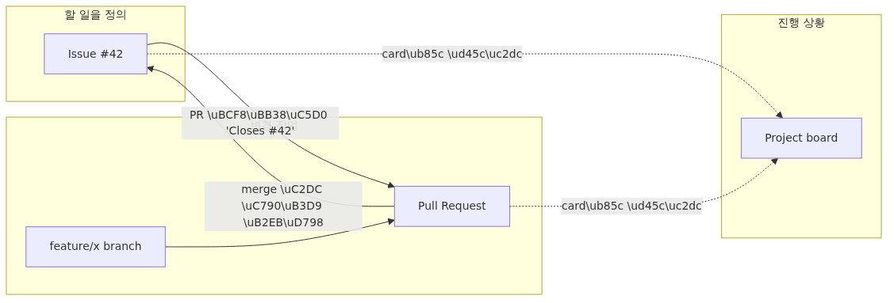

# Issue와 Project로 일감 관리하기 - GitHub에서 할 일을 추적하는 법

## 핵심 질문

Issue와 Project를 어떻게 사용해야 일감의 흐름이 보이고 협업이 빨라질까요?

이 글은 그 질문에 답하기 위해 Issue와 Project 운영의 핵심 결정과 운영 함정을 살펴봅니다.


## 이 글에서 다룰 문제

지금까지의 시리즈는 "코드를 어떻게 바꿨는가"에 집중했습니다. commit이 그것을 기록하고, PR이 합의를 만들었습니다. 하지만 실무에서는 그 앞단의 질문이 더 자주 나옵니다. "지금 무엇을 해야 하지?", "이 일은 누가 맡고 있지?", "이번 달 안에 마무리할 일은 몇 개 남았지?"

GitHub Issue와 Project는 그 질문에 답하기 위한 도구입니다. 코드 저장소 안에 "할 일 목록"과 "진행 상황 보드"를 함께 두면 다음과 같은 일이 가능해집니다.

1. 작업의 시작과 끝이 추적됩니다. issue를 열고, PR로 끝내고, merge가 issue를 자동으로 닫아 줍니다.
2. 한 달 뒤에 "이 변경 왜 했지?"를 추적할 때 commit → PR → issue로 거슬러 올라가 의도까지 닿을 수 있습니다.
3. 팀이 늘어나도 같은 화면을 보면서 일할 수 있습니다. 따로 Jira 같은 도구를 띄울 필요가 없습니다.

혼자 쓰는 저장소라도 issue는 쓸모가 있습니다. 머릿속에 떠 있는 할 일을 적어 두는 자리가 있으면 다음에 저장소를 열었을 때 어디서부터 다시 시작할지 빨리 떠오릅니다.

## Mental Model

> issue는 "무엇을 할지"를, PR은 "실제로 어떻게 했는지"를, Project는 "지금 어디까지 왔는지"를 기록하는 세 개의 보완적인 면입니다.
issue, PR, project가 어떻게 맞물리는지 먼저 그림으로 잡고 갑니다.



*Mental Model*
읽는 순서는 다음과 같습니다.

1. issue가 작업의 시작점입니다. "무엇을, 왜 해야 하는지"를 적습니다.
2. 그 issue를 처리하기 위해 branch와 PR이 만들어집니다.
3. PR 본문에 `Closes #42`라고 적어 두면 merge가 issue도 같이 닫아 줍니다.
4. project board는 issue와 PR을 카드로 모아서 "지금 어디까지 와 있는지"를 한눈에 보여 줍니다.

핵심은 issue가 "할 일", PR이 "그 일을 끝내는 변경"이라는 분업입니다.

## 핵심 개념

| 용어 | 뜻 |
| --- | --- |
| Issue | 저장소 단위의 할 일 카드입니다. 제목, 본문, 댓글 스레드, label, assignee, milestone을 가집니다. |
| Label | issue/PR을 분류하는 색깔 태그입니다. `bug`, `enhancement`, `good first issue`처럼 씁니다. |
| Milestone | 여러 issue/PR을 묶어 마감일과 진행률을 보여 주는 단위입니다. 보통 "v1.2 release"처럼 씁니다. |
| Assignee | issue/PR을 맡은 사람입니다. 한 명 또는 여러 명을 지정할 수 있습니다. |
| Project (Projects v2) | 여러 issue와 PR을 카드로 올려 두고 status, priority 등을 별도 column으로 관리하는 보드입니다. |
| Closing keywords | `Closes`, `Fixes`, `Resolves` 같은 단어로, PR 본문에 `Closes #42`라고 적으면 PR이 default branch로 merge될 때 해당 issue가 자동으로 닫힙니다. |
| Reference | `#42`, `org/repo#42` 같이 issue/PR을 가리키는 표기입니다. 자동으로 링크가 걸립니다. |

`Closes`, `Fixes`, `Resolves`는 모두 같은 뜻입니다. 셋 다 단·복수형(`Closes`, `Close`)을 지원합니다.

## Before-After

**Before - issue 없이 PR만 만든 경우**

```text
PR #5: Fix sidebar overflow
- (\ubcf8\ubb38 \ube44\uc5b4 \uc788\uc74c)
- merge \uC644\ub8CC

# 3\uac1c\uc6d4 \ub4a4
$ git log --oneline | grep sidebar
9d8e7f6 Fix sidebar overflow
$ # \uc65c \uace0\uccd0\uc57c \ud588\ub294\uc9c0\ub294 \uc544\ubb34\ub3c4 \ubaa8\ub984
```

기록은 남았지만 의도는 사라졌습니다. 누군가 "왜 sidebar의 overflow가 문제였는지"를 다시 알아내려면 처음부터 디자인을 들여다봐야 합니다.

**After - issue + PR 연결로 진행한 경우**

```text
Issue #42: Sidebar text overflows on narrow screens
- 1024px \uc774\ud558\uc5d0\uc11c \ud14d\uc2a4\ud2b8\uac00 \uc798\ub9bc
- \uc790\ub04f \ub9c8\uc6b0\uc2a4 \uc870\uc791\uc744 \ub9c9\uc740 \ub2e4\uc6b4\ub2e4\ub294 \uc81c\ubcf4

PR #5: Fix sidebar overflow on narrow screens
\ubcf8\ubb38: Closes #42
- \uc88c\uce21 \uc5ec\ubc31 16px \ucd94\uac00, max-width 240px \uc124\uc815
- \uac80\uc99d: 320~1280px \uad6c\uac04\uc5d0\uc11c \uc2a4\ud06c\ub864 \ud14c\uc2a4\ud2b8 \uc644\ub8cc
```

merge하는 순간 issue #42가 자동으로 닫히고, 6개월 뒤 누군가 commit `9d8e7f6`을 발견하면 PR을 거쳐 issue까지 따라갈 수 있습니다.

## 단계별 실습

Episode 7에서 만든 `vacation-notes` 저장소를 그대로 사용합니다. `main`은 `5e6f7a8 Merge pull request #1 from feature/release-notes`를 가리키고, 직전 작업은 깔끔하게 마무리된 상태입니다.

### 1. 첫 번째 issue 만들기

브라우저에서 저장소의 `Issues` 탭으로 들어가 `New issue` 버튼을 누릅니다.

- Title: `Add a packing list section to notes`
- Description (본문 예시):
  ```text
  ## Background
  notes.md \uc5d0 \uc5ec\ud589 \uc2dc \ucc59\uae38 \ud56d\ubaa9\uc744 \uc801\uc744 \uc790\ub9ac\uac00 \uc5c6\uc2b5\ub2c8\ub2e4.

  ## Goal
  `## Packing list` \uc139\uc158\uc744 \ucd94\uac00\ud574 \uae30\ubcf8 \ud56d\ubaa9 \uc138 \uac1c\ub97c \ub123\uace0,
  \uc870\ud558\uc138\ud55c \uad6c\uc870\ub294 \ucd94\ud6c4 PR\uc5d0\uc11c \ub2e4\ub8f0 \uc218 \uc788\ub3c4\ub85d \ub5e0\uc5b4 \ub461\ub2c8\ub2e4.

  ## Out of scope
  - \uc548\ub0b4 \uc774\ubbf8\uc9c0
  - i18n
  ```
- Submit `Submit new issue`. 새 issue가 `#2`라는 번호를 받습니다(`#1`은 Episode 7의 PR이 가져갔습니다).

### 2. label과 assignee 붙이기

issue 화면 오른쪽 사이드바에서 다음을 지정합니다.

- Labels: `enhancement` 하나를 붙입니다. 직접 만든 label이 없다면 GitHub이 기본으로 제공하는 것을 씁니다.
- Assignees: 본인을 지정합니다. "이 issue는 내가 맡는다"라는 신호입니다.
- Milestone: 지금은 비워 둬도 됩니다. 일정이 정해지면 그때 붙이면 됩니다.

label은 한 issue에 여러 개 붙일 수 있습니다. 색상이 잘 보이는 짧은 이름이 좋습니다.

### 3. issue를 처리할 branch 만들기

로컬 작업으로 돌아옵니다. issue 번호를 branch 이름에 넣어 두면 나중에 추적이 편합니다.

```text
$ git switch main
Already on 'main'
Your branch is up to date with 'origin/main'.
$ git pull
Already up to date.
$ git switch -c feature/packing-list-2
Switched to a new branch 'feature/packing-list-2'
```

`feature/packing-list-2`의 끝자리 `2`는 issue 번호와 맞춥니다. 이건 약속이라기보다 흔히 쓰는 관습입니다.

### 4. 변경을 commit하고 push하기

```text
$ printf '\n## Packing list\n\n- Passport\n- Phone charger\n- Travel adapter\n' >> notes.md
$ git add notes.md
$ git commit -m "Add packing list section"
[feature/packing-list-2 a1b2c3d] Add packing list section
 1 file changed, 5 insertions(+)
$ git push -u origin feature/packing-list-2
Enumerating objects: 5, done.
...
remote: Create a pull request for 'feature/packing-list-2' on GitHub by visiting:
remote:      https://github.com/<your-id>/vacation-notes/pull/new/feature/packing-list-2
To https://github.com/<your-id>/vacation-notes.git
 * [new branch]      feature/packing-list-2 -> feature/packing-list-2
Branch 'feature/packing-list-2' set up to track remote branch 'feature/packing-list-2' from 'origin'.
```

여기까지는 Episode 7과 같은 흐름입니다.

### 5. PR을 issue와 연결해서 열기

GitHub에서 새 PR을 엽니다. 이번에는 본문에 한 줄을 꼭 넣습니다.

```text
Title: Add packing list section to notes
Body:
Closes #2

\uc5ec\ud589 \uc2dc \ucc59\uae38 \ud56d\ubaa9\uc744 \uc801\uc744 \uc790\ub9ac\ub97c \ucd94\uac00\ud569\ub2c8\ub2e4.
\uae30\ubcf8 \ud56d\ubaa9\ub9cc \ub123\uc5b4 \ub461\uace0, \uc138\ubd80 \uad6c\uc870\ub294 \ucd94\ud6c4 PR\uc5d0\uc11c \ub2e4\ub8f0 \uc218 \uc788\ub3c4\ub85d \uc81c\ud55c\ud588\uc2b5\ub2c8\ub2e4.
```

`Closes #2`라고 쓰는 순간 PR 화면 오른쪽 `Development` 섹션에 issue가 자동으로 연결됩니다. 한 PR에서 여러 issue를 함께 닫으려면 `Closes #2, closes #3`처럼 키워드를 issue마다 반복해서 적어야 합니다. `Closes #2, #3` 형태는 두 번째 번호를 닫지 못합니다.

### 6. PR을 merge하면 issue가 자동으로 닫힘

PR을 검토한 뒤 `Merge pull request` 버튼을 누릅니다. merge가 끝나는 순간 GitHub은 다음을 동시에 처리합니다.

1. PR의 commit이 base인 `main`에 합쳐집니다.
2. issue `#2`의 상태가 `Open`에서 `Closed`로 바뀝니다.
3. issue 본문 아래에 "Closed via PR #N" 같은 자동 메시지가 추가됩니다.

`Closes`, `Fixes`, `Resolves` 중 어느 단어를 써도 동작은 같습니다. 이미 닫힌 issue를 다시 닫지는 않습니다.

### 7. Project board로 흐름을 한눈에 보기

저장소의 `Projects` 탭에서 `New project`를 누르고 `Board` 템플릿을 고릅니다. 기본 column은 `Todo`, `In Progress`, `Done` 세 개입니다.

- 위에서 만든 issue `#2`를 `Add item`으로 보드에 올려 두면 `Todo` column에 카드가 생깁니다.
- branch에서 작업을 시작하면 카드를 `In Progress`로 옮깁니다.
- PR을 보드에 추가하면 PR도 같은 보드 위에서 움직입니다.
- merge가 일어나 issue가 닫히면 카드가 자동으로 `Done`으로 옮겨지도록 자동화 규칙을 켤 수 있습니다(`Workflows` 메뉴).

자동화는 처음부터 너무 복잡하게 만들 필요가 없습니다. 카드를 손으로 옮기는 것부터 시작해도 충분히 도움이 됩니다.

## 자주 하는 실수

- 작업을 끝내고 issue를 닫는 것을 잊습니다. PR 본문에 `Closes #N`을 적는 습관을 들이면 따로 닫지 않아도 됩니다.
- issue 본문에 한 줄짜리 제목만 적습니다. 한 달 뒤의 본인이 그 issue를 다시 봤을 때 무슨 뜻이었는지 알아야 합니다. 짧게라도 background와 goal을 적어 둡니다.
- label을 너무 많이 만듭니다. 처음에는 `bug`, `enhancement`, `chore` 정도로 시작하고 늘려 가는 편이 안전합니다.
- PR 본문이 아닌 commit message에만 `Closes #N`을 적습니다. default branch에 들어간 commit message에 키워드가 그대로 남아 있으면 동작하지만, squash나 rebase 과정에서 message가 다시 쓰이면 잘못 닫히거나 아예 닫히지 않을 수 있습니다. PR 본문에 적는 편이 안전합니다.
- 혼자 쓰는 저장소라서 issue를 안 쓰고 메모장에 적습니다. issue로 옮기면 commit과 자동으로 연결되고 검색이 됩니다.

## 실무에서의 활용

issue와 project를 실무에서 쓰는 패턴은 다음과 같습니다.

- **Bug report 템플릿 만들기**. `.github/ISSUE_TEMPLATE/bug.yml` 파일을 두면 새 issue를 열 때 재현 단계, 기대 동작, 실제 동작 같은 항목이 자동으로 채워집니다.
- **Milestone으로 release 단위 묶기**. `v1.2`라는 milestone을 만들고 그 안에 issue/PR을 넣으면, milestone 페이지에서 진행률(%)을 한눈에 봅니다.
- **good first issue label로 신규 기여자 받기**. open source 저장소에서는 처음 기여하는 사람을 위해 쉽게 풀 수 있는 issue에 이 label을 붙입니다.
- **Project automation으로 column 자동 이동**. PR이 열리면 카드가 `In Progress`로, merge되면 `Done`으로 자동 이동하도록 설정합니다.
- **Issue로 결정 기록 남기기**. 코드를 바꾸지 않더라도 "이 라이브러리를 쓰기로 결정했다" 같은 결정을 issue로 기록해 두면, 다음에 같은 토론을 반복하지 않게 됩니다.

## 체크리스트

- [ ] issue 본문에 background와 goal을 짧게라도 적었습니다
- [ ] label과 assignee를 지정했습니다
- [ ] branch 이름에 issue 번호를 포함시켰습니다
- [ ] PR 본문에 `Closes #N`을 한 줄 이상 넣었습니다
- [ ] merge 후 issue가 자동으로 닫혔는지 확인했습니다
- [ ] Project board에 카드를 올려 진행 상황이 보이도록 했습니다

## 정리와 다음 글

이 글에서는 issue와 project로 일감을 추적하는 한 사이클을 돌려 봤습니다. 핵심을 다시 모읍니다.

- issue는 "할 일", PR은 "그 일을 끝내는 변경"입니다
- PR 본문에 `Closes #N`을 적으면 merge가 issue를 자동으로 닫아 줍니다
- label, milestone, assignee로 issue를 분류하고 묶고 맡깁니다
- Project board는 issue와 PR을 한 화면 위에 카드로 모아 줍니다

다음 글에서는 PR과 issue 본문만큼 자주 보는, 그러나 더 짧게 써야 하는 글인 commit message를 다룹니다. 좋은 commit message가 무엇이고, 왜 `git log --oneline`이 짧은 한 줄에 그렇게 의존하는지 살펴봅니다.

<!-- toc:begin -->
## 시리즈 목차

- [Git이란 무엇인가? 버전 관리의 시작](./01-what-is-git.md)
- [첫 commit 만들기: init, add, commit](./02-first-commit.md)
- [변경 사항 확인하기: status, diff, log](./03-status-diff-log.md)
- [branch 이해하기: 분기와 전환](./04-branch-basics.md)
- [merge와 conflict 해결하기](./05-merge-and-conflict.md)
- [GitHub repository 만들기와 remote, push, pull](./06-github-repository.md)
- [Pull Request로 협업하기](./07-pull-request.md)
- **Issue와 Project로 일감 관리하기 (현재 글)**
- [좋은 commit message 쓰기](./09-good-commit-message.md)
- 실무 워크플로 한눈에 보기 (예정)
<!-- toc:end -->

## 참고 자료

- GitHub Docs, "About issues": <https://docs.github.com/en/issues/tracking-your-work-with-issues/about-issues>
- GitHub Docs, "Linking a pull request to an issue": <https://docs.github.com/en/issues/tracking-your-work-with-issues/linking-a-pull-request-to-an-issue>
- GitHub Docs, "About Projects": <https://docs.github.com/en/issues/planning-and-tracking-with-projects/learning-about-projects/about-projects>
- GitHub Docs, "Managing labels": <https://docs.github.com/en/issues/using-labels-and-milestones-to-track-work/managing-labels>
- GitHub Docs, "About milestones": <https://docs.github.com/en/issues/using-labels-and-milestones-to-track-work/about-milestones>
