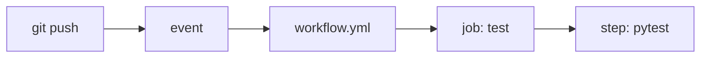

# GitHub Actions란 무엇인가?

> GitHub Actions 101 시리즈 (1/10)

<!-- a-grade-intro:begin -->

**핵심 질문**: *push* 한 번으로 *테스트, 린트, 배포* 가 자동으로 도는 *기반* 을 어디서 시작합니까?

> 자동화는 *손이 아니라 코드* 로 합니다.

<!-- a-grade-intro:end -->

## 이 글에서 배울 것

- *GitHub Actions* 의 정의와 위치
- *Workflow / Job / Step* 의 관계
- 첫 워크플로우 작성 과정
- *왜 GitHub Actions 인가* (vs. Jenkins/CircleCI)
- 흔한 오해 5가지

## 왜 중요한가

CI/CD 는 *팀의 속도와 품질* 을 결정합니다. *GitHub Actions* 는 *코드 옆* 에서 도는 *기본 자동화 엔진* 으로, 별도의 *서버를 운영* 하지 않고 시작할 수 있습니다.

> *PR이 merge 되는 순간* 자동화가 시작돼야 *진짜 CI* 입니다.

## 개념 한눈에 보기



## 핵심 용어 정리

- **Workflow**: 자동화 *전체 단위*, `.github/workflows/*.yml` 한 파일.
- **Event**: 워크플로우를 *시작시키는* 사건 (push, PR 등).
- **Job**: 워크플로우 안의 *실행 단위*, 기본은 *병렬*.
- **Step**: Job 안의 *명령 한 줄* 또는 *Action 호출*.
- **Runner**: Job을 *실행하는 머신* (ubuntu-latest 등).
- **Action**: 재사용 가능한 *Step 단위* (예: `actions/checkout`).

## Before/After

**Before**: PR마다 *로컬에서 직접* 테스트를 돌리고 결과를 *Slack에 복붙* 한다.

**After**: PR을 열면 *자동으로* 테스트가 돌고 *체크 표시* 가 PR에 붙는다.

## 실습: 첫 워크플로우 5단계

### 1단계 — 디렉터리 만들기

```bash
mkdir -p .github/workflows
```

### 2단계 — 워크플로우 파일 작성

```yaml
# .github/workflows/ci.yml
name: ci
on:
  push:
    branches: [main]
  pull_request:

jobs:
  test:
    runs-on: ubuntu-latest
    steps:
      - uses: actions/checkout@v4
      - uses: actions/setup-python@v5
        with:
          python-version: "3.11"
      - run: pip install -r requirements.txt
      - run: pytest -q
```

### 3단계 — push로 트리거 확인

```bash
git add .github/workflows/ci.yml
git commit -m "ci: add first workflow"
git push
```

### 4단계 — Actions 탭에서 결과 확인

```text
Repo > Actions 탭
- 워크플로우 실행 로그가 보입니다.
- 각 step의 출력과 시간이 기록됩니다.
```

### 5단계 — PR 체크로 활용

```text
브랜치 보호 규칙에서 "Require status checks to pass"를 켜면
test 가 실패하면 머지가 막힙니다.
```

## 이 코드에서 주목할 점

- *YAML 한 파일* 이 *전체 자동화* 를 정의합니다.
- *checkout* 은 거의 *모든 워크플로우* 의 첫 step입니다.
- *runs-on* 으로 *실행 환경* 을 선택합니다.

## 자주 하는 실수 5가지

1. **워크플로우 위치 오타.** `.github/workflows/` *정확한 경로* 여야 인식됩니다.
2. **`on:` 누락.** *Trigger 가 없는* 워크플로우는 영원히 실행되지 않습니다.
3. **`actions/checkout` 생략.** *코드가 없으면* 다음 step이 모두 실패합니다.
4. **무거운 step을 *모든 PR* 에 실행.** 시간과 비용 낭비.
5. **secret 을 *YAML에 직접* 적음.** *`${{ secrets.* }}`* 만 사용합니다.

## 실무에서는 이렇게 쓰입니다

성숙한 팀은 *test / lint / typecheck / build / deploy* 를 *각자의 워크플로우* 로 나누고, *재사용 가능한 workflow(reusable workflow)* 로 *조직 전체* 가 동일한 표준을 공유합니다.

## 시니어 엔지니어는 이렇게 생각합니다

- *CI 가 없으면 기능 추가도 없다*.
- *YAML 도 코드*. 리뷰합니다.
- *실행 시간* 은 *비용 + 피드백 속도*.
- *secret* 은 *코드와 절대 섞지 않습니다*.
- *워크플로우* 도 *작게 분해* 합니다.

## 체크리스트

- [ ] `.github/workflows/` 디렉터리가 있다.
- [ ] *push 와 PR* 양쪽에서 트리거된다.
- [ ] *PR 체크* 에 결과가 표시된다.
- [ ] *secret* 은 `secrets.*` 만 사용한다.

## 연습 문제

1. *Hello World* 만 출력하는 워크플로우를 만들어 보세요.
2. *ubuntu / macOS* 두 OS에서 도는 *matrix* 를 추가하세요.
3. *PR 체크* 에서 실패하도록 *고의로* 깨뜨리고 결과를 보세요.

## 정리 및 다음 단계

GitHub Actions는 *코드 옆에서 도는 자동화* 입니다. 다음 글에서는 *Workflow와 Job* 의 구조를 더 깊게 봅니다.

<!-- toc:begin -->
- **GitHub Actions란 무엇인가? (현재 글)**
- Workflow와 Job (예정)
- Trigger 이해하기 (예정)
- Python 테스트 자동화 (예정)
- Lint와 Type Check (예정)
- 빌드 아티팩트 (예정)
- Docker 빌드 (예정)
- 배포 자동화 (예정)
- Secret 관리 (예정)
- 실전 CI/CD 파이프라인 (예정)
<!-- toc:end -->

## 참고 자료

- [GitHub Actions Documentation](https://docs.github.com/actions)
- [Workflow syntax](https://docs.github.com/actions/using-workflows/workflow-syntax-for-github-actions)
- [Awesome Actions](https://github.com/sdras/awesome-actions)
- [Actions Marketplace](https://github.com/marketplace?type=actions)
