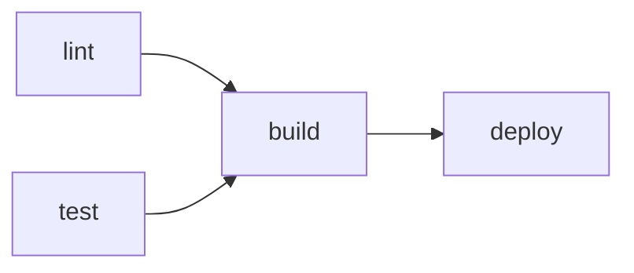

# Workflow와 Job

> GitHub Actions 101 시리즈 (2/10)

<!-- a-grade-intro:begin -->

**핵심 질문**: *test* 가 끝나야 *deploy* 가 도는 흐름을 *어떻게 명시* 합니까?

> *Job 의 그래프* 가 곧 *파이프라인* 입니다.

<!-- a-grade-intro:end -->

## 이 글에서 배울 것

- *Workflow / Job / Step* 의 정확한 관계
- *jobs.<id>.needs* 로 의존성 표현
- *matrix* 로 *여러 환경* 동시 실행
- *outputs* 로 Job 간 *값 전달*
- 흔한 실수 5가지

## 왜 중요한가

CI 가 *직렬* 이면 느리고 *완전 병렬* 이면 *순서가 깨집니다*. *Job 그래프* 를 정확히 그릴 줄 알아야 *빠르고 안전한* 파이프라인이 됩니다.

> *병렬은 속도, 의존성은 안전*.

## 개념 한눈에 보기



## 핵심 용어 정리

- **Workflow**: 한 *YAML 파일* = 한 워크플로우.
- **Job**: 워크플로우 안의 *실행 단위*. 기본 *병렬*.
- **Step**: Job 안의 *명령 / Action* 호출.
- **needs**: Job 간 *의존성* 선언.
- **matrix**: *여러 변수 조합* 으로 Job을 *복제*.
- **outputs**: Job이 *다음 Job* 에 전달하는 값.

## Before/After

**Before**: 모든 step을 *한 Job 에* 몰아넣어 *6분 짜리 직렬* 파이프라인.

**After**: *lint / test / build* 를 *3 개의 병렬 Job* 으로 나누고 *deploy 는 build 의 needs* 로 묶어 *2분 짜리 그래프* 파이프라인.

## 실습: Job 그래프 5단계

### 1단계 — Job 분리

```yaml
jobs:
  lint:
    runs-on: ubuntu-latest
    steps:
      - uses: actions/checkout@v4
      - run: ruff check .

  test:
    runs-on: ubuntu-latest
    steps:
      - uses: actions/checkout@v4
      - run: pytest -q
```

### 2단계 — needs 로 순서 만들기

```yaml
  build:
    runs-on: ubuntu-latest
    needs: [lint, test]
    steps:
      - uses: actions/checkout@v4
      - run: python -m build
```

### 3단계 — matrix 로 다중 환경

```yaml
  test:
    strategy:
      matrix:
        python: ["3.10", "3.11", "3.12"]
    runs-on: ubuntu-latest
    steps:
      - uses: actions/checkout@v4
      - uses: actions/setup-python@v5
        with:
          python-version: ${{ matrix.python }}
      - run: pytest -q
```

### 4단계 — outputs 로 값 전달

```yaml
  build:
    runs-on: ubuntu-latest
    outputs:
      version: ${{ steps.v.outputs.version }}
    steps:
      - id: v
        run: echo "version=1.2.3" >> "$GITHUB_OUTPUT"

  deploy:
    needs: build
    runs-on: ubuntu-latest
    steps:
      - run: echo "deploy ${{ needs.build.outputs.version }}"
```

### 5단계 — 실패 정책: continue-on-error

```yaml
  flaky:
    continue-on-error: true
    runs-on: ubuntu-latest
    steps:
      - run: pytest tests/flaky.py
```

## 이 코드에서 주목할 점

- *needs* 가 곧 *DAG* 입니다.
- *matrix* 는 *조합 폭발* 에 주의합니다.
- *outputs* 는 *문자열* 만 전달됩니다.

## 자주 하는 실수 5가지

1. **모든 step을 *한 Job 에*.** 병렬 기회 상실.
2. **`needs` 누락.** 의존성이 *암묵적* 이 됩니다.
3. **matrix 가 *너무 큼*.** 빌드 비용 폭발.
4. **`outputs` 에 *복잡한 객체*.** 직렬화 문제 발생.
5. **`if:` 조건 누락.** *불필요한 Job* 이 매번 돕니다.

## 실무에서는 이렇게 쓰입니다

성숙한 팀은 *PR* 에서는 *빠른 lint+test* 만, *main push* 에서는 *full matrix + build* 를 도는 *2단 그래프* 를 운영합니다.

## 시니어 엔지니어는 이렇게 생각합니다

- *Job 분해* 가 *피드백 시간* 을 결정한다.
- *matrix* 는 *필요한 만큼만*.
- *needs* 는 *비즈니스 의도* 의 표현.
- *outputs* 는 *간단한 값* 에만.
- *if* 조건으로 *불필요한 실행* 제거.

## 체크리스트

- [ ] *lint / test / build* 가 분리됐다.
- [ ] *needs* 로 의존성이 명시됐다.
- [ ] *matrix* 가 비용을 고려해 설정됐다.
- [ ] *outputs* 는 *문자열* 로만.

## 연습 문제

1. *3-Job 그래프* (lint, test, build)를 만들어 보세요.
2. *Python 3.11/3.12* matrix 를 추가하세요.
3. *build outputs* 의 version 을 *deploy* 가 사용하게 하세요.

## 정리 및 다음 단계

Job 그래프는 *파이프라인의 척추* 입니다. 다음 글에서는 *언제 도는가(Trigger)* 를 다룹니다.

<!-- toc:begin -->
- [GitHub Actions란 무엇인가?](./01-what-is-github-actions.md)
- **Workflow와 Job (현재 글)**
- Trigger 이해하기 (예정)
- Python 테스트 자동화 (예정)
- Lint와 Type Check (예정)
- 빌드 아티팩트 (예정)
- Docker 빌드 (예정)
- 배포 자동화 (예정)
- Secret 관리 (예정)
- 실전 CI/CD 파이프라인 (예정)
<!-- toc:end -->

## 참고 자료

- [Workflow syntax](https://docs.github.com/actions/using-workflows/workflow-syntax-for-github-actions)
- [Using jobs in a workflow](https://docs.github.com/actions/using-jobs/using-jobs-in-a-workflow)
- [Using a matrix for jobs](https://docs.github.com/actions/using-jobs/using-a-matrix-for-your-jobs)
- [Defining outputs for jobs](https://docs.github.com/actions/using-jobs/defining-outputs-for-jobs)
