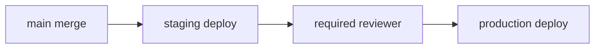

# 배포 자동화

> GitHub Actions 101 시리즈 (8/10)

<!-- a-grade-intro:begin -->

**핵심 질문**: *staging은 자동, production 은 승인 후* 같은 *세분화된 배포 정책* 을 어떻게 코드로 표현합니까?

> *배포는 빈번하고 작게*, *위험은 게이트로* 통제합니다.

<!-- a-grade-intro:end -->

## 이 글에서 배울 것

- *GitHub Environments* 와 *required reviewers*
- *OIDC* 로 *AWS/GCP* 단기 자격증명
- *staging → production* 승격 패턴
- *rollback* 워크플로우
- 흔한 함정 5가지

## 왜 중요한가

*수동 배포* 는 *주말 출근* 의 원인입니다. 자동화는 *속도* 만이 아니라 *재현성* 을 줍니다.

> *배포 절차서가 인간의 머릿속* 에만 있으면 *언젠가 사고* 가 납니다.

## 개념 한눈에 보기



## 핵심 용어 정리

- **Environment**: GitHub의 *배포 환경* (staging, production).
- **Required reviewers**: 환경별 *승인자*.
- **OIDC**: 클라우드와의 *단기 토큰* 신뢰.
- **Promotion**: staging → production *승격*.
- **Rollback**: *직전 배포로 복귀*.

## Before/After

**Before**: 누군가 *로컬에서* `kubectl apply` 한다. 무엇이 배포됐는지 *기록 없음*.

**After**: PR 머지 → *자동 staging 배포* → *승인* → *production* . 모두 *Actions 로그* 로 추적.

## 실습: 배포 자동화 5단계

### 1단계 — Environment 정의 (UI)

```text
Repo > Settings > Environments
- staging: protection rules 없음
- production: required reviewers 1명, wait timer 5분
```

### 2단계 — staging 자동 배포

```yaml
deploy-staging:
  needs: build
  environment: staging
  runs-on: ubuntu-latest
  steps:
    - run: kubectl apply -f k8s/staging/
```

### 3단계 — production 승인 게이트

```yaml
deploy-production:
  needs: deploy-staging
  environment:
    name: production
    url: https://app.example.com
  runs-on: ubuntu-latest
  steps:
    - run: kubectl apply -f k8s/production/
```

### 4단계 — OIDC 로 AWS 단기 자격증명

```yaml
permissions:
  id-token: write
  contents: read
steps:
  - uses: aws-actions/configure-aws-credentials@v4
    with:
      role-to-assume: arn:aws:iam::123456789012:role/gha-deploy
      aws-region: ap-northeast-2
  - run: aws s3 sync ./build s3://my-bucket
```

### 5단계 — Rollback 워크플로우

```yaml
on:
  workflow_dispatch:
    inputs:
      sha:
        description: "git sha to roll back to"
        required: true
jobs:
  rollback:
    environment: production
    runs-on: ubuntu-latest
    steps:
      - run: ./deploy.sh ${{ inputs.sha }}
```

## 이 코드에서 주목할 점

- *environment* 한 줄로 *승인 게이트* 가 붙습니다.
- *OIDC* 는 *장기 키 폐기* 의 핵심.
- *rollback* 도 *워크플로우로 코드화*.

## 자주 하는 실수 5가지

1. **`production` 에 *required reviewers 없음*.** 누구나 배포.
2. **장기 *AWS 키* 를 secret 에 보관.** 유출 위험.
3. **rollback 절차가 *문서로만*.** 새벽엔 못 찾음.
4. **staging 과 production 이 *다른 매니페스트*.** 표류 발생.
5. **배포 결과를 *Slack/Issue 에 안 알림*.** 기록 누락.

## 실무에서는 이렇게 쓰입니다

성숙한 팀은 *PR 머지* → *카나리* → *블루/그린* → *전체 롤아웃* 을 *한 워크플로우* 로 묶고, *Datadog/Grafana* 메트릭을 *자동 검증* 합니다.

## 시니어 엔지니어는 이렇게 생각합니다

- *배포는 코드*, *수동 명령은 흔적이 없다*.
- *production* 은 *항상 게이트*.
- *단기 자격증명* 이 표준.
- *rollback 도 워크플로우*.
- *staging == production* 동일 매니페스트.

## 체크리스트

- [ ] *Environments* 가 정의됐다.
- [ ] *production* 에 *required reviewers* 가 있다.
- [ ] *OIDC* 로 클라우드에 인증한다.
- [ ] *rollback* 워크플로우가 있다.

## 연습 문제

1. *staging* 환경을 정의하고 *main push* 시 자동 배포되게 하세요.
2. *production* 환경에 *승인 게이트* 를 추가하세요.
3. *workflow_dispatch* 로 *rollback* 워크플로우를 만들어 보세요.

## 정리 및 다음 단계

배포 자동화는 *변경 비용* 을 결정합니다. 다음 글에서는 *Secret 관리* 를 다룹니다.

<!-- toc:begin -->
- [GitHub Actions란 무엇인가?](./01-what-is-github-actions.md)
- [Workflow와 Job](./02-workflow-and-job.md)
- [Trigger 이해하기](./03-triggers.md)
- [Python 테스트 자동화](./04-python-test-automation.md)
- [Lint와 Type Check](./05-lint-and-typecheck.md)
- [빌드 아티팩트](./06-build-artifact.md)
- [Docker 빌드](./07-docker-build.md)
- **배포 자동화 (현재 글)**
- Secret 관리 (예정)
- 실전 CI/CD 파이프라인 (예정)
<!-- toc:end -->

## 참고 자료

- [Using environments for deployment](https://docs.github.com/actions/deployment/targeting-different-environments/using-environments-for-deployment)
- [Configuring OpenID Connect in cloud providers](https://docs.github.com/actions/deployment/security-hardening-your-deployments/configuring-openid-connect-in-amazon-web-services)
- [aws-actions/configure-aws-credentials](https://github.com/aws-actions/configure-aws-credentials)
- [google-github-actions/auth](https://github.com/google-github-actions/auth)
