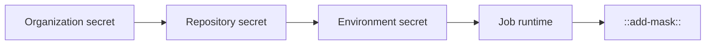

# Secret 관리

> GitHub Actions 101 시리즈 (9/10)

<!-- a-grade-intro:begin -->

**핵심 질문**: *비밀번호, API 키, 인증서* 같은 *민감한 값* 을 워크플로우에서 *어떻게 안전하게* 다룹니까?

> *Secret 은 코드가 아니라 *런타임 자원* 입니다. 저장, 노출, 회전을 분리해 설계하세요.*

<!-- a-grade-intro:end -->

## 이 글에서 배울 것

- *Repository / Environment / Organization* secret 의 차이
- *GITHUB_TOKEN* 과 *최소 권한 (`permissions:`)* 원칙
- *OIDC* 로 *장기 키 폐기* 하는 흐름
- *`::add-mask::`* 로 동적 값 마스킹
- 흔한 함정 5가지

## 왜 중요한가

*Secret 유출* 은 *복구 불가능* 합니다. 한 번 공개 로그에 찍히면 *영원히* 인터넷에 남습니다.

> *Secret 의 가장 큰 위험은 *해커가 아니라 우리* 입니다. 무심코 echo 하는 순간 끝납니다.*

## 개념 한눈에 보기



## 핵심 용어 정리

- **Repository secret**: 한 *저장소* 전용.
- **Environment secret**: *환경별* 분리 (staging, production).
- **Organization secret**: 여러 저장소 *공유*.
- **GITHUB_TOKEN**: 워크플로우 실행마다 *자동 발급* 되는 단기 토큰.
- **OIDC**: 클라우드와 *키 없는 신뢰*.

## Before/After

**Before**: `.env` 파일을 *커밋* 하거나 `AWS_KEY` 를 *Slack DM* 으로 공유한다. 회전은 *수동, 1년에 한 번*.

**After**: secret 은 *GitHub UI* 에서만 관리. *OIDC* 로 *장기 키 0개*. *분기마다 자동 회전 알림*.

## 실습: Secret 관리 5단계

### 1단계 — Repository secret 등록

```bash
# UI 대신 gh CLI 로 등록
gh secret set NPM_TOKEN --body "npm_xxx"
gh secret set --env production DB_PASSWORD --body "***"
```

### 2단계 — 워크플로우에서 사용

```yaml
jobs:
  publish:
    runs-on: ubuntu-latest
    environment: production
    steps:
      - run: npm publish
        env:
          NODE_AUTH_TOKEN: ${{ secrets.NPM_TOKEN }}
```

### 3단계 — `GITHUB_TOKEN` 최소 권한

```yaml
permissions:
  contents: read
  pull-requests: write
  # 나머지는 기본값 'none'
```

### 4단계 — 동적 값 마스킹

```yaml
- name: Mask runtime token
  run: |
    TOKEN=$(curl -s https://auth.example.com/token | jq -r .token)
    echo "::add-mask::$TOKEN"
    echo "GENERATED_TOKEN=$TOKEN" >> "$GITHUB_ENV"
```

### 5단계 — Dependabot secret + 회전

```text
Settings > Secrets > Dependabot
- 의존성 업데이트 PR 도 secret 접근 가능
- 분기 1회 회전 캘린더 등록 (gh secret set 으로 갱신)
```

## 이 코드에서 주목할 점

- *secret 은 환경 변수* 로만 노출, *명령행 인자* 금지.
- *`permissions:`* 는 *처음에 deny-all* 로 두고 필요한 것만 허용.
- *`::add-mask::`* 로 *런타임 생성 값* 도 보호.

## 자주 하는 실수 5가지

1. **`echo $SECRET` 으로 디버깅.** 로그에 *영구 박제*.
2. **PR 에서 `pull_request_target` + secret 접근 허용.** *임의 코드 실행* 위험.
3. **`GITHUB_TOKEN` 을 *write-all* 로 둔다.** 사고 시 *전체 영향*.
4. **secret 을 *fork PR* 에 노출.** 외부 기여자가 탈취.
5. **회전 일정 없음.** 떠난 직원의 키가 *수년간 살아 있음*.

## 실무에서는 이렇게 쓰입니다

성숙한 팀은 *HashiCorp Vault* 나 *Doppler*, *1Password Secrets Automation* 으로 secret 의 *단일 출처* 를 관리하고, GitHub Actions 는 *OIDC* 로 *짧게 빌려* 옵니다.

## 시니어 엔지니어는 이렇게 생각합니다

- *Secret 이 코드에 있으면 이미 유출된 것*.
- *최소 권한* 이 기본값.
- *장기 키는 부채*, *OIDC 가 자산*.
- *회전은 캘린더가 아니라 자동화*.
- *fork PR 에는 secret 을 *절대* 주지 않는다*.

## 체크리스트

- [ ] *Repository / Environment / Organization* 구분이 명확하다.
- [ ] *`permissions:`* 가 *최소 권한* 으로 설정됐다.
- [ ] *OIDC* 로 클라우드에 인증한다.
- [ ] *회전 일정* 이 캘린더에 있다.

## 연습 문제

1. *production* 환경에 *DB_PASSWORD* secret 을 추가하고 워크플로우에서 안전하게 사용하세요.
2. 워크플로우의 *`permissions:`* 를 *deny-all* 에서 *필요한 권한만* 허용하도록 바꿔 보세요.
3. *런타임 생성 토큰* 을 `::add-mask::` 로 마스킹하는 단계를 추가해 보세요.

## 정리 및 다음 단계

Secret 관리는 *보안 사고의 90%* 를 막아 줍니다. 다음 글에서는 *지금까지의 모든 내용을 묶는 실전 CI/CD 파이프라인* 을 다룹니다.

<!-- toc:begin -->
- [GitHub Actions란 무엇인가?](./01-what-is-github-actions.md)
- [Workflow와 Job](./02-workflow-and-job.md)
- [Trigger 이해하기](./03-triggers.md)
- [Python 테스트 자동화](./04-python-test-automation.md)
- [Lint와 Type Check](./05-lint-and-typecheck.md)
- [빌드 아티팩트](./06-build-artifact.md)
- [Docker 빌드](./07-docker-build.md)
- [배포 자동화](./08-deploy-automation.md)
- **Secret 관리 (현재 글)**
- 실전 CI/CD 파이프라인 (예정)
<!-- toc:end -->

## 참고 자료

- [Using secrets in GitHub Actions](https://docs.github.com/actions/security-guides/using-secrets-in-github-actions)
- [Automatic token authentication](https://docs.github.com/actions/security-guides/automatic-token-authentication)
- [Security hardening for GitHub Actions](https://docs.github.com/actions/security-guides/security-hardening-for-github-actions)
- [Workflow commands - add-mask](https://docs.github.com/actions/using-workflows/workflow-commands-for-github-actions#masking-a-value-in-a-log)
