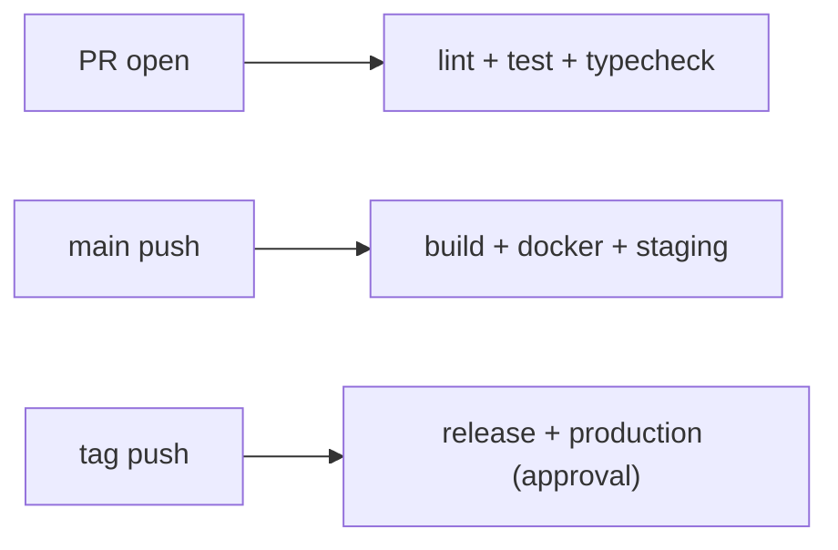

# 실전 CI/CD 파이프라인

> GitHub Actions 101 시리즈 (10/10)

<!-- a-grade-intro:begin -->

**핵심 질문**: 지금까지 배운 *trigger, test, lint, artifact, docker, deploy, secret* 을 *하나의 파이프라인* 으로 어떻게 묶습니까?

> *좋은 파이프라인은 *작은 단계의 합* 입니다. 각 단계는 단순하고, 합성은 명시적이어야 합니다.*

<!-- a-grade-intro:end -->

## 이 글에서 배울 것

- *PR / main / tag* 단계별 *책임 분리*
- *reusable workflow* (`workflow_call`) 로 *중복 제거*
- *composite action* 으로 단계 묶기
- *팀 표준 템플릿* 저장소 패턴
- 흔한 함정 5가지

## 왜 중요한가

지금까지 배운 부품을 *한 곳* 에 모아야 *DORA 4지표* (배포 빈도, 리드 타임, 변경 실패율, 복구 시간) 가 개선됩니다.

> *조각으로는 빠르지만, 합쳐야 *지속적으로 빠릅니다*.*

## 개념 한눈에 보기



## 핵심 용어 정리

- **Reusable workflow**: `workflow_call` 로 호출되는 *공유 워크플로우*.
- **Composite action**: 여러 step 을 하나로 묶은 *재사용 단계*.
- **Template repo**: 팀이 *시작점* 으로 쓰는 표준 저장소.
- **DORA metrics**: 배포 성과 4지표.
- **Promotion**: staging -> production 승격.

## Before/After

**Before**: 저장소마다 *비슷하지만 다른* 워크플로우. 한 군데 고치면 *나머지가 표류*.

**After**: *공통 reusable workflow* 1개. 저장소는 *얇은 호출자* 만 둔다. *수정 1회 -> 전사 반영*.

## 실습: 실전 파이프라인 5단계

### 1단계 — Reusable workflow 정의

```yaml
# .github/workflows/_ci.yml (org/template-repo)
on:
  workflow_call:
    inputs:
      python-version:
        type: string
        default: "3.12"
jobs:
  ci:
    runs-on: ubuntu-latest
    steps:
      - uses: actions/checkout@v4
      - uses: actions/setup-python@v5
        with:
          python-version: ${{ inputs.python-version }}
      - run: pip install -e ".[dev]"
      - run: ruff check . && mypy . && pytest -q
```

### 2단계 — PR 단계 (lint + test)

```yaml
# .github/workflows/pr.yml
on:
  pull_request:
jobs:
  ci:
    uses: org/template-repo/.github/workflows/_ci.yml@v1
    with:
      python-version: "3.12"
```

### 3단계 — main 단계 (build + docker + staging)

```yaml
on:
  push:
    branches: [main]
jobs:
  ci:
    uses: org/template-repo/.github/workflows/_ci.yml@v1
  docker:
    needs: ci
    uses: org/template-repo/.github/workflows/_docker.yml@v1
  deploy-staging:
    needs: docker
    environment: staging
    runs-on: ubuntu-latest
    steps:
      - run: kubectl apply -f k8s/staging/
```

### 4단계 — tag 단계 (release + production)

```yaml
on:
  push:
    tags: ["v*"]
jobs:
  release:
    runs-on: ubuntu-latest
    steps:
      - uses: softprops/action-gh-release@v2
  deploy-prod:
    needs: release
    environment: production  # required reviewers ON
    runs-on: ubuntu-latest
    steps:
      - run: kubectl apply -f k8s/production/
```

### 5단계 — Composite action 으로 단계 묶기

```yaml
# .github/actions/setup-app/action.yml
runs:
  using: composite
  steps:
    - uses: actions/setup-python@v5
      with: { python-version: "3.12" }
    - run: pip install -e ".[dev]"
      shell: bash
```

## 이 코드에서 주목할 점

- *PR* 은 *피드백*, *main* 은 *배포*, *tag* 는 *릴리스*.
- *reusable workflow* 의 *버전 핀* (`@v1`) 으로 *깨짐 방지*.
- *production environment* 가 *마지막 게이트*.

## 자주 하는 실수 5가지

1. **PR 에서 *전체 e2e* 실행.** 피드백이 30분 밖.
2. **main 에서 *production 직배포*.** 카나리/staging 생략.
3. **reusable workflow 를 `@main` 으로 호출.** 어느 날 *깨짐*.
4. **tag 없이 *production* 에 배포.** 무엇이 배포됐는지 *추적 불가*.
5. **composite action 의 *입력 검증 없음*.** 잘못된 값으로 *조용히 통과*.

## 실무에서는 이렇게 쓰입니다

플랫폼 팀은 *org-wide template repo* 를 만들어 모든 서비스가 *동일한 CI/CD 골격* 을 쓰게 하고, *DORA 메트릭* 은 *Sleuth/LinearB* 로 자동 수집합니다.

## 시니어 엔지니어는 이렇게 생각합니다

- *trigger 가 책임을 결정한다*.
- *공통은 reusable, 차이는 caller*.
- *production 게이트는 절대 양보하지 않는다*.
- *템플릿은 *코드*, 위키가 아니다*.
- *DORA* 가 좋아질 방향으로 설계한다.

## 체크리스트

- [ ] *PR / main / tag* 단계가 분리됐다.
- [ ] 공통 단계는 *reusable workflow* 로 추출됐다.
- [ ] *production* 에 *required reviewers* 가 있다.
- [ ] reusable workflow 가 *버전 핀* 으로 호출된다.

## 연습 문제

1. *PR 단계* 워크플로우를 작성해 *lint + test + typecheck* 만 돌리세요.
2. *reusable workflow* 를 만들어 두 저장소에서 동일한 CI 를 쓰게 하세요.
3. *tag push* 시 *production 배포* 에 *승인 게이트* 가 걸리는 워크플로우를 작성하세요.

## 정리 및 다음 단계

여기까지 따라왔다면 *현업 CI/CD 의 95%* 를 다룰 수 있습니다. 다음은 *Docker 101*, *Kubernetes 101*, *SRE 101* 으로 *런타임* 과 *운영* 을 깊이 배우세요.

<!-- toc:begin -->
- [GitHub Actions란 무엇인가?](./01-what-is-github-actions.md)
- [Workflow와 Job](./02-workflow-and-job.md)
- [Trigger 이해하기](./03-triggers.md)
- [Python 테스트 자동화](./04-python-test-automation.md)
- [Lint와 Type Check](./05-lint-and-typecheck.md)
- [빌드 아티팩트](./06-build-artifact.md)
- [Docker 빌드](./07-docker-build.md)
- [배포 자동화](./08-deploy-automation.md)
- [Secret 관리](./09-secret-management.md)
- **실전 CI/CD 파이프라인 (현재 글)**
<!-- toc:end -->

## 참고 자료

- [Reusing workflows](https://docs.github.com/actions/using-workflows/reusing-workflows)
- [Creating a composite action](https://docs.github.com/actions/creating-actions/creating-a-composite-action)
- [DORA - Accelerate State of DevOps](https://dora.dev/)
- [Creating a template repository](https://docs.github.com/repositories/creating-and-managing-repositories/creating-a-template-repository)
