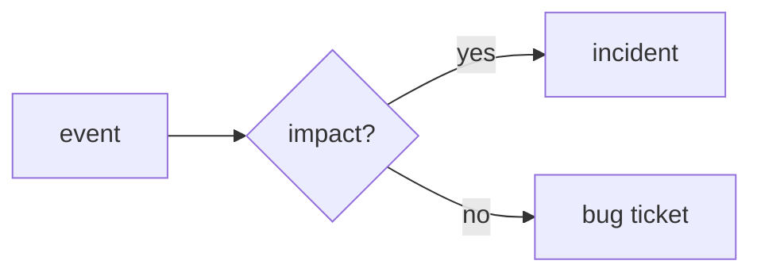

# Incident란 무엇인가?

> Incident Response 101 시리즈 (1/10)


## 이 글에서 다룰 문제

*기준* 이 *없으면* *대응* 이 *늦거나* *과합니다*.

## 전체 흐름


## Before/After

**Before**: *모든 알림* 을 *incident* 처럼 처리.

**After**: *영향* 으로 *분류* 후 처리.

## Incident 판정

### 1단계 — 영향 입력

```python
def impact(users, minutes):
    return {"users": users, "minutes": minutes}
```

### 2단계 — 임계값

```python
def is_incident(i, user_th=100, min_th=5):
    return i["users"] >= user_th or i["minutes"] >= min_th
```

### 3단계 — 분류

```python
def classify(i):
    return "incident" if is_incident(i) else "bug"
```

### 4단계 — 알림

```python
def page(i):
    return classify(i) == "incident"
```

### 5단계 — 채널 결정

```python
def channel(kind):
    return "#inc" if kind == "incident" else "#bugs"
```

## 이 코드에서 주목할 점

- *임계값* 은 *합의* 의 결과.
- *분류* 가 *경로* 결정.
- *코드* 로 *주관* 제거.

## 자주 하는 실수 5가지

1. ***alert* 와 *incident* 혼동.**
2. ***임계값* 부재.**
3. ***영향* 추정 *주관* 적.**
4. ***on-call* *학습 자료* 부족.**
5. ***기록* 없이 *복귀*.**

## 실무에서는 이렇게 쓰입니다

*PagerDuty* 의 *severity rule* 이 *분류* 를 *자동* 화 합니다.

## 체크리스트

- [ ] *임계값* 합의.
- [ ] *분류 코드*.
- [ ] *알림 라우팅*.
- [ ] *학습 자료*.

## 정리 및 다음 단계

다음 글은 *Severity 분류* 입니다.

<!-- toc:begin -->
- **Incident란 무엇인가? (현재 글)**
- Severity 분류 (예정)
- 초기 대응 (예정)
- Communication (예정)
- Timeline 작성 (예정)
- Root Cause Analysis (예정)
- Mitigation과 Resolution (예정)
- Postmortem (예정)
- 재발 방지 (예정)
- Incident Runbook 만들기 (예정)
<!-- toc:end -->

## 참고 자료

- [Incident Response - PagerDuty](https://response.pagerduty.com/)
- [Managing Incidents - Google SRE Book](https://sre.google/sre-book/managing-incidents/)
- [Atlassian Incident Handbook](https://www.atlassian.com/incident-management/handbook)
- [Incident Definition - ITIL](https://wiki.en.it-processmaps.com/index.php/Incident_Management)
