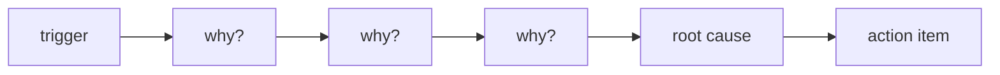

# Root Cause Analysis

> Incident Response 101 시리즈 (6/10)


## 이 글에서 다룰 문제

*트리거* 만 고치면 *다음 사건* 에서 *같은 원인* 이 *다시* 폭발합니다.

## 전체 흐름


## Before/After

**Before**: *트리거* 를 *근본 원인* 으로 오인.

**After**: *5 Whys* 로 *조건* 까지 추적.

## 미니 RCA 워크북

### 1단계 — 5 Whys

```python
def five_whys(start):
    chain = [start]
    for _ in range(5):
        chain.append(input(f"why? {chain[-1]} -> "))
    return chain
```

### 2단계 — 기여 요인 수집

```python
def factors():
    return {"people": [], "process": [], "tooling": [], "system": []}
```

### 3단계 — 트리거 vs 근본 원인

```python
def classify(item, evidence):
    return "root" if evidence >= 3 else "trigger"
```

### 4단계 — 액션 매핑

```python
def actions(root):
    return [{"root": root, "action": f"fix {root}"}]
```

### 5단계 — 검증 가능 여부

```python
def is_actionable(action):
    return action["action"].startswith(("add ", "fix ", "remove ", "test "))
```

## 이 코드에서 주목할 점

- *체인* 으로 *깊이* 보존.
- *기여 요인* 은 *4축*.
- *액션* 은 *동사* 로 시작.

## 자주 하는 실수 5가지

1. ***첫 답* 에서 멈춤.**
2. ***사람* 을 *근본 원인* 으로.**
3. ***트리거* 만 고치고 종료.**
4. ***액션* 이 *추상* 적.**
5. ***검증* 불가능한 액션.**

## 실무에서는 이렇게 쓰입니다

*Postmortem doc* 에 *5 Whys* 섹션과 *Contributing Factors* 표를 *템플릿* 으로 내장합니다.

## 체크리스트

- [ ] *템플릿 섹션*.
- [ ] *기여 요인 4축*.
- [ ] *액션 동사* 규칙.
- [ ] *검증 기준*.

## 정리 및 다음 단계

다음 글은 *Mitigation과 Resolution* 입니다.

<!-- toc:begin -->
- [Incident란 무엇인가?](./01-what-is-incident.md)
- [Severity 분류](./02-severity.md)
- [초기 대응](./03-initial-response.md)
- [Communication](./04-communication.md)
- [Timeline 작성](./05-timeline.md)
- **Root Cause Analysis (현재 글)**
- Mitigation과 Resolution (예정)
- Postmortem (예정)
- 재발 방지 (예정)
- Incident Runbook 만들기 (예정)
<!-- toc:end -->

## 참고 자료

- [Five Whys - Google SRE Workbook](https://sre.google/workbook/postmortem-culture/)
- [Root Cause Analysis - PagerDuty](https://response.pagerduty.com/after/root_cause_analysis/)
- [Incident RCA - Atlassian](https://www.atlassian.com/incident-management/postmortem/templates)
- [Beyond Root Cause - Increment](https://increment.com/postmortems/beyond-root-cause/)
