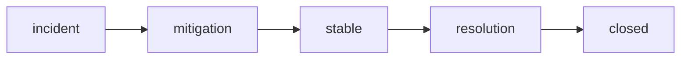

# Mitigation과 Resolution

> Incident Response 101 시리즈 (7/10)

<!-- a-grade-intro:begin -->

**핵심 질문**: *불* 을 *끄는 것* 과 *원인* 을 *제거* 하는 것은 *같은 일* 일까요?

> *Mitigation* 은 *피해 차단*, *Resolution* 은 *원인 제거* 입니다. *순서* 가 다르고 *책임자* 도 다릅니다.

<!-- a-grade-intro:end -->

## 이 글에서 배울 것

- *Mitigation vs Resolution*
- *롤백* 전략
- *스케일 아웃*
- *스로틀* 과 *킬 스위치*
- *복구 검증*

## 왜 중요한가

*Mitigation* 을 *Resolution* 으로 착각하면 *같은 사건* 이 *밤에 다시* 터집니다.

## 개념 한눈에 보기



## 핵심 용어 정리

- **mitigation**: *피해* 를 *차단*.
- **resolution**: *원인* 을 *제거*.
- **rollback**: *이전 버전* 으로 되돌림.
- **kill switch**: *기능* 을 *즉시 끔*.
- **throttle**: *유입* 을 *제한*.

## Before/After

**Before**: *완전히 고친 후* 공지.

**After**: *피해 차단* 즉시 공지, *원인 제거* 별도 공지.

## 실습: 미니 Mitigation 키트

### 1단계 — 롤백

```python
def rollback(version):
    return {"action": "rollback", "to": version}
```

### 2단계 — 스케일 아웃

```python
def scale_out(service, replicas):
    return {"service": service, "replicas": replicas}
```

### 3단계 — 스로틀

```python
def throttle(endpoint, rps):
    return {"endpoint": endpoint, "rps": rps}
```

### 4단계 — 킬 스위치

```python
FLAGS = {}

def kill(feature):
    FLAGS[feature] = False
    return FLAGS[feature]
```

### 5단계 — 복구 검증

```python
def verify(metrics):
    return metrics.get("err_ratio", 1) < 0.01
```

## 이 코드에서 주목할 점

- *Mitigation* 은 *작은* 동작.
- *킬 스위치* 는 *플래그* 한 줄.
- *검증* 은 *수치* 로.

## 자주 하는 실수 5가지

1. ***롤백* 없이 *전진* 만.**
2. ***킬 스위치* 미준비.**
3. ***Mitigation* 을 *Resolution* 으로 발표.**
4. ***검증* 없이 *closed*.**
5. ***스로틀* 해제 *잊음*.**

## 실무에서는 이렇게 쓰입니다

*Feature flag* 시스템과 *autoscaler* 를 *runbook* 명령어 한 줄로 묶어 *2분* 안에 *Mitigation* 합니다.

## 시니어 엔지니어는 이렇게 생각합니다

- *Mitigation* 이 *우선*.
- *Resolution* 은 *근무 시간* 에.
- *킬 스위치* 는 *모든 기능* 에.
- *검증* 은 *정량적*.
- *해제* 도 *이벤트*.

## 체크리스트

- [ ] *롤백 절차*.
- [ ] *킬 스위치 목록*.
- [ ] *스로틀 정책*.
- [ ] *복구 검증 지표*.

## 연습 문제

1. *mitigation* 의 의미 한 줄로.
2. *resolution* 의 의미 한 줄로.
3. *kill switch* 의 의미 한 줄로.

## 정리 및 다음 단계

다음 글은 *Postmortem* 입니다.

<!-- toc:begin -->
- [Incident란 무엇인가?](./01-what-is-incident.md)
- [Severity 분류](./02-severity.md)
- [초기 대응](./03-initial-response.md)
- [Communication](./04-communication.md)
- [Timeline 작성](./05-timeline.md)
- [Root Cause Analysis](./06-root-cause-analysis.md)
- **Mitigation과 Resolution (현재 글)**
- Postmortem (예정)
- 재발 방지 (예정)
- Incident Runbook 만들기 (예정)
<!-- toc:end -->

## 참고 자료

- [Mitigation vs Resolution - PagerDuty](https://response.pagerduty.com/during/mitigation/)
- [Rollback Strategies - Google SRE Book](https://sre.google/sre-book/release-engineering/)
- [Feature Flags - Martin Fowler](https://martinfowler.com/articles/feature-toggles.html)
- [Throttling and Backpressure - Increment](https://increment.com/reliability/throttling/)
