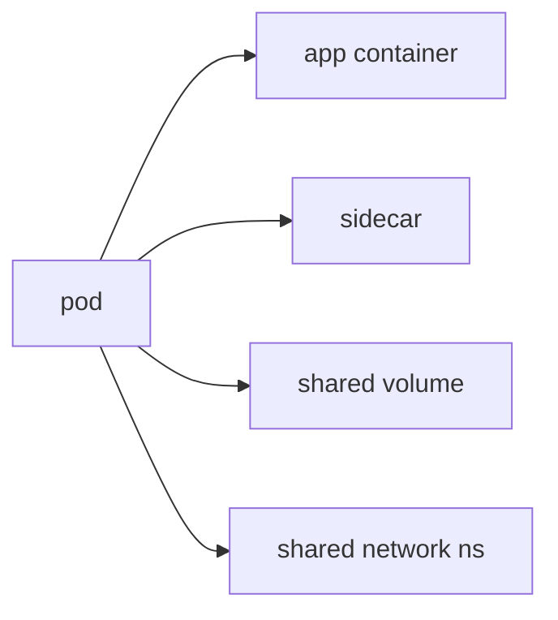

# Pod

> Kubernetes 101 시리즈 (2/10)

<!-- a-grade-intro:begin -->

**핵심 질문**: 왜 *컨테이너* 가 아니라 *Pod* 가 *기본 단위* 일까요?

> *Pod* 는 *함께 살고 함께 죽는* *컨테이너 묶음* 으로, *Kubernetes* 의 *최소 배포 단위* 입니다.

<!-- a-grade-intro:end -->

## 이 글에서 배울 것

- *Pod* 의 정의
- *컨테이너* 와의 차이
- *사이드카* 패턴
- *라이프사이클* 단계
- *직접 만들지 않는* 이유

## 왜 중요한가

*모든 워크로드* 는 결국 *Pod* 위에서 돕니다. *Pod 의 모델* 을 이해해야 *상위 객체* 도 의미가 살아납니다.

## 개념 한눈에 보기



## 핵심 용어 정리

- **pod**: *컨테이너 1개 이상* 의 *공유 묶음*.
- **sidecar**: *주 컨테이너* 를 *돕는* 부속 컨테이너.
- **init container**: *시작 전* 한 번 도는 컨테이너.
- **lifecycle**: *Pending → Running → Succeeded/Failed*.
- **ephemeral**: *Pod 는 죽으면 끝*, 다시 살리지 않음.

## Before/After

**Before**: *컨테이너 단독* 으로 *공유 자원* 처리 어려움.

**After**: *Pod* 안에서 *네트워크/볼륨* 자연스럽게 *공유*.

## 실습: Pod YAML 다루기

### 1단계 — Pod manifest

```python
"""
apiVersion: v1
kind: Pod
metadata:
  name: web
spec:
  containers:
  - name: app
    image: nginx:1.25
    ports: [{containerPort: 80}]
"""
```

### 2단계 — apply

```python
import subprocess

def apply(path):
    subprocess.run(["kubectl", "apply", "-f", path], check=True)
```

### 3단계 — 상태 조회

```python
def describe(name):
    res = subprocess.run(
        ["kubectl", "describe", "pod", name],
        capture_output=True, text=True, check=True,
    )
    return res.stdout
```

### 4단계 — 로그

```python
def logs(name):
    res = subprocess.run(
        ["kubectl", "logs", name],
        capture_output=True, text=True, check=True,
    )
    return res.stdout
```

### 5단계 — 삭제

```python
def delete(name):
    subprocess.run(["kubectl", "delete", "pod", name], check=True)
```

## 이 코드에서 주목할 점

- *Pod* 이름은 *고유*.
- *containers* 는 *배열* (둘 이상 가능).
- *Pod 만 단독* 으로 만드는 건 *학습용*.

## 자주 하는 실수 5가지

1. ***Pod = 컨테이너 1개* 라고 단정.**
2. ***Pod 직접* 생성 후 *재시작 기대*.**
3. ***IP* 가 *고정* 이라고 가정.**
4. ***볼륨 공유* 효과를 *컨테이너 분리* 후 잃음.**
5. ***로그* 를 *컨테이너 안* 에서만 본다.**

## 실무에서는 이렇게 쓰입니다

*로그 수집기*, *Envoy 프록시*, *시크릿 동기화기* 같은 *사이드카* 가 *주 컨테이너* 옆에 *함께* 배치됩니다.

## 시니어 엔지니어는 이렇게 생각합니다

- *Pod 은 휘발*. 살리지 않는다.
- *재시작* 은 *상위 객체* 의 책임.
- *사이드카* 는 *결합 수단* 이자 *결합 부담*.
- *Pod IP* 는 *임시*.
- *학습* 외에는 *Pod 직접* 생성 금지.

## 체크리스트

- [ ] *Pod* 직접 생성은 *디버깅* 한정.
- [ ] *사이드카* 의 *역할* 명확.
- [ ] *로그* 는 *stdout*.
- [ ] *Pod 라이프사이클* 추적.

## 연습 문제

1. *Pod* 와 *컨테이너* 의 *차이* 한 줄로.
2. *사이드카* 의 *대표 사례* 한 가지.
3. *Pod* 를 *직접 만들지 말라* 는 *이유* 한 줄로.

## 정리 및 다음 단계

*Pod* 가 잡혔으면 *재시작* 과 *롤링 업데이트* 를 책임지는 *Deployment* 가 다음입니다.

<!-- toc:begin -->
- [Kubernetes란 무엇인가?](./01-what-is-kubernetes.md)
- **Pod (현재 글)**
- Deployment (예정)
- Service (예정)
- Ingress (예정)
- ConfigMap과 Secret (예정)
- Volume (예정)
- HPA (예정)
- Helm (예정)
- 운영 관점의 Kubernetes (예정)
<!-- toc:end -->

## 참고 자료

- [Pods (Kubernetes)](https://kubernetes.io/docs/concepts/workloads/pods/)
- [Pod lifecycle](https://kubernetes.io/docs/concepts/workloads/pods/pod-lifecycle/)
- [Init containers](https://kubernetes.io/docs/concepts/workloads/pods/init-containers/)
- [Sidecar pattern](https://kubernetes.io/blog/2023/08/25/native-sidecar-containers/)
