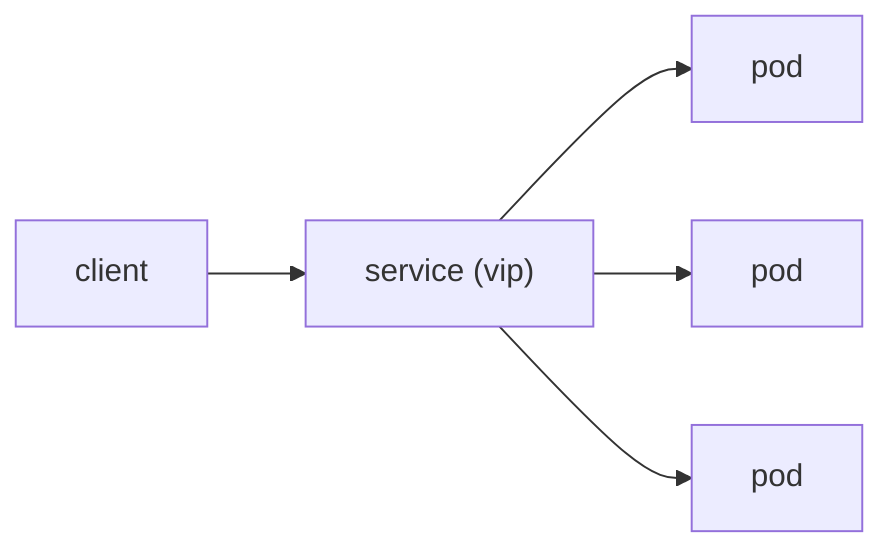

# Service

> Kubernetes 101 시리즈 (4/10)

<!-- a-grade-intro:begin -->

**핵심 질문**: *Pod IP* 가 *계속 바뀌는데* *어떻게 안정적* 으로 *부를까요*?

> *Service* 는 *셀렉터로 묶인 Pod* 에 *안정 가상 IP* 와 *DNS 이름* 을 부여합니다.

<!-- a-grade-intro:end -->

## 이 글에서 배울 것

- *Service* 가 푸는 문제
- *ClusterIP / NodePort / LoadBalancer*
- *selector* 매칭
- *클러스터 내부 DNS*
- *Headless Service*

## 왜 중요한가

*마이크로서비스* 가 서로를 *이름* 으로 호출하려면 *Service* 가 필수입니다.

## 개념 한눈에 보기



## 핵심 용어 정리

- **ClusterIP**: *클러스터 내부* 가상 IP (기본).
- **NodePort**: *각 노드의 포트* 노출.
- **LoadBalancer**: *클라우드 LB* 자동 생성.
- **selector**: *labels* 로 *Pod* 묶기.
- **DNS name**: `svc.namespace.svc.cluster.local`.

## Before/After

**Before**: *Pod IP* 직접 호출 → *재시작 시 연결 깨짐*.

**After**: *Service 이름* 으로 *DNS* 통해 *안정 호출*.

## 실습: 서비스 노출

### 1단계 — Service manifest

```python
"""
apiVersion: v1
kind: Service
metadata: {name: web}
spec:
  selector: {app: web}
  ports:
  - port: 80
    targetPort: 80
"""
```

### 2단계 — apply + 조회

```python
import subprocess

def apply_and_get(path):
    subprocess.run(["kubectl", "apply", "-f", path], check=True)
    return subprocess.run(
        ["kubectl", "get", "svc", "web"],
        capture_output=True, text=True, check=True,
    ).stdout
```

### 3단계 — DNS 확인

```python
def dns_check(target):
    res = subprocess.run([
        "kubectl", "run", "tmp", "--rm", "-i", "--restart=Never",
        "--image=busybox", "--", "nslookup", target,
    ], capture_output=True, text=True, check=True)
    return res.stdout
```

### 4단계 — NodePort로 변경

```python
def to_nodeport(svc):
    subprocess.run([
        "kubectl", "patch", "svc", svc, "-p",
        '{"spec": {"type": "NodePort"}}',
    ], check=True)
```

### 5단계 — 정리

```python
def delete(svc):
    subprocess.run(["kubectl", "delete", "svc", svc], check=True)
```

## 이 코드에서 주목할 점

- *selector* 가 *Deployment labels* 와 일치해야 함.
- *targetPort* 는 *컨테이너 포트*.
- *DNS 이름* 으로 *호출* 표준화.

## 자주 하는 실수 5가지

1. ***selector* 와 *labels* 불일치로 *연결 실패*.**
2. ***NodePort* 를 *프로덕션 외부 진입점* 으로 사용.**
3. ***Pod IP* 직접 호출.**
4. ***Headless Service* 를 *일반 케이스* 에 사용.**
5. ***네임스페이스* 빼먹은 *DNS 이름*.**

## 실무에서는 이렇게 쓰입니다

*ClusterIP* 가 *내부* 통신, *LoadBalancer* 가 *외부 진입*, *Ingress* 가 *L7 라우팅* 을 담당합니다.

## 시니어 엔지니어는 이렇게 생각합니다

- *Service 이름* 이 *API 계약*.
- *내부* 는 *ClusterIP* 가 기본.
- *외부* 는 *LoadBalancer + Ingress*.
- *Headless* 는 *상태 ful* 에서.
- *DNS TTL* 도 *변수* 다.

## 체크리스트

- [ ] *selector* 일치 검증.
- [ ] *type* 명시.
- [ ] *DNS 이름* 으로 통신.
- [ ] *외부 노출* 은 *Ingress* 우선.

## 연습 문제

1. *ClusterIP* 와 *LoadBalancer* 의 *차이* 한 줄로.
2. *selector* 가 *왜* 핵심인지 한 줄로.
3. *Headless Service* 의 *대표 용도* 한 가지.

## 정리 및 다음 단계

내부 통신이 잡혔으면 *외부 HTTP* 트래픽을 *경로별* 로 나누는 *Ingress* 가 다음입니다.

<!-- toc:begin -->
- [Kubernetes란 무엇인가?](./01-what-is-kubernetes.md)
- [Pod](./02-pod.md)
- [Deployment](./03-deployment.md)
- **Service (현재 글)**
- Ingress (예정)
- ConfigMap과 Secret (예정)
- Volume (예정)
- HPA (예정)
- Helm (예정)
- 운영 관점의 Kubernetes (예정)
<!-- toc:end -->

## 참고 자료

- [Service (Kubernetes)](https://kubernetes.io/docs/concepts/services-networking/service/)
- [DNS for Services and Pods](https://kubernetes.io/docs/concepts/services-networking/dns-pod-service/)
- [Service types](https://kubernetes.io/docs/concepts/services-networking/service/#publishing-services-service-types)
- [Headless Services](https://kubernetes.io/docs/concepts/services-networking/service/#headless-services)
