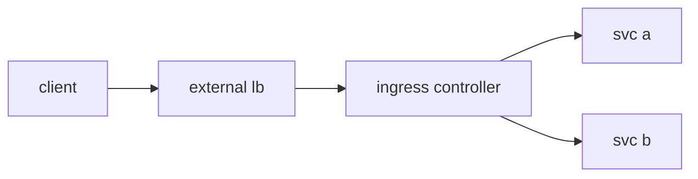

# Ingress

> Kubernetes 101 시리즈 (5/10)

<!-- a-grade-intro:begin -->

**핵심 질문**: *서비스 여러 개* 를 *하나의 도메인* 에서 *경로별* 로 어떻게 *나눌까요*?

> *Ingress* 는 *L7 HTTP* 라우팅과 *TLS 종료* 를 *한 진입점* 으로 정리해 줍니다.

<!-- a-grade-intro:end -->

## 이 글에서 배울 것

- *Ingress* 와 *IngressController* 분리
- *호스트/경로* 라우팅
- *TLS 종료*
- *외부 LoadBalancer* 와의 관계
- *Gateway API* 한 줄 소개

## 왜 중요한가

*LoadBalancer 서비스* 만 있으면 *서비스마다* *비용* 이 듭니다. *Ingress* 로 *한 진입점* 에 모읍니다.

## 개념 한눈에 보기



## 핵심 용어 정리

- **Ingress**: *L7 라우팅 규칙* 객체.
- **IngressController**: *규칙을 실제로 푸는* 프록시 (nginx, Envoy).
- **host**: *도메인 이름*.
- **path**: *URL 경로*.
- **TLS termination**: *Ingress* 에서 *암호 해독*.

## Before/After

**Before**: *서비스마다 LB* → *비용* 과 *관리 부담*.

**After**: *Ingress 한 장* + *Controller 1개* 로 *경로별 분기*.

## 실습: 호스트 경로 라우팅

### 1단계 — Ingress manifest

```python
"""
apiVersion: networking.k8s.io/v1
kind: Ingress
metadata: {name: web}
spec:
  rules:
  - host: example.com
    http:
      paths:
      - path: /api
        pathType: Prefix
        backend:
          service: {name: api, port: {number: 80}}
      - path: /
        pathType: Prefix
        backend:
          service: {name: web, port: {number: 80}}
"""
```

### 2단계 — apply

```python
import subprocess

def apply(path):
    subprocess.run(["kubectl", "apply", "-f", path], check=True)
```

### 3단계 — TLS 시크릿 생성

```python
def tls_secret(name, cert, key):
    subprocess.run([
        "kubectl", "create", "secret", "tls", name,
        "--cert", cert, "--key", key,
    ], check=True)
```

### 4단계 — TLS 적용

```python
"""
spec:
  tls:
  - hosts: [example.com]
    secretName: example-tls
"""
```

### 5단계 — 동작 확인

```python
def curl(host, path):
    res = subprocess.run(
        ["curl", "-sk", f"https://{host}{path}"],
        capture_output=True, text=True, check=True,
    )
    return res.stdout
```

## 이 코드에서 주목할 점

- *Ingress* 는 *규칙*, *Controller* 가 *실행체*.
- *pathType: Prefix* 가 *흔한 기본*.
- *TLS* 는 *Ingress* 에서 *종료*.

## 자주 하는 실수 5가지

1. ***IngressController* 미설치 후 *동작 기대*.**
2. ***pathType* 누락으로 *호환성 문제*.**
3. ***TLS 시크릿* 을 *다른 네임스페이스* 에 생성.**
4. ***외부 LB* 비용 폭증을 *Ingress* 로 해결 안 함.**
5. ***경로 우선순위* 잘못 이해.**

## 실무에서는 이렇게 쓰입니다

*nginx-ingress* 또는 *AWS ALB Controller* 가 *Ingress 객체* 를 *외부 LB* 에 *반영* 하고, *cert-manager* 가 *TLS* 를 자동 발급합니다.

## 시니어 엔지니어는 이렇게 생각합니다

- *Ingress* 는 *분기 규칙*.
- *Controller* 의 *기능 차이* 가 크다.
- *TLS* 는 *cert-manager* 위임.
- *Gateway API* 가 *차세대 표준*.
- *외부 진입점* 은 *최소화*.

## 체크리스트

- [ ] *Controller* 설치 확인.
- [ ] *pathType* 명시.
- [ ] *TLS* 자동화.
- [ ] *진입점* 통합.

## 연습 문제

1. *Ingress* 와 *IngressController* 의 *차이* 한 줄로.
2. *TLS 종료* 가 *Ingress* 에서 좋은 *이유* 한 가지.
3. *Gateway API* 가 *해결하는 한계* 한 줄로.

## 정리 및 다음 단계

라우팅이 잡혔으면 *설정 값* 과 *비밀* 을 *분리* 해 둘 차례입니다. 다음 글은 *ConfigMap과 Secret*.

<!-- toc:begin -->
- [Kubernetes란 무엇인가?](./01-what-is-kubernetes.md)
- [Pod](./02-pod.md)
- [Deployment](./03-deployment.md)
- [Service](./04-service.md)
- **Ingress (현재 글)**
- ConfigMap과 Secret (예정)
- Volume (예정)
- HPA (예정)
- Helm (예정)
- 운영 관점의 Kubernetes (예정)
<!-- toc:end -->

## 참고 자료

- [Ingress (Kubernetes)](https://kubernetes.io/docs/concepts/services-networking/ingress/)
- [Ingress Controllers](https://kubernetes.io/docs/concepts/services-networking/ingress-controllers/)
- [cert-manager](https://cert-manager.io/docs/)
- [Gateway API](https://gateway-api.sigs.k8s.io/)
