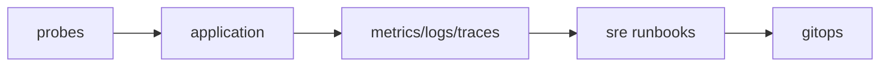

# 운영 관점의 Kubernetes

> Kubernetes 101 시리즈 (10/10)

<!-- a-grade-intro:begin -->

**핵심 질문**: *클러스터* 가 *돌고 있다* 는 것이 *운영 가능* 하다는 뜻일까요?

> *probe, RBAC, 정책, 관측성, 런북* 이 모여야 *운영* 입니다.

<!-- a-grade-intro:end -->

## 이 글에서 배울 것

- *liveness/readiness/startup* probe
- *RBAC* 와 *네트워크 정책*
- *metrics/logs/traces*
- *용량 산정* 과 *GitOps*
- *런북* 의 구조

## 왜 중요한가

*기능* 이 *돌아가는 것* 과 *야간* 에도 *문제 없이 돌아가는 것* 은 다릅니다. *운영성* 이 *서비스 신뢰* 입니다.

## 개념 한눈에 보기



## 핵심 용어 정리

- **liveness probe**: *재시작* 판단.
- **readiness probe**: *트래픽* 수신 판단.
- **RBAC**: *역할 기반 권한*.
- **NetworkPolicy**: *Pod 간 통신* 제한.
- **GitOps**: *Git* 을 *원천* 으로 한 *선언적 운영*.

## Before/After

**Before**: *수동 kubectl*, *log grep*, *추측 디버깅*.

**After**: *probe* + *대시보드* + *런북* 으로 *재현 가능한 대응*.

## 실습: 운영 기본기

### 1단계 — Probe 추가

```python
"""
livenessProbe:
  httpGet: {path: /healthz, port: 8080}
readinessProbe:
  httpGet: {path: /ready, port: 8080}
"""
```

### 2단계 — RBAC

```python
"""
apiVersion: rbac.authorization.k8s.io/v1
kind: Role
metadata: {name: reader, namespace: web}
rules:
- apiGroups: [""]
  resources: ["pods", "pods/log"]
  verbs: ["get", "list"]
"""
```

### 3단계 — NetworkPolicy

```python
"""
apiVersion: networking.k8s.io/v1
kind: NetworkPolicy
metadata: {name: web-only, namespace: web}
spec:
  podSelector: {matchLabels: {app: web}}
  ingress:
  - from:
    - podSelector: {matchLabels: {role: lb}}
"""
```

### 4단계 — 관측성 수집

```python
import subprocess

def top_pods(ns):
    res = subprocess.run(
        ["kubectl", "top", "pods", "-n", ns],
        capture_output=True, text=True, check=True,
    )
    return res.stdout
```

### 5단계 — 런북 스니펫

```python
def runbook_step(name):
    return {
        "name": name,
        "preconditions": ["alert fired", "owner paged"],
        "actions": ["check probe", "rollout status", "rollback if needed"],
    }
```

## 이 코드에서 주목할 점

- *readiness* 가 *0/1* 일 때 *트래픽 차단*.
- *RBAC* 는 *최소 권한* 부터 시작.
- *NetworkPolicy* 는 *기본 deny* 가 가장 안전.

## 자주 하는 실수 5가지

1. ***liveness* 만 두고 *readiness* 누락.**
2. ***모든 권한* 을 *기본* 으로.**
3. ***NetworkPolicy* 미적용으로 *측면 이동* 허용.**
4. ***로그* 만 보고 *지표* 무시.**
5. ***런북* 없이 *대응* 시도.**

## 실무에서는 이렇게 쓰입니다

*Argo CD* 같은 *GitOps* 도구가 *Git* 의 상태를 *클러스터* 에 *수렴* 시키며, *대시보드* 와 *런북* 으로 *야간* 에도 대응합니다.

## 시니어 엔지니어는 이렇게 생각합니다

- *probe* 는 *계약* 이다.
- *권한* 은 *작게 시작* 한다.
- *관측성* 은 *세 다리* (metrics, logs, traces).
- *Git* 이 *원천* 이면 *드리프트* 가 사라진다.
- *런북* 은 *훈련* 으로 갱신.

## 체크리스트

- [ ] *probe* 3종 검토.
- [ ] *RBAC 최소 권한*.
- [ ] *NetworkPolicy 기본 deny*.
- [ ] *대시보드 + 알람*.
- [ ] *런북* 존재.

## 연습 문제

1. *liveness* 와 *readiness* 의 *차이* 한 줄로.
2. *GitOps* 의 *핵심 이점* 한 줄로.
3. *NetworkPolicy 기본 deny* 의 *효과* 한 줄로.

## 정리 및 다음 단계

여기까지가 *Kubernetes 101* 시리즈입니다. 다음 단계는 *Serverless* 와 *SRE* 시리즈에서 *운영성* 을 더 깊이 다룹니다.

<!-- toc:begin -->
- [Kubernetes란 무엇인가?](./01-what-is-kubernetes.md)
- [Pod](./02-pod.md)
- [Deployment](./03-deployment.md)
- [Service](./04-service.md)
- [Ingress](./05-ingress.md)
- [ConfigMap과 Secret](./06-configmap-and-secret.md)
- [Volume](./07-volume.md)
- [HPA](./08-hpa.md)
- [Helm](./09-helm.md)
- **운영 관점의 Kubernetes (현재 글)**
<!-- toc:end -->

## 참고 자료

- [Probes](https://kubernetes.io/docs/tasks/configure-pod-container/configure-liveness-readiness-startup-probes/)
- [RBAC](https://kubernetes.io/docs/reference/access-authn-authz/rbac/)
- [NetworkPolicy](https://kubernetes.io/docs/concepts/services-networking/network-policies/)
- [Argo CD](https://argo-cd.readthedocs.io/)
