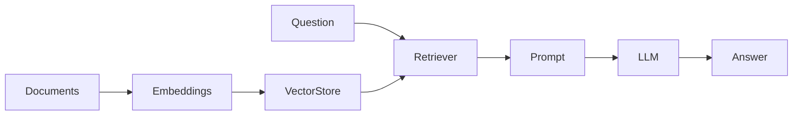

# Retriever — 문서 검색과 컨텍스트 주입

> LangChain 101 시리즈 (3/6)

<!-- a-grade-intro:begin -->

**핵심 질문**: *LLM* 이 *모르* *는* *내용* 은 *어떻게* *답* *하게* *하나요*?

> *문서* 를 *임베딩* 해 *벡터 스토어* 에 *넣고* *Retriever* 로 *불러* *프롬프트* 에 *주입* 합니다.

<!-- a-grade-intro:end -->

## 이 글에서 배울 것

- *RAG* 의 *기본* *흐름*
- *임베딩* 과 *벡터 스토어*
- *FAISS* 로 *로컬* *인덱스* *만들기*
- *Retriever* 인터페이스
- *컨텍스트* 를 *프롬프트* 에 *주입*

## 왜 중요한가

*LLM* 의 *지식* 은 *학습 시점* 에 *고정* 됩니다. *최신 문서* 나 *사내 자료* 는 *컨텍스트* 로 *직접* *전달* 해야 합니다.

## 개념 한눈에 보기



## 핵심 용어 정리

- **Embedding**: *텍스트* 를 *벡터* 로 *변환* *하는* *모델*.
- **VectorStore**: *벡터* 와 *원문* 을 *함께* *저장* *하는* *인덱스*.
- **FAISS**: *Meta* 의 *로컬* *벡터 검색* *라이브러리*.
- **Retriever**: *질문* 으로 *관련 문서* 를 *돌려* *주는* *Runnable*.
- **Top-k**: *유사도 상위* *k 개* *문서* *반환*.

## Before/After

**Before**: "*PDF* 를 *직접* *읽고* *문자열* 로 *프롬프트* 에 *붙입니다*."

**After**: "`retriever | format_docs | prompt | llm` 한 줄이 *같은* *흐름* 을 *대체* 합니다."

## 실습: 로컬 RAG 5단계

### 1단계 — 문서 준비

```python
from langchain_core.documents import Document

docs = [
    Document(page_content="LCEL은 LangChain 컴포넌트를 파이프 연산자로 잇는 표현식 언어입니다."),
    Document(page_content="Retriever는 질문을 받아 관련 문서 리스트를 반환하는 Runnable입니다."),
    Document(page_content="FAISS는 Meta가 만든 로컬 벡터 검색 라이브러리입니다."),
]
```

### 2단계 — 임베딩 모델 로드

```python
from langchain_huggingface import HuggingFaceEmbeddings

embeddings = HuggingFaceEmbeddings(
    model_name="sentence-transformers/all-MiniLM-L6-v2"
)
```

### 3단계 — FAISS 인덱스 생성

```python
from langchain_community.vectorstores import FAISS

vectorstore = FAISS.from_documents(docs, embeddings)
retriever = vectorstore.as_retriever(search_kwargs={"k": 2})
```

### 4단계 — 컨텍스트 포맷터

```python
def format_docs(docs):
    return "\n\n".join(d.page_content for d in docs)
```

### 5단계 — RAG 체인 연결

```python
import os
from langchain_core.prompts import ChatPromptTemplate
from langchain_core.output_parsers import StrOutputParser
from langchain_core.runnables import RunnablePassthrough
from langchain_groq import ChatGroq

os.environ.setdefault("GROQ_API_KEY", "your-key-here")
llm = ChatGroq(model="llama-3.1-8b-instant", temperature=0)

prompt = ChatPromptTemplate.from_messages([
    ("system", "주어진 컨텍스트만 사용해 한국어로 답합니다."),
    ("human", "컨텍스트:\n{context}\n\n질문: {question}"),
])

chain = (
    {"context": retriever | format_docs, "question": RunnablePassthrough()}
    | prompt
    | llm
    | StrOutputParser()
)

print(chain.invoke("FAISS는 누가 만들었나요?"))
```

## 이 코드에서 주목할 점

- *Retriever* 자체가 *Runnable* 이라 `|` 로 *바로* *체인* 에 *합쳐* 집니다.
- *dict 형태* `{"context": ..., "question": ...}` 는 *병렬* 입력을 *조립* 하는 *LCEL 관용구* 입니다.
- *RunnablePassthrough* 는 *invoke 의 입력* 을 *그대로* `question` 에 *연결* 합니다.

## 자주 하는 실수 5가지

1. ***임베딩 모델 불일치*** — *인덱싱* 과 *검색* 에 *다른* *모델* 을 쓰면 *유사도* 가 *깨집니다*.
2. ***Top-k 과다*** — `k` 가 *크면* *컨텍스트* 가 *늘어* *비용* 과 *지연* 이 *증가* 합니다.
3. ***청크 분할 누락*** — *긴 문서* 를 *통째로* 넣으면 *임베딩 품질* 이 *낮아* 집니다.
4. ***답변 출처 미표시*** — *근거 문서* 를 *함께* *반환* 하지 않으면 *환각* 을 *잡* *기* *어렵습니다*.
5. ***인덱스 재생성 누락*** — *원문* 이 *바뀌었는데* *인덱스* 를 *그대로* 쓰면 *낡은 답변* 이 *나옵니다*.

## 실무에서는 이렇게 쓰입니다

*프로덕션* 에서는 *문서 로더 → 청크 분할 → 임베딩 → 벡터 스토어* 파이프라인을 *별도* *작업* 으로 *돌리고*, *Retriever* 는 *서빙 시점* 에만 *호출* 합니다. *벡터 스토어* 로는 *Pinecone*, *Weaviate*, *PGVector* 가 *자주* *쓰입니다*.

## 시니어 엔지니어는 이렇게 생각합니다

- *RAG* 는 *환각 방지* 가 아니라 *지식 주입* 도구입니다.
- *Top-k* 는 *3~5* 에서 *시작* 하고 *측정* 하며 *조정* 합니다.
- *청크 크기* 는 *모델 컨텍스트 윈도우* 의 *1/10* 안쪽이 *안전* 합니다.
- *근거 문서* 를 *반드시* *응답* 에 *포함* 합니다.
- *인덱스 갱신 주기* 를 *문서 변경 주기* 와 *맞춥니다*.

## 체크리스트

- [ ] *동일 임베딩 모델* 로 *인덱싱* 과 *검색*.
- [ ] *Top-k* *합리적 값* (3~5) 으로 *시작*.
- [ ] *컨텍스트 포맷터* 로 *원문* *분리자* *명확화*.
- [ ] *근거 문서* *함께* *반환*.

## 연습 문제

1. *문서* 를 *5 개* 더 *추가* 하고 *Top-k* 를 *1, 3, 5* 로 *바꿔* *답변* 차이를 *비교* 하세요.
2. `RecursiveCharacterTextSplitter` 로 *긴 문서* 를 *분할* 한 뒤 *동일 질문* 의 *결과* 를 *비교* 하세요.
3. *체인* 이 *근거 문서 리스트* 도 *함께* *반환* 하도록 *수정* 하세요.

## 정리 및 다음 단계

다음 글은 *Tool Calling — 외부 도구 연결하기* 입니다.

<!-- toc:begin -->
## 시리즈 목차

- [LangChain 소개 — LCEL과 Runnable 기본](./01-lcel-runnable-basics.md)
- [Prompt와 LLM Chain — 체인 첫 번째 구성](./02-prompt-llm-chain.md)
- **Retriever — 문서 검색과 컨텍스트 주입 (현재 글)**
- Tool Calling — 외부 도구 연결하기 (예정)
- Streaming — 실시간 출력 처리 (예정)
- 실전 체인 조립 — 컴포넌트를 하나로 연결하기 (예정)

<!-- toc:end -->

## 참고 자료

- [Retrieval concept](https://python.langchain.com/docs/concepts/retrievers/)
- [FAISS vector store](https://python.langchain.com/docs/integrations/vectorstores/faiss/)
- [HuggingFace embeddings](https://python.langchain.com/docs/integrations/text_embedding/huggingface/)
- [LangChain GitHub](https://github.com/langchain-ai/langchain)
