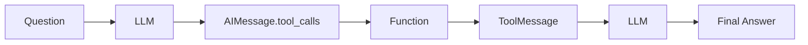

# Tool Calling — 외부 도구 연결하기

> LangChain 101 시리즈 (4/6)

## 이 글에서 다룰 문제

*LLM* 만으로는 *계산*, *DB 조회*, *외부 API* 호출이 *어렵습니다*. *Tool Calling* 은 *모델* 의 *판단* 과 *결정적* *함수 실행* 을 *연결* 합니다.

## 전체 흐름


## Before/After

**Before**: "*LLM* 답변 *문자열* 을 *정규식* 으로 *파싱* 해 *함수* 를 *호출* 합니다."

**After**: "*모델* 이 *구조화* 된 *tool_calls* 를 *반환* 하고 *그대로* *실행* 합니다."

## Tool Calling 5단계

### 1단계 — Tool 두 개 정의

```python
from langchain_core.tools import tool

@tool
def add(a: int, b: int) -> int:
    """두 정수를 더합니다."""
    return a + b

@tool
def multiply(a: int, b: int) -> int:
    """두 정수를 곱합니다."""
    return a * b

tools = [add, multiply]
tools_by_name = {t.name: t for t in tools}
```

### 2단계 — 모델에 바인딩

```python
import os
from langchain_groq import ChatGroq

os.environ.setdefault("GROQ_API_KEY", "your-key-here")
llm = ChatGroq(model="llama-3.1-8b-instant", temperature=0)
llm_with_tools = llm.bind_tools(tools)
```

### 3단계 — 첫 호출 — tool_calls 받기

```python
from langchain_core.messages import HumanMessage

messages = [HumanMessage(content="3과 4를 더한 뒤 그 결과에 5를 곱해 주세요.")]
ai_msg = llm_with_tools.invoke(messages)
print(ai_msg.tool_calls)
messages.append(ai_msg)
```

### 4단계 — 도구 실행과 ToolMessage 추가

```python
from langchain_core.messages import ToolMessage

for call in ai_msg.tool_calls:
    fn = tools_by_name[call["name"]]
    result = fn.invoke(call["args"])
    messages.append(ToolMessage(content=str(result), tool_call_id=call["id"]))
```

### 5단계 — 모델에 결과 돌려주고 최종 답 받기

```python
final = llm_with_tools.invoke(messages)
if final.tool_calls:
    for call in final.tool_calls:
        fn = tools_by_name[call["name"]]
        result = fn.invoke(call["args"])
        messages.append(final)
        messages.append(ToolMessage(content=str(result), tool_call_id=call["id"]))
    final = llm_with_tools.invoke(messages)
print(final.content)
```

## 이 코드에서 주목할 점

- *함수 docstring* 과 *타입 힌트* 가 *그대로* *모델* 에 *전달* 되는 *스키마* 입니다.
- *모델* 은 *한 번* 에 *여러* *tool_calls* 를 *반환* 할 수 있습니다.
- *루프* 가 *필요* 한 *이유* 는 *모델* 이 *중간 결과* 를 *보고* *추가* *호출* 을 *결정* 하기 때문입니다.

## 자주 하는 실수 5가지

1. ***eval/exec 직접 사용*** — *모델 출력* 을 *코드* 로 *실행* 하면 *치명적* *보안 사고* 가 *납니다*. *반드시* *허용 함수* 만 *등록* 하세요.
2. ***docstring 누락*** — *모델* 이 *언제* 호출할지 *판단* 할 *근거* 가 *사라집니다*.
3. ***tool_call_id 누락*** — *ToolMessage* 가 *어떤* *호출* 의 *결과* 인지 *추적* 이 *안* 됩니다.
4. ***루프 종료 조건 부재*** — *tool_calls* 가 *비었을 때* 만 *종료* 하도록 *분기* 해야 합니다.
5. ***병렬 호출 무시*** — *여러* *tool_calls* 를 *순서대로* 만 *처리* 하면 *지연* 이 *늘어납니다*.

## 실무에서는 이렇게 쓰입니다

*프로덕션* 에서는 *Tool Calling* 으로 *DB 조회*, *내부 API*, *검색* 등을 *모델* 이 *직접* *호출* 합니다. *루프* 는 *LangGraph* 의 *ToolNode* 와 *tools_condition* 으로 *대체* 하는 경우가 *많습니다*.

## 체크리스트

- [ ] *함수* 마다 *docstring* 과 *타입 힌트* *작성*.
- [ ] *bind_tools* 로 *모델* 에 *등록*.
- [ ] *tool_call_id* *유지* 하며 *ToolMessage* *추가*.
- [ ] *루프 상한* *설정*.

## 정리 및 다음 단계

다음 글은 *Streaming — 실시간 출력 처리* 입니다.

<!-- toc:begin -->
## 시리즈 목차

- [LangChain 소개 — LCEL과 Runnable 기본](./01-lcel-runnable-basics.md)
- [Prompt와 LLM Chain — 체인 첫 번째 구성](./02-prompt-llm-chain.md)
- [Retriever — 문서 검색과 컨텍스트 주입](./03-retriever.md)
- **Tool Calling — 외부 도구 연결하기 (현재 글)**
- Streaming — 실시간 출력 처리 (예정)
- 실전 체인 조립 — 컴포넌트를 하나로 연결하기 (예정)

<!-- toc:end -->

## 참고 자료

- [Tool calling concept](https://python.langchain.com/docs/concepts/tool_calling/)
- [How to use tools](https://python.langchain.com/docs/how_to/tool_calling/)
- [@tool decorator](https://python.langchain.com/docs/how_to/custom_tools/)
- [LangChain GitHub](https://github.com/langchain-ai/langchain)
