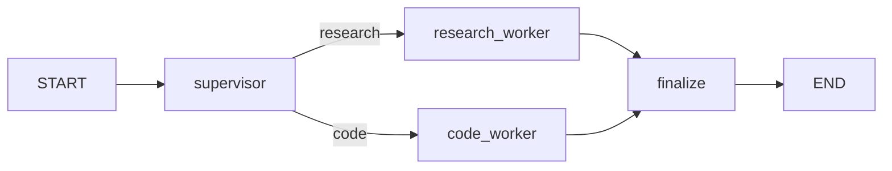

# 멀티 에이전트 시스템

> LangGraph 101 시리즈 (5/6)

<!-- a-grade-intro:begin -->

**핵심 질문**: *왜* *프롬프트* 를 *키우지* *않고* *에이전트* 를 *나누나요*?

> *역할* 이 *섞이면* *디버깅* *불가능* 합니다. *supervisor* 가 *위임* 하고 *worker* 가 *전담* 합니다.

<!-- a-grade-intro:end -->

## 이 글에서 배울 것

- *supervisor / worker* *패턴*
- *분류* 와 *위임* 분리
- *공유 상태* 의 *경계*
- *finalize* 노드 의 *역할*
- *멀티 에이전트* 의 *오해*

## 왜 중요한가

*복잡* 한 *요청* 을 *하나* 의 *에이전트* 에 *밀어 넣으면* *프롬프트* 가 *비대* 해지고 *역할* 이 *흐려* 집니다. *supervisor* 가 *요청* 성격 을 *판단* 하고 *적절* 한 *worker* 에게 *넘기면* *책임* 이 *분리* 되고 *그래프* 도 *읽기* *쉬워* 집니다.

## 개념 한눈에 보기



## 핵심 용어 정리

- **supervisor**: *요청* 을 *읽고* *route* 만 *결정* 하는 *분기* 노드.
- **worker**: *특정* *역할* 만 *전담* 하는 *노드*. *각자* *프롬프트* 를 *가집니다*.
- **route field**: *상태* 에 *남는* *위임* 결과. *supervisor* 의 *출력* 입니다.
- **finalize**: *worker* *결과* 를 *조립* 해 *최종* *답변* 을 *만드는* *노드*.
- **shared state**: *모든* *노드* 가 *읽고* *쓰는* *공통* *TypedDict*.

## Before/After

**Before**: "*하나* 의 *시스템* *프롬프트* 가 *5* *역할* 을 *동시* 에 *수행* *하려* *합니다*."

**After**: "*supervisor* 가 *분류* 만, *worker* 가 *답변* 만 *맡습니다*."

## 실습: supervisor/worker 5단계

### 1단계 — 공유 상태 정의

```python
from typing import TypedDict

class SupervisorState(TypedDict):
    request: str
    route: str
    worker_result: str
    final_answer: str
```

### 2단계 — supervisor 노드

```python
import os
from langchain_core.messages import HumanMessage, SystemMessage
from langchain_groq import ChatGroq

os.environ.setdefault("GROQ_API_KEY", "your-key-here")

def llm() -> ChatGroq:
    return ChatGroq(model="llama-3.1-8b-instant", temperature=0)

def supervisor(state: SupervisorState) -> dict:
    text = state["request"].lower()
    if any(k in text for k in ("code", "python", "implement", "write")):
        return {"route": "code"}
    if any(k in text for k in ("what", "why", "explain", "concept")):
        return {"route": "research"}
    response = llm().invoke([
        SystemMessage(content="Classify as research or code. Reply with only the label."),
        HumanMessage(content=state["request"]),
    ])
    label = response.content.strip().lower()
    return {"route": label if label in {"research", "code"} else "research"}
```

### 3단계 — worker 두 종

```python
def research_worker(state: SupervisorState) -> dict:
    response = llm().invoke([
        SystemMessage(content="You are a research worker. Explain concepts in crisp bullets."),
        HumanMessage(content=state["request"]),
    ])
    return {"worker_result": response.content}

def code_worker(state: SupervisorState) -> dict:
    response = llm().invoke([
        SystemMessage(content="You are a coding worker. Reply with one short Python example."),
        HumanMessage(content=state["request"]),
    ])
    return {"worker_result": response.content}
```

### 4단계 — finalize와 라우팅

```python
from typing import Literal

def finalize(state: SupervisorState) -> dict:
    return {
        "final_answer": f"Route: {state['route']}\nResult:\n{state['worker_result']}"
    }

def route_to_worker(state: SupervisorState) -> Literal["research_worker", "code_worker"]:
    return "code_worker" if state["route"] == "code" else "research_worker"
```

### 5단계 — 그래프 빌드와 실행

```python
from langgraph.graph import StateGraph, START, END

builder = StateGraph(SupervisorState)
builder.add_node("supervisor", supervisor)
builder.add_node("research_worker", research_worker)
builder.add_node("code_worker", code_worker)
builder.add_node("finalize", finalize)

builder.add_edge(START, "supervisor")
builder.add_conditional_edges(
    "supervisor",
    route_to_worker,
    {"research_worker": "research_worker", "code_worker": "code_worker"},
)
builder.add_edge("research_worker", "finalize")
builder.add_edge("code_worker", "finalize")
builder.add_edge("finalize", END)

graph = builder.compile()
result = graph.invoke({"request": "Explain what a checkpointer is.", "route": "", "worker_result": "", "final_answer": ""})
print(result["final_answer"])
```

## 이 코드에서 주목할 점

- *supervisor* 는 *직접* *답* 을 *만들지* *않습니다*. *route* 만 *씁니다*.
- *worker* 는 *각자* *worker_result* 같은 *공유* *필드* 에 *결과* 를 *씁니다*.
- *finalize* 가 *조립* 만 *맡기* 때문에 *worker* *수* 가 *늘어나도* *정리* *지점* 이 *흔들리지* *않습니다*.

## 자주 하는 실수 5가지

1. ***supervisor 가 답변까지 생성*** — *결국* *거대* *단일* *에이전트* 로 *되돌아* *갑니다*.
2. ***공유 상태 비대*** — *worker* *간* *결합도* 가 *높아* *집니다*. *필요* *필드* 만 *남깁니다*.
3. ***worker_result 키 충돌*** — *여러* *worker* 가 *같은* *키* 를 *쓰면* *덮어쓰기* 됩니다.
4. ***finalize 누락*** — *최종* *답변* *형식* 이 *worker* *마다* *달라* *집니다*.
5. ***supervisor 가 LLM 만 의존*** — *명백* 한 *키워드* 분류 는 *코드* 로 *처리* 가 *빠르고* *저렴* 합니다.

## 실무에서는 이렇게 쓰입니다

*프로덕션* 에서는 *intent* *기반* *triage*, *역할별* *모델* *선택* (*싸고 빠른* vs *비싸고 정확*), *권한별* *worker* *격리* 등에 *적용* 됩니다. *worker* 별 *별도* *체크포인터* 도 *가능* 합니다.

## 시니어 엔지니어는 이렇게 생각합니다

- *멀티* *에이전트* 라고 *자동* *으로* *똑똑* *해지지* *않습니다*. *경계* 가 *애매* 하면 *오히려* *나빠* 집니다.
- *supervisor* 는 *얇게*, *worker* 는 *깊게* *유지* 합니다.
- *공유* *상태* 는 *최소* 로, *worker* 결과 는 *별도* *필드* 로.
- *finalize* 가 *디버깅* *지점* 입니다.
- *분류* 가 *결정적* 이면 *코드* 로 *합니다*. *LLM* 은 *모호* 한 *경우* 에만.

## 체크리스트

- [ ] *supervisor* 와 *worker* *책임* 이 *문장* 으로 *분리* *설명* 됨.
- [ ] *worker* *출력* 필드 가 *명시* 적으로 *구분*.
- [ ] *finalize* 노드 가 *최종* *조립* 담당.
- [ ] *공유* 상태 가 *필요* *필드* 만 *포함*.

## 연습 문제

1. *세 번째* *worker* `qa_worker` 를 *추가* 하고 *supervisor* 분기 를 *확장* 하세요.
2. *worker* *결과* 를 *각각* *별도* *키* (*research_result*, *code_result*)에 *저장* 하도록 *수정* 하세요.
3. *supervisor* 의 *키워드* *분류* 를 *제거* 하고 *LLM* 만 *쓸* 때 *지연* *시간* 을 *비교* 하세요.

## 정리 및 다음 단계

다음 글은 *LangGraph 완성* 입니다.

<!-- toc:begin -->
## 시리즈 목차

- [LangGraph 소개와 그래프 기초](./01-graph-basics.md)
- [상태 관리와 체크포인트](./02-state-and-checkpoints.md)
- [조건부 엣지와 분기 흐름](./03-conditional-edges.md)
- [도구 호출 에이전트](./04-tool-calling-agent.md)
- **멀티 에이전트 시스템 (현재 글)**
- LangGraph 완성 (예정)

<!-- toc:end -->

## 참고 자료

- [Multi-agent concepts](https://langchain-ai.github.io/langgraph/concepts/multi_agent/)
- [Supervisor tutorial](https://langchain-ai.github.io/langgraph/tutorials/multi_agent/agent_supervisor/)
- [Multi-agent network how-to](https://langchain-ai.github.io/langgraph/how-tos/multi-agent-network/)
- [LangGraph reference](https://langchain-ai.github.io/langgraph/reference/)
