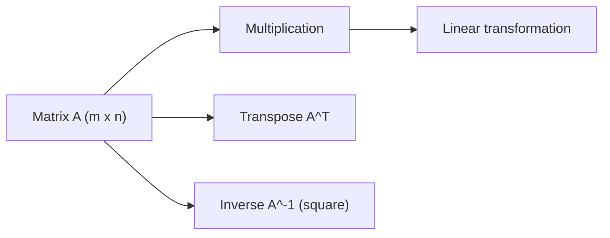

# 행렬

> Linear Algebra 101 시리즈 (3/10)


## 이 글에서 다룰 문제

*행렬* 은 *데이터셋* 이자 *변환* 입니다. ML 모든 레이어가 *행렬 곱* 위에서 돌아갑니다.

> *Matrices are linear transformations in disguise.*

## 전체 흐름


## Before/After

**Before**: *“행렬 곱은 그냥 행과 열의 합.”* — *왜* 그런지 모름.

**After**: *“행렬 곱 = *변환의 합성*. 한 변환 후 또 한 변환을 적용.”*

## 5단계 행렬 다루기

### 1단계 — 행렬 만들기

```python
import numpy as np
A = np.array([[1.0, 2.0], [3.0, 4.0]])
print("A:", A, "shape:", A.shape)
```

### 2단계 — 전치

```python
print("A^T:", A.T)
```

### 3단계 — 행렬 곱

```python
B = np.array([[5.0, 6.0], [7.0, 8.0]])
print("A B:", A @ B)
print("B A:", B @ A)  # 다름! 비가환
```

### 4단계 — 항등행렬

```python
I = np.eye(2)
print("I:", I)
print("A I = A:", A @ I)
```

### 5단계 — 역행렬

```python
A_inv = np.linalg.inv(A)
print("A^-1:", A_inv)
print("A A^-1 ~ I:", A @ A_inv)
```

## 이 코드에서 주목할 점

- *행렬 곱* 은 *비가환* — `A B != B A`.
- *역행렬* 은 *모든 행렬* 에 *존재하지 않음*.
- *NumPy* `@` 는 *행렬 곱*, `*` 는 *원소곱*.

## 자주 하는 실수 5가지

1. ***@* 와 ** 혼동.**
2. ***형상* 안 맞춰 *broadcast* 사고.**
3. ***특이행렬(singular)* 의 역행렬 계산.**
4. ***행렬 곱 비가환* 망각.**
5. ***부동소수점 오차* 로 *I* 가 *완전 1* 이 아님 — 무시.**

## 실무에서는 이렇게 쓰입니다

선형 회귀 *정규방정식*, 신경망의 *가중치 행렬*, 그래픽스의 *변환 행렬*, 추천 시스템의 *유저-아이템 행렬* — 모두 *행렬 연산* 입니다.

## 체크리스트

- [ ] *행렬 곱* 가능.
- [ ] *전치* 가능.
- [ ] *역행렬* 의 *조건* 을 안다.
- [ ] *비가환성* 을 인지한다.

## 정리 및 다음 단계

행렬은 *변환의 압축* 입니다. 다음 글에서는 *내적과 거리* 를 다룹니다.

<!-- toc:begin -->
- [선형대수란 무엇인가?](./01-what-is-linear-algebra.md)
- [벡터](./02-vectors.md)
- **행렬 (현재 글)**
- 내적과 거리 (예정)
- 선형변환 (예정)
- 기저와 차원 (예정)
- 고유값과 고유벡터 (예정)
- 행렬 분해 (예정)
- PCA (예정)
- 머신러닝에서의 선형대수 (예정)
<!-- toc:end -->

## 참고 자료

- [3Blue1Brown — Matrix multiplication](https://www.3blue1brown.com/lessons/matrix-multiplication)
- [Khan Academy — Matrices](https://www.khanacademy.org/math/algebra-home/alg-matrices)
- [NumPy — linalg.inv](https://numpy.org/doc/stable/reference/generated/numpy.linalg.inv.html)
- [Wikipedia — Matrix](https://en.wikipedia.org/wiki/Matrix_(mathematics))
