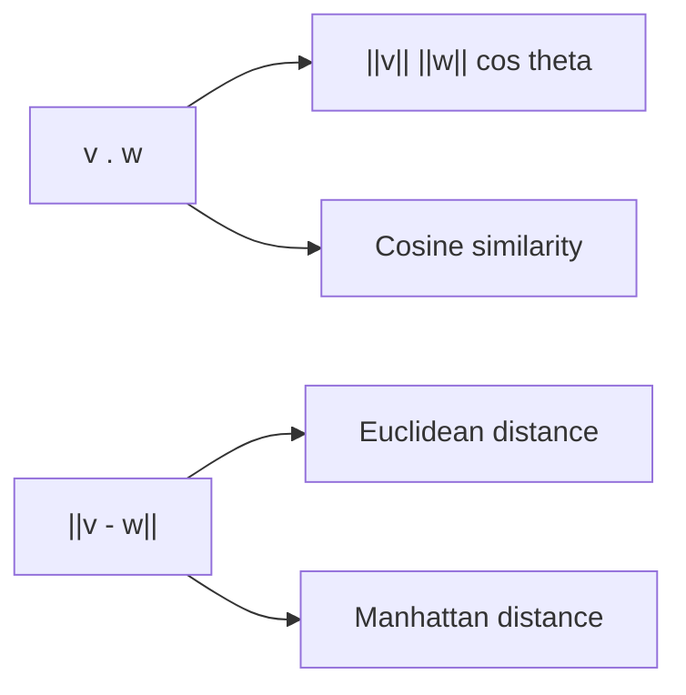

# 내적과 거리

> Linear Algebra 101 시리즈 (4/10)


## 이 글에서 다룰 문제

추천, 검색, NLP의 *유사도/거리* 가 모두 *내적과 거리* 에서 나옵니다. *벡터 검색* 도 같습니다.

> *Inner product is the engine of similarity.*

## 전체 흐름


## Before/After

**Before**: *“내적은 그냥 곱하고 더하는 것.”*

**After**: *“내적은 *두 벡터의 정렬 정도* — *코사인* 으로 *방향 유사도* 를 잰다.”*

## 5단계 내적과 거리

### 1단계 — 벡터 준비

```python
import numpy as np
v = np.array([1.0, 2.0, 3.0])
w = np.array([4.0, 5.0, 6.0])
```

### 2단계 — 내적

```python
print("v . w:", np.dot(v, w))
print("v . w:", v @ w)
```

### 3단계 — 코사인 유사도

```python
cos_sim = (v @ w) / (np.linalg.norm(v) * np.linalg.norm(w))
print("cosine similarity:", cos_sim)
```

### 4단계 — 유클리드 거리

```python
print("Euclidean:", np.linalg.norm(v - w))
```

### 5단계 — 맨해튼 거리

```python
print("Manhattan:", np.sum(np.abs(v - w)))
```

## 이 코드에서 주목할 점

- *내적* 은 *방향과 크기* 를 모두 반영.
- *코사인 유사도* 는 *방향만* 반영 — *크기 무관*.
- *거리* 는 *비유사도* — *작을수록 가까움*.

## 자주 하는 실수 5가지

1. ***내적과 원소곱* 혼동.**
2. ***코사인 유사도* 에 *정규화* 누락.**
3. ***영벡터* 의 *코사인* 계산 — *0으로 나눔*.**
4. ***유클리드/맨해튼* 의 *기하학적 차이* 무시.**
5. ***고차원 거리* 의 *직관 무너짐(차원의 저주)* 망각.**

## 실무에서는 이렇게 쓰입니다

추천 시스템(*아이템 유사도*), 벡터 DB(*ANN 검색*), NLP(*임베딩 유사도*), 클러스터링(*KMeans*) — 모두 *내적/거리* 위에서 동작합니다.

## 체크리스트

- [ ] *내적* 계산 가능.
- [ ] *코사인 유사도* 계산 가능.
- [ ] *유클리드/맨해튼* 거리 차이 안다.
- [ ] *직교* 의 의미 안다.

## 정리 및 다음 단계

내적은 *유사도*, 거리는 *비유사도* 입니다. 다음 글에서는 *선형변환* 을 다룹니다.

<!-- toc:begin -->
- [선형대수란 무엇인가?](./01-what-is-linear-algebra.md)
- [벡터](./02-vectors.md)
- [행렬](./03-matrices.md)
- **내적과 거리 (현재 글)**
- 선형변환 (예정)
- 기저와 차원 (예정)
- 고유값과 고유벡터 (예정)
- 행렬 분해 (예정)
- PCA (예정)
- 머신러닝에서의 선형대수 (예정)
<!-- toc:end -->

## 참고 자료

- [Wikipedia — Dot product](https://en.wikipedia.org/wiki/Dot_product)
- [Wikipedia — Cosine similarity](https://en.wikipedia.org/wiki/Cosine_similarity)
- [3Blue1Brown — Dot products](https://www.3blue1brown.com/lessons/dot-products)
- [scikit-learn — Pairwise metrics](https://scikit-learn.org/stable/modules/metrics.html)
