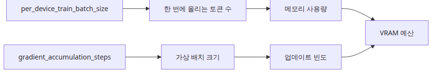

# 학습 루프와 하이퍼파라미터

## 핵심 질문

학습 루프와 하이퍼파라미터를 어떻게 설정해야 안정적인 수렴과 일반화를 얻을까요?

이 글은 그 질문에 답하기 위해 학습 루프와 하이퍼파라미터의 핵심 결정과 운영 함정을 살펴봅니다.

## 이 글에서 다룰 문제

4편은 파인튜닝 시리즈에서 처음으로 실제 가중치 업데이트가 발생하는 글입니다. 하지만 여전히 목표는 큰 성능이 아니라 **학습 루프가 살아 있는지 확인하는 것**입니다. 1 step만 끝까지 도는 것을 검증해 두면, 이후 학습이 안 될 때 "환경 문제인지, 데이터 문제인지, 하이퍼파라미터 문제인지"를 빠르게 분리할 수 있습니다.

또 hyperparameter를 한꺼번에 조정하는 습관에서 벗어나는 것도 4편의 목표입니다. learning rate를 10배 바꾼 동시에 batch size를 4배 바꾸면 어느 변화가 결과에 영향을 줬는지 추적할 수 없습니다. 4편에서 한 번에 하나만 바꾸는 디버깅 루틴을 익혀 두면 5편 평가에서 "왜 점수가 낮지?"에 대한 답이 훨씬 빨리 나옵니다.

## Mental Model

학습 루프 한 step은 다음과 같이 분해됩니다.

```
1. batch = data_collator([sample_i, sample_j, ...])
2. outputs = model(input_ids=..., attention_mask=..., labels=...)
3. loss = outputs.loss
4. loss.backward()                       # gradient 계산
5. optimizer.step()                       # 파라미터 업데이트
6. lr_scheduler.step(); optimizer.zero_grad()
```

`Trainer`는 이 6단계를 감싸 줄 뿐입니다. 어디 한 곳이 망가지면 전부 망가집니다. 그래서 4편의 1 step은 "위 6단계가 모두 한 번씩 통과했다"는 무결성 검증입니다.

추가로 알아야 할 관계 두 가지:

- **Effective batch size** = `per_device_train_batch_size × gradient_accumulation_steps × num_devices`. 이 값이 같으면 손실 곡선도 비슷해야 합니다.
- **Learning rate**는 effective batch size와 함께 움직입니다. 배치를 4배 키웠다면 lr도 √4 ~ 4배 사이로 키우는 것이 보통입니다.

## 핵심 개념

| 항목 | 의미 |
| --- | --- |
| `labels` | 다음 토큰 예측의 정답. causal LM에서는 `input_ids`를 그대로 복사 (prompt는 -100 마스킹) |
| Data collator | 가변 길이 샘플을 한 배치로 묶고 padding/마스킹을 일괄 처리 |
| `learning_rate` | LoRA에서는 풀 파인튜닝보다 10배 큰 값(1e-4~5e-4)을 자주 씀 |
| `per_device_train_batch_size` | GPU 한 장에 올리는 샘플 수 |
| `gradient_accumulation_steps` | 메모리가 부족할 때 작은 배치를 N번 누적해 큰 배치 효과 |
| `max_steps` / `num_train_epochs` | 둘 중 하나만 사용. `max_steps`가 우선 |
| `warmup_ratio` | 학습 초반 lr을 0에서부터 선형 증가 |

## Before vs. After

**Before** — `Trainer.train()`을 호출했더니 즉시 `KeyError: 'labels'` 또는 loss가 NaN이 나옵니다. 어디부터 봐야 할지 막막합니다.

**After** — 4편의 1-step 패턴을 따르면 다음 한 줄이 출력됩니다.

```
{'train_runtime': 1.42, 'train_samples_per_second': 1.41,
 'train_steps_per_second': 0.7, 'train_loss': 8.7421, 'epoch': 0.5}
```

손실 절대값(8.74)은 의미가 없습니다. 중요한 것은 (1) 끝까지 돌았다, (2) loss가 숫자다(NaN/Inf 아님), (3) `global_step=1`이다. 이 세 가지가 충족되면 환경, 데이터, 어댑터, 옵티마이저가 한 번씩 모두 정상 동작했다는 뜻입니다.

## 학습 루프에서 줄여도 되는 것과 줄이면 안 되는 것


*축소 가능한 요소와 유지해야 할 요소 비교*

샘플 수와 step 수는 줄여도 됩니다. 하지만 **토큰화된 입력, labels, optimizer step, loss 계산**은 줄이면 학습 검증이 아니라 단순 추론 테스트가 됩니다. 그래서 이 글의 예제는 가장 작은 데이터셋을 쓰더라도 학습 구성요소는 그대로 유지합니다.


*학습 루프에서 줄여도 되는 것과 줄이면 안 되는 것*

## 단계별 실습

### 1단계 — 두 줄짜리 데이터셋 만들기

```python
from datasets import Dataset

texts = [
    "질문: 파이썬 리스트를 정렬하는 방법은? 답변: sorted(lst) 또는 lst.sort()를 사용합니다.",
    "질문: HTTP 404는 무엇을 뜻하나요? 답변: 요청한 리소스를 찾지 못했다는 뜻입니다.",
]

rows = []
for text in texts:
    encoded = tokenizer(text, truncation=True, padding="max_length", max_length=64)
    encoded["labels"] = encoded["input_ids"].copy()
    rows.append(encoded)

dataset = Dataset.from_list(rows)
```

`labels = input_ids.copy()`는 가장 단순한 형태입니다. 실전에서는 prompt 부분을 -100으로 마스킹해 loss에서 빼야 합니다.

### 2단계 — `TrainingArguments` 정의

```python
from transformers import TrainingArguments

args = TrainingArguments(
    output_dir="artifacts",
    per_device_train_batch_size=2,
    max_steps=1,
    learning_rate=5e-4,
    save_strategy="no",
    report_to=[],
)
```

이 시점에서 `report_to=[]`는 wandb/tensorboard 자동 연결을 끕니다. 작은 검증에서는 빈 리스트가 빠르고 깔끔합니다.

### 3단계 — Trainer 실행

```python
from transformers import Trainer

trainer = Trainer(model=peft_model, args=args, train_dataset=dataset)
trainer.train()
```

### 4단계 — 결과 검증

출력에 `'train_loss': <숫자>`와 `'global_step': 1`이 보이면 성공입니다. 손실이 0.0이거나 NaN이면 데이터/마스킹/모델 dtype 중 하나가 깨진 것입니다.

### 5단계 — Effective batch size 실험 (선택)

```python
args.per_device_train_batch_size = 1
args.gradient_accumulation_steps = 2
args.max_steps = 1
```

위 두 조합은 effective batch가 같으므로 loss 출력이 거의 동일해야 합니다. 다르다면 어디선가 데이터 누수가 있는 것입니다.

## 이 코드에서 봐야 할 것



*배치 크기와 gradient accumulation 관계 구조*

- `labels = input_ids.copy()`는 causal LM에서 다음 토큰 예측 손실을 계산하기 위한 최소 설정입니다.
- `max_steps=1`로 줄여도 backward와 optimizer step은 실제로 일어납니다.
- 이 예제는 `training_loss`와 `global_step`만 확인하면 충분합니다. 숫자 자체보다 루프가 끝까지 도는지가 더 중요합니다.
- `report_to=[]`로 wandb/tensorboard 자동 연결을 끄면 작은 검증이 훨씬 깔끔해집니다.

## 자주 하는 실수


*학습 디버깅 출력 우선순위 판단 흐름*

- **샘플이 적다고 collator를 생략** — 가변 길이 샘플이 섞이면 collator가 없을 때 즉시 깨집니다. 작은 실습에서도 `DataCollatorForLanguageModeling`을 두는 편이 안전합니다.
- **loss 절대값에 의존** — tiny 모델 1 step의 loss는 8~10이 정상입니다. 절대값보다 "감소 추세"와 "NaN 여부"를 봅니다.
- **컬럼 이름 mismatch** — Trainer는 `input_ids`, `attention_mask`, `labels` 외의 컬럼은 자동으로 무시합니다. 따라서 잘못된 이름의 컬럼이 있으면 silent하게 학습 데이터에서 제외됩니다.
- **lr 한 번에 큰 폭 변경** — 5e-4 → 5e-3로 한 번에 올리면 NaN이 나오기 쉽습니다. 2~3배씩 늘려 가며 관찰합니다.
- **`save_strategy="epoch"`을 그대로 두기** — 작은 검증에서는 디스크가 빠르게 찹니다. `"no"`로 두고 마지막에만 `trainer.save_model()`을 호출합니다.
- **fp16/bf16 미고려** — bf16을 지원하는 GPU(A100, H100, RTX 30+)에서는 `bf16=True`로 메모리와 속도가 모두 좋아집니다. 단, tiny 모델 검증에서는 굳이 켤 필요가 없습니다.

## 실무 적용

- **3-step smoke test 자동화**: PR마다 1 step이 아니라 3 step을 돌려 loss가 단조 감소(또는 변동)하는지 자동 확인합니다.
- **Learning rate 스윕은 log-scale**: {1e-5, 5e-5, 1e-4, 5e-4, 1e-3} 5개 정도. linear로 잡으면 정보가 너무 적습니다.
- **gradient accumulation 활용**: GPU 메모리가 batch=2까지만 허락하고 effective batch=16이 필요하면 `gradient_accumulation_steps=8`로 같은 효과를 냅니다.
- **eval은 스텝 단위**: `eval_steps=50, evaluation_strategy="steps"`로 두면 epoch 끝까지 기다리지 않고도 회귀를 일찍 잡을 수 있습니다.
- **체크포인트 정책**: `save_total_limit=2`로 디스크를 보호하고, `load_best_model_at_end=True`로 5편 평가에서 가장 좋은 모델을 자동으로 선택합니다.
- **wandb 연결**: 실험을 두 개 이상 비교할 때부터는 `report_to=["wandb"]`로 켭니다. 손실 곡선과 lr 스케줄이 한 화면에 겹치는 순간 직관이 빠르게 좋아집니다.

## 실무에서는 이렇게 생각한다

학습 루프의 핸심은 "얼마나 많이 돌리느냐"가 아니라 "한 번이라도 끝까지 도는지"입니다. 실무에서 파인튜닝 파이프라인을 처음 구축할 때는 3-step smoke test를 PR 게이트로 거는 것을 권합니다. loss가 숫자인지, NaN이 아닌지, global_step이 증가하는지만 확인하면 됩니다.

하이퍼파라미터 조정은 한 번에 하나만 바꾸는 원칙을 지켜야 합니다. learning rate와 batch size를 동시에 바꾸면 어느 변화가 결과에 영향을 줬는지 추적할 수 없기 때문입니다. GPU 메모리가 부족하다면 batch size를 줄이고 gradient accumulation으로 보상하는 것이 맞지, learning rate를 낮추는 것은 다른 문제입니다.

## 체크리스트

- [ ] `TrainingArguments`의 필수 필드를 직접 읽고 수정할 수 있다.
- [ ] `labels`가 왜 필요한지 이해했다.
- [ ] `python main.py` 실행 후 1 step 학습과 loss 출력을 확인했다.
- [ ] loss가 NaN이 아닌 유한한 숫자였다.
- [ ] effective batch size 공식 = `per_device × accum × devices`를 설명할 수 있다.
- [ ] 다음 글에서 동일한 모델을 평가할 준비가 되었다.

## 정리 · 다음 글

학습 루프는 생각보다 작은 단위로도 검증할 수 있습니다. 1 step이 성공하면 이후에 늘려야 할 것은 데이터와 시간이지, 기본 구조가 아닙니다. 환경/데이터/어댑터/옵티마이저 중 하나라도 깨졌다면 1 step에서 반드시 신호가 나옵니다.

다음 글(5편)에서는 평가를 다룹니다. perplexity로 빠른 sanity check를 하고, golden set 기반의 정성/정량 평가를 어떻게 결합할지 코드로 확인합니다.

<!-- toc:begin -->
## 시리즈 목차

- [LLM 파인튜닝 입문](./01-intro.md)
- [데이터셋 준비와 전처리](./02-dataset.md)
- [LoRA 어댑터 구성](./03-lora.md)
- **학습 루프와 하이퍼파라미터 (현재 글)**
- 모델 평가 (예정)
- 모델 서빙 (예정)

<!-- toc:end -->

---

## 참고 자료

- [Transformers Trainer documentation](https://huggingface.co/docs/transformers/main_classes/trainer)
- [TrainingArguments reference](https://huggingface.co/docs/transformers/main_classes/trainer#transformers.TrainingArguments)
- [DataCollatorForLanguageModeling](https://huggingface.co/docs/transformers/main_classes/data_collator)
- [Mixed precision training](https://huggingface.co/docs/transformers/perf_train_gpu_one)
