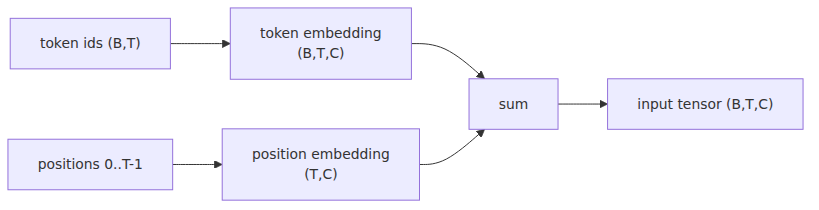

# 정수에서 벡터로, 그리고 위치

> LLM from Scratch 101 시리즈 (2/9)

토크나이저까지 만들고 나면 잠깐 멍해집니다. 이제 입력은 숫자니까 끝난 것 같지만, 사실 아직 시작도 아닙니다. `12, 4, 38, 2` 같은 ID 배열은 신경망 입장에서 그저 인덱스 목록입니다. 12번이 13번보다 특별히 가깝다는 뜻도 없고, 셰익스피어 문체와 연결된 감각도 없습니다.

저는 임베딩을 처음 배울 때 "단어 의미를 담은 고차원 공간" 같은 설명보다 룩업 테이블이라는 표현이 훨씬 도움이 됐습니다. 한 칸 뽑아 오는 일부터 이해하면, 그 위에 얹는 위치 정보도 자연스럽게 이어집니다.

오늘은 `model.py`를 시작합니다. 아직 트랜스포머 블록은 없고, 토큰 ID를 `(B, T, C)` 텐서로 바꾸는 입구까지만 만듭니다. 작아 보여도 GPT의 첫 관문입니다.

오늘 멘탈 모델은 이 문장 하나면 충분합니다. **토큰 입력 벡터는 token embedding과 positional embedding의 합입니다.**

---

<!-- a-grade-intro:begin -->

## 핵심 질문

- nn.Embedding은 사실 어떤 연산을 수행할까요?
- 토큰 임베딩만으로는 왜 부족할까요?
- sinusoidal과 learned positional embedding은 무엇이 다를까요?
- 토큰과 위치는 왜 더해서 하나의 벡터로 다룰까요?

<!-- a-grade-intro:end -->

## nn.Embedding은 사실 그냥 룩업 테이블

`nn.Embedding(vocab_size, n_embd)`는 `(vocab_size, n_embd)` 모양의 큰 표입니다. 토큰 ID가 들어오면 그 행을 뽑아 옵니다. 끝입니다. 선형대수로 꾸미면 복잡해 보이지만, 동작 자체는 인덱싱입니다.

중요한 건 그 표의 값이 학습된다는 점입니다. 처음에는 랜덤이지만, 역전파가 몇천 번 돌고 나면 비슷한 문맥에 자주 나온 토큰들이 비슷한 방향으로 움직입니다. 의미는 숫자 ID에 있지 않고, 학습된 벡터 행에 생깁니다.

이 관점을 잡아 두면 왜 원-핫 벡터를 굳이 직접 만들지 않는지도 바로 보입니다. 원-핫은 어휘 수만큼 차원이 커지고 대부분이 0입니다. 임베딩 테이블은 그 거대한 희소 표현을 작은 밀집 벡터로 눌러 담는 장치입니다. 계산량도 줄고, 학습이 쌓이면서 비슷한 토큰끼리 기하학적 이웃도 만들어집니다.

## 직접 만들어보기 — Embedding은 5줄짜리 클래스

`nn.Embedding`이 너무 커 보인다면 손으로 한 번 만들면 됩니다.

```python
import torch
import torch.nn as nn

class MiniEmbedding(nn.Module):
    def __init__(self, vocab_size: int, n_embd: int) -> None:
        super().__init__()
        self.weight = nn.Parameter(torch.randn(vocab_size, n_embd) * 0.02)

    def forward(self, idx: torch.Tensor) -> torch.Tensor:
        return self.weight[idx]

idx = torch.tensor([[0, 1, 2], [2, 1, 0]])
emb = MiniEmbedding(vocab_size=4, n_embd=3)
print(emb(idx).shape)
```

이 코드가 `(2, 3, 3)`을 찍으면 이미 핵심은 잡은 셈입니다. 배치 2개, 토큰 3개, 임베딩 차원 3개라는 뜻입니다.

## 위치 정보는 어디로 갔지?

문제는 순서입니다. 어텐션은 나중에 토큰끼리 관계를 계산하지만, 입력 단계만 놓고 보면 1번 위치의 `a`와 10번 위치의 `a`를 구분할 장치가 없습니다. 셰익스피어 문장에서 앞에 나온 `To`와 끝에 나온 `to`를 같은 벡터로만 보면 순서를 잃습니다.

그래서 위치 임베딩을 따로 둡니다. 토큰이 무엇인지와 어디에 놓였는지를 분리해서 학습하는 셈입니다.

이 분리가 실전에서 꽤 유용합니다. 토큰 의미는 데이터 전반에서 재사용되지만, 위치 감각은 문맥 길이와 함께 달라집니다. 두 정보를 한 군데 섞어 두기보다 별도 테이블로 나누면 설계가 단순하고 디버깅도 쉽습니다. 어느 쪽이 문제인지 모양만 봐도 감이 옵니다.

## Sinusoidal vs Learned Positional Embedding

원 논문은 사인·코사인 기반 위치 인코딩을 썼습니다. 좌표를 함수로 계산하니 길이가 달라도 일반화가 쉽다는 장점이 있습니다. GPT 계열은 learned positional embedding을 많이 씁니다. 이번 시리즈도 그쪽으로 갑니다. 구현이 짧고, 작은 모델에서 직관적으로 보기 좋기 때문입니다.



*사인파형과 학습형 위치 임베딩의 차이*
한 토큰 벡터에 "무슨 글자냐"와 "몇 번째냐"를 같이 실어 보내는 구조입니다.

## 한 토큰의 입력 벡터 = token_emb + pos_emb

이제 `model.py` 골격을 잡아보겠습니다. 오늘은 임베딩까지만 들어 있습니다.

```python
from dataclasses import dataclass

import torch
import torch.nn as nn

@dataclass
class GPTConfig:
    vocab_size: int = 65
    block_size: int = 64
    n_layer: int = 6
    n_head: int = 4
    n_embd: int = 128

class GPT(nn.Module):
    def __init__(self, config: GPTConfig) -> None:
        super().__init__()
        self.config = config
        self.token_embedding_table = nn.Embedding(config.vocab_size, config.n_embd)
        self.position_embedding_table = nn.Embedding(config.block_size, config.n_embd)

    def forward(self, idx: torch.Tensor) -> torch.Tensor:
        b, t = idx.shape
        pos = torch.arange(t, device=idx.device)
        tok_emb = self.token_embedding_table(idx)
        pos_emb = self.position_embedding_table(pos)
        x = tok_emb + pos_emb
        return x

config = GPTConfig()
model = GPT(config)
idx = torch.randint(0, config.vocab_size, (4, 8))
print(model(idx).shape)
```

출력 모양이 `(4, 8, 128)`이면 정상입니다. 아직 logits도 loss도 없지만, GPT 입력부는 이미 갖췄습니다.

여기서 눈여겨볼 부분은 브로드캐스팅입니다. `tok_emb`는 `(B, T, C)`이고 `pos_emb`는 `(T, C)`입니다. PyTorch가 배치 차원을 자동으로 맞춰서 더해 줍니다. 처음에는 마법처럼 보이지만, 이 모양 감각만 익히면 이후 블록 구현도 훨씬 덜 헷갈립니다.

## TinyShakespeare 첫 미니배치 만들기

입력 텐서를 보려면 배치 함수도 필요합니다. 첫 글에서 만든 `train.bin`을 메모리맵으로 읽어 오면 간단합니다.

```python
from pathlib import Path

import numpy as np
import torch

def get_batch(split: str, batch_size: int = 4, block_size: int = 8):
    data_path = Path("data") / ("train.bin" if split == "train" else "val.bin")
    data = np.memmap(data_path, dtype=np.uint16, mode="r")
    ix = torch.randint(len(data) - block_size - 1, (batch_size,))
    x = torch.stack([
        torch.from_numpy(np.array(data[int(i) : int(i) + block_size], dtype=np.int64))
        for i in ix
    ])
    y = torch.stack([
        torch.from_numpy(
            np.array(data[int(i) + 1 : int(i) + block_size + 1], dtype=np.int64)
        )
        for i in ix
    ])
    return x, y

x, y = get_batch("train")
print(x.shape, y.shape)
print(x[0])
print(y[0])
```

이제 모델은 `(B, T)` 입력을 받을 준비가 됐고, 배치도 뽑을 수 있습니다. 다음 단계부터 비로소 토큰들이 서로를 보기 시작합니다.

입문자 입장에서는 `x`와 `y`가 왜 둘 다 필요한지도 한 번 짚고 넘어가면 좋습니다. `x`는 현재 문맥이고, `y`는 한 칸 오른쪽으로 민 정답입니다. 모델은 `x`의 각 위치에서 바로 다음 문자를 맞히도록 학습합니다. 이 한 칸 시프트 구조가 언어 모델 학습의 기본 리듬입니다.

## 다음 글 예고

다음 글에서는 어텐션으로 넘어갑니다. 각 토큰이 어떤 다른 토큰을 얼마나 참고할지 스스로 점수 매기게 만들겠습니다. 드디어 `Q`, `K`, `V`가 등장합니다.

<!-- a-grade-example:begin -->

## 시니어 엔지니어는 이렇게 생각합니다

- **초기화** — 정규분포·xavier 등 초기화가 학습 안정성에 영향을 줍니다.
- **위치 인코딩** — 절대·상대·rotary 차이를 의식해 선택합니다.
- **Tied weights** — 입력/출력 임베딩 공유는 메모리·일반화 모두에 유리합니다.
- **드롭아웃 위치** — 임베딩 직후 드롭아웃이 일반화에 도움이 될 수 있습니다.
- **디버깅** — 임베딩 norm 분포를 모니터링합니다.

## 체크리스트

- [ ] nn.Embedding이 lookup table임을 5줄 코드로 직접 재현했다.
- [ ] TinyShakespeare 미니배치를 만들어 embedding 출력 shape를 찍었다.
- [ ] sinusoidal과 learned 두 방식의 출력 차이를 비교했다.
- [ ] token_emb + pos_emb의 결과 벡터 의미를 설명할 수 있다.

<!-- a-grade-example:end -->

<!-- toc:begin -->
## 시리즈 목차

- [글자를 숫자로 바꾸기](./01-tokenizer.md)
- **정수에서 벡터로, 그리고 위치 (현재 글)**
- 어떤 토큰을 얼마나 볼지 스스로 정하기 (예정)
- 블록 하나, 깊이의 단위 (예정)
- 조립: GPT 모델 클래스 완성 (예정)
- 기울기로 배우기 (예정)
- 샘플링 — 학습된 모델에서 글 뽑아내기 (예정)
- 베이스 모델을 우리 작업에 맞추기 (예정)
- 직접 만든 LLM을 챗봇으로 — FastAPI + 스트리밍 (예정)

<!-- toc:end -->

## 참고 자료

- [Attention Is All You Need](https://arxiv.org/abs/1706.03762)
- [Let's build GPT: from scratch, in code, spelled out.](https://www.youtube.com/watch?v=kCc8FmEb1nY)
- [PyTorch nn.Embedding](https://pytorch.org/docs/stable/generated/torch.nn.Embedding.html)
