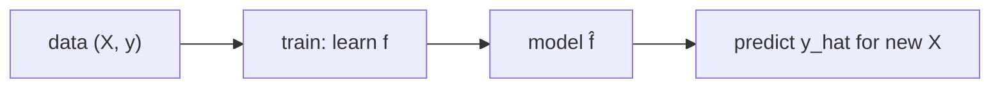

# Machine Learning이란 무엇인가?

> Machine Learning 101 시리즈 (1/10)


## 이 글에서 다룰 문제

추천, 의료, 금융, 자율주행 — *모든 산업* 이 ML로 *재편* 되는 중입니다. *기초 개념* 이 흔들리면 *어떤 모델을 써도 무너집니다*.

## 전체 흐름


## Before/After

**Before**: *“if-else로 모든 규칙 작성”* — 새 패턴마다 *코드 추가*.

**After**: *“데이터를 주면 모델이 규칙을 배움”* — *코드 대신 데이터* 로 확장.

## 5단계 첫 ML

### 1단계 — 데이터 준비

```python
from sklearn.datasets import load_iris
X, y = load_iris(return_X_y=True)
print(X.shape, y.shape)
```

### 2단계 — 모델 선택

```python
from sklearn.linear_model import LogisticRegression
model = LogisticRegression(max_iter=1000)
```

### 3단계 — 학습

```python
model.fit(X, y)
```

### 4단계 — 예측

```python
print(model.predict(X[:5]))
```

### 5단계 — 평가

```python
print("acc:", model.score(X, y))
```

## 이 코드에서 주목할 점

- *fit / predict / score* 는 *scikit-learn 의 표준 인터페이스*.
- *score* 는 단지 *훈련 정확도* — *일반화 측정* 이 아님.
- *모델 선택* 은 *문제 유형* 에 따른다.

## 자주 하는 실수 5가지

1. ***훈련 데이터 평가* 만 보고 *성공* 으로 판단.**
2. ***피처 스케일* 무시.**
3. ***레이블 누수* (target leakage).**
4. ***랜덤 시드* 미고정으로 *재현 불가*.**
5. ***결측치/이상치* 처리 없이 학습.**

## 실무에서는 이렇게 쓰입니다

추천, 사기 탐지, 수요 예측, 이미지 인식, NLP 챗봇 — *데이터 → 학습 → 추론* 파이프라인이 *모든 ML 제품* 의 척추.

## 체크리스트

- [ ] *X, y* 의 의미를 안다.
- [ ] *fit/predict/score* 를 호출한다.
- [ ] *훈련 정확도 ≠ 일반화* 를 안다.
- [ ] *베이스라인* 의 가치를 안다.

## 정리 및 다음 단계

머신러닝은 *데이터로 학습하는 함수* 입니다. 다음 글에서는 *지도학습과 비지도학습* 을 다룹니다.

<!-- toc:begin -->
- **Machine Learning이란 무엇인가? (현재 글)**
- 지도학습과 비지도학습 (예정)
- Train/Test Split (예정)
- Linear Regression (예정)
- Logistic Regression (예정)
- Decision Tree와 Random Forest (예정)
- Clustering (예정)
- Overfitting과 Regularization (예정)
- Model Evaluation (예정)
- ML 프로젝트 전체 흐름 (예정)
<!-- toc:end -->

## 참고 자료

- [scikit-learn — Getting Started](https://scikit-learn.org/stable/getting_started.html)
- [Andrew Ng — Machine Learning Specialization](https://www.coursera.org/specializations/machine-learning-introduction)
- [Hands-On Machine Learning — Aurélien Géron](https://www.oreilly.com/library/view/hands-on-machine-learning/9781098125967/)
- [Google — Machine Learning Crash Course](https://developers.google.com/machine-learning/crash-course)
