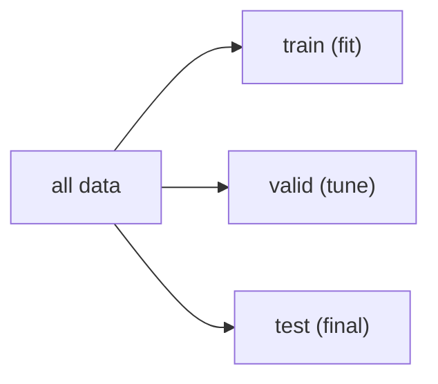

# Train/Test Split

> Machine Learning 101 시리즈 (3/10)


## 이 글에서 다룰 문제

*일반화 측정* 이 없으면 *모델 선택* 도, *비교* 도 불가능. *훈련 점수* 는 *팔지 못하는 점수*.

## 전체 흐름


## Before/After

**Before**: *전체 데이터에 fit → 같은 데이터로 score* — *과대평가*.

**After**: *train 으로 fit → test 로 score* — *현실적인 점수*.

## 5단계 분할 평가

### 1단계 — 데이터

```python
from sklearn.datasets import load_iris
X, y = load_iris(return_X_y=True)
```

### 2단계 — 분할

```python
from sklearn.model_selection import train_test_split
Xtr, Xte, ytr, yte = train_test_split(
    X, y, test_size=0.2, stratify=y, random_state=42
)
```

### 3단계 — 모델

```python
from sklearn.linear_model import LogisticRegression
model = LogisticRegression(max_iter=1000).fit(Xtr, ytr)
```

### 4단계 — 테스트 평가

```python
print("train:", model.score(Xtr, ytr))
print("test :", model.score(Xte, yte))
```

### 5단계 — K-fold

```python
from sklearn.model_selection import cross_val_score
print(cross_val_score(model, X, y, cv=5).mean())
```

## 이 코드에서 주목할 점

- *stratify=y* 가 *클래스 비율* 을 *유지*.
- *random_state* 고정 → *재현 가능*.
- *cross_val_score* 는 *훈련/평가* 를 *K번 반복*.

## 자주 하는 실수 5가지

1. ***test 데이터로 튜닝* (=test 누수).**
2. ***스케일러를 전체* 에 fit (=정보 누수).**
3. ***시드 미고정* 으로 *결과* 가 흔들림.**
4. ***불균형 데이터* 에 *stratify* 미사용.**
5. ***시계열* 을 *무작위 분할*.**

## 실무에서는 이렇게 쓰입니다

A/B 실험, 모델 비교, MLOps 평가 게이트 — *분할 전략* 이 *조직의 의사결정* 까지 좌우.

## 체크리스트

- [ ] *train/valid/test* 의 *역할* 을 안다.
- [ ] *stratify* 의 의미를 안다.
- [ ] *random_state* 를 *항상 고정*.
- [ ] *cross_val_score* 를 쓸 수 있다.

## 정리 및 다음 단계

*올바른 분할* 은 *모든 측정* 의 *전제* 입니다. 다음 글에서는 *Linear Regression* 으로 *지도학습* 의 *기본기* 를 다룹니다.

<!-- toc:begin -->
- [Machine Learning이란 무엇인가?](./01-what-is-machine-learning.md)
- [지도학습과 비지도학습](./02-supervised-and-unsupervised.md)
- **Train/Test Split (현재 글)**
- Linear Regression (예정)
- Logistic Regression (예정)
- Decision Tree와 Random Forest (예정)
- Clustering (예정)
- Overfitting과 Regularization (예정)
- Model Evaluation (예정)
- ML 프로젝트 전체 흐름 (예정)
<!-- toc:end -->

## 참고 자료

- [scikit-learn — train_test_split](https://scikit-learn.org/stable/modules/generated/sklearn.model_selection.train_test_split.html)
- [scikit-learn — Cross-validation](https://scikit-learn.org/stable/modules/cross_validation.html)
- [Forecasting: Principles and Practice — Hyndman](https://otexts.com/fpp3/)
- [Google — Data leakage](https://developers.google.com/machine-learning/guides/rules-of-ml)
