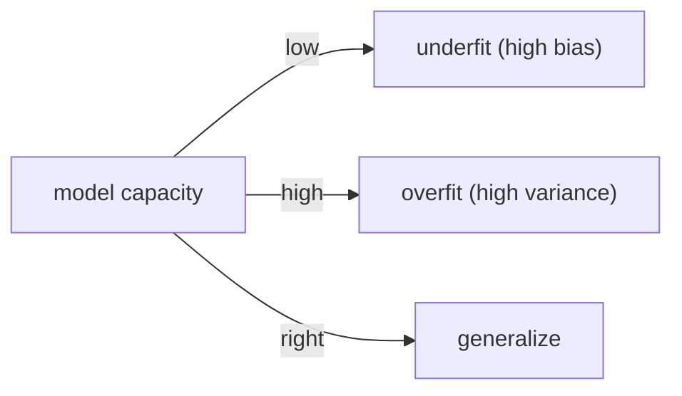

# Overfitting과 Regularization

> Machine Learning 101 시리즈 (8/10)


## 이 글에서 다룰 문제

*모든 모델 개선* 의 *반은 정규화*. *복잡한 모델* 일수록 *정규화* 가 *생명선*.

## 전체 흐름


## Before/After

**Before**: *“모델을 더 키우자”* — *과적합* 으로 *후퇴*.

**After**: *학습 곡선* 으로 *진단* → *정규화* 로 *회복*.

## 5단계 정규화 비교

### 1단계 — 데이터

```python
from sklearn.datasets import fetch_california_housing
from sklearn.model_selection import train_test_split
from sklearn.preprocessing import StandardScaler
X, y = fetch_california_housing(return_X_y=True)
Xtr, Xte, ytr, yte = train_test_split(X, y, test_size=0.2, random_state=42)
sc = StandardScaler().fit(Xtr); Xtr, Xte = sc.transform(Xtr), sc.transform(Xte)
```

### 2단계 — Linear

```python
from sklearn.linear_model import LinearRegression
lin = LinearRegression().fit(Xtr, ytr)
print("lin :", lin.score(Xte, yte))
```

### 3단계 — Ridge (L2)

```python
from sklearn.linear_model import Ridge
ridge = Ridge(alpha=1.0).fit(Xtr, ytr)
print("ridge:", ridge.score(Xte, yte))
```

### 4단계 — Lasso (L1)

```python
from sklearn.linear_model import Lasso
lasso = Lasso(alpha=0.01).fit(Xtr, ytr)
print("lasso:", lasso.score(Xte, yte), "nz:", (lasso.coef_ != 0).sum())
```

### 5단계 — alpha 스윕

```python
import numpy as np
for a in np.logspace(-3, 2, 6):
    s = Ridge(alpha=a).fit(Xtr, ytr).score(Xte, yte)
    print(f"alpha={a:.3g}  R^2={s:.3f}")
```

## 이 코드에서 주목할 점

- *Lasso* 는 *피처 선택* 효과 (계수 0).
- *Ridge* 는 *모든 계수* 를 *작게*.
- *alpha* 는 *교차검증* 으로 결정.

## 자주 하는 실수 5가지

1. ***스케일링* 없이 *L1/L2*.**
2. ***alpha* 를 *수동* 으로 *한 번* 만 시도.**
3. ***훈련 점수* 만 보고 *과적합* 판단.**
4. ***Lasso* 의 *불안정성* 무시 (상관 피처).**
5. ***ElasticNet* 을 모르고 *둘 중 하나* 만 사용.**

## 실무에서는 이렇게 쓰입니다

광고 CTR, 검색 랭킹, 유전체 — *고차원 데이터* 에서 *Lasso/ElasticNet* 으로 *피처 선택*.

## 체크리스트

- [ ] *훈련/테스트* 점수를 *동시* 에 본다.
- [ ] *학습 곡선* 을 그린다.
- [ ] *alpha* 를 *교차검증* 으로 정한다.
- [ ] *Lasso* 의 *피처 선택* 효과를 확인.

## 정리 및 다음 단계

정규화는 *모델 일반화* 의 *핵심 도구* 입니다. 다음 글에서는 *Model Evaluation* 으로 *제대로 측정* 하는 법을 다룹니다.

<!-- toc:begin -->
- [Machine Learning이란 무엇인가?](./01-what-is-machine-learning.md)
- [지도학습과 비지도학습](./02-supervised-and-unsupervised.md)
- [Train/Test Split](./03-train-test-split.md)
- [Linear Regression](./04-linear-regression.md)
- [Logistic Regression](./05-logistic-regression.md)
- [Decision Tree와 Random Forest](./06-decision-tree-and-random-forest.md)
- [Clustering](./07-clustering.md)
- **Overfitting과 Regularization (현재 글)**
- Model Evaluation (예정)
- ML 프로젝트 전체 흐름 (예정)
<!-- toc:end -->

## 참고 자료

- [scikit-learn — Linear models (Ridge, Lasso)](https://scikit-learn.org/stable/modules/linear_model.html)
- [scikit-learn — Validation curves](https://scikit-learn.org/stable/modules/learning_curve.html)
- [Bias-Variance — Stanford CS229 notes](https://cs229.stanford.edu/notes2022fall/)
- [StatQuest — Regularization](https://www.youtube.com/watch?v=Q81RR3yKn30)
