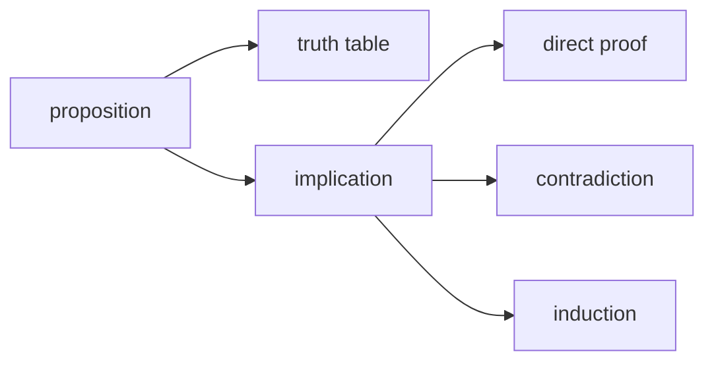

# 논리와 증명

> Math for CS 101 시리즈 (2/10)

<!-- a-grade-intro:begin -->

**핵심 질문**: *프로그램* 의 *정확성* 을 *어떻게* *증명* 할까요?

> *논리* 는 *명제* 와 *함의* 를, *증명* 은 *직접*, *귀류*, *귀납* 으로 합니다.

<!-- a-grade-intro:end -->

## 이 글에서 배울 것

- *명제* 와 *진리표*
- *함의* 와 *동치*
- *직접 증명*
- *귀류법*
- *수학적 귀납법*

## 왜 중요한가

*테스트* 는 *몇 가지* 만 본다. *증명* 은 *모든 경우* 를 봅니다.

## 개념 한눈에 보기



## 핵심 용어 정리

- **proposition**: *참/거짓* 명제.
- **implication**: `p → q`.
- **direct proof**: *전제* 에서 *결론* 으로.
- **contradiction**: *반대* 가정 후 *모순*.
- **induction**: *기저* + *귀납 단계*.

## Before/After

**Before**: *예제 3개* 로 *맞다고* 결론.

**After**: *수학적 귀납법* 으로 *모든 n* 증명.

## 실습: 작은 증명 키트

### 1단계 — 진리표

```python
def truth_imply():
    return [(p, q, (not p) or q) for p in (False, True) for q in (False, True)]
```

### 2단계 — 동치 확인

```python
def equiv(p, q):
    return p == q
```

### 3단계 — 직접 증명 스케치

```python
def even_sum(a, b):
    assert a % 2 == 0 and b % 2 == 0
    return (a + b) % 2 == 0
```

### 4단계 — 귀류법 스케치

```python
def assume_not(claim):
    return f"suppose not {claim}, derive contradiction"
```

### 5단계 — 귀납법

```python
def sum_to(n):
    return n * (n + 1) // 2
```

## 이 코드에서 주목할 점

- *함의* 는 `not p or q`.
- *짝수* 의 *합* 은 *짝수*.
- *합* 공식은 *닫힌 형식*.

## 자주 하는 실수 5가지

1. ***예제* 로 *증명* 대체.**
2. ***함의* 와 *역* 혼동.**
3. ***귀납* 의 *기저* 누락.**
4. ***반례 1개* 면 *반증*.**
5. ***기호* 만 따라가고 *의미* 무시.**

## 실무에서는 이렇게 쓰입니다

*컴파일러* 의 *타입 체커* 와 *분산 시스템* 의 *합의 알고리즘* 정확성은 *형식 증명* 으로 검증합니다.

## 시니어 엔지니어는 이렇게 생각합니다

- *증명* 은 *문서*.
- *반례* 는 *친구*.
- *귀납* 은 *루프* 의 사촌.
- *동치* 는 *리팩터링* 도구.
- *함의* 는 *가드*.

## 체크리스트

- [ ] *진리표* 작성.
- [ ] *함의* 의 *역/대우* 구분.
- [ ] *기저 단계* 확인.
- [ ] *반례* 탐색.

## 연습 문제

1. *implication* 의 의미 한 줄로.
2. *contradiction* 의 의미 한 줄로.
3. *induction* 의 의미 한 줄로.

## 정리 및 다음 단계

다음 글은 *집합과 함수* 입니다.

<!-- toc:begin -->
- [CS에 수학이 필요한 이유](./01-why-math-for-cs.md)
- **논리와 증명 (현재 글)**
- 집합과 함수 (예정)
- 그래프 (예정)
- 조합 (예정)
- 확률 (예정)
- 선형대수 (예정)
- 미분 (예정)
- 정보이론 (예정)
- 알고리즘과 수학 (예정)
<!-- toc:end -->

## 참고 자료

- [Discrete Mathematics and Its Applications - Rosen](https://en.wikipedia.org/wiki/Discrete_Mathematics_and_Its_Applications)
- [How to Prove It - Velleman](https://www.cambridge.org/core/books/how-to-prove-it/)
- [Mathematical Induction - Khan Academy](https://www.khanacademy.org/math/precalculus/x9e81a4f98389efdf:series/x9e81a4f98389efdf:induction/v/proof-by-induction)
- [Logic in Computer Science - Huth, Ryan](https://www.cambridge.org/core/books/logic-in-computer-science/)
