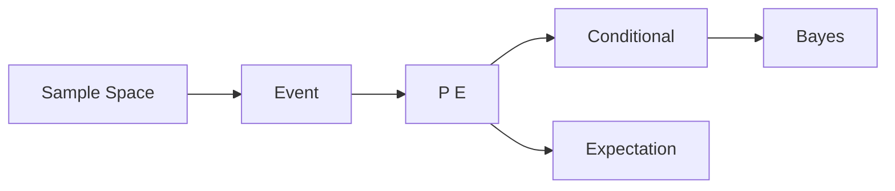

# 확률

> Math for CS 101 시리즈 (6/10)

<!-- a-grade-intro:begin -->

**핵심 질문**: *불확실성* 을 *어떻게* 수치로 다룰까요?

> *확률* 은 *불확실성* 의 *언어* 이고, *머신러닝* 과 *시스템 신뢰성* 의 *기초* 입니다.

<!-- a-grade-intro:end -->

## 이 글에서 배울 것

- *표본공간* 과 *사건*
- *조건부 확률*
- *베이즈 정리*
- *기댓값*
- *분산*

## 왜 중요한가

*A/B 테스트*, *추천*, *분류기*, *장애 확률* 모두 *확률* 으로 모델링합니다.

## 개념 한눈에 보기



## 핵심 용어 정리

- **sample space**: *가능한 결과* 의 집합.
- **event**: *결과의 부분집합*.
- **conditional**: *조건* 아래 확률.
- **Bayes**: *사후* 를 *사전* 으로 갱신.
- **expectation**: *평균* 결과.

## Before/After

**Before**: *직관* 으로 추정.

**After**: *수식* 으로 정량화.

## 실습: 미니 확률 키트

### 1단계 — 확률

```python
def prob(favorable, total):
    return favorable / total
```

### 2단계 — 조건부 확률

```python
def cond(p_a_and_b, p_b):
    return p_a_and_b / p_b
```

### 3단계 — 베이즈

```python
def bayes(p_b_given_a, p_a, p_b):
    return p_b_given_a * p_a / p_b
```

### 4단계 — 기댓값

```python
def expect(values, probs):
    return sum(v * p for v, p in zip(values, probs))
```

### 5단계 — 분산

```python
def variance(values, probs):
    mu = expect(values, probs)
    return sum(p * (v - mu) ** 2 for v, p in zip(values, probs))
```

## 이 코드에서 주목할 점

- *확률* 의 합은 *1*.
- *조건부* 는 *나눗셈*.
- *기댓값* 은 *가중 평균*.

## 자주 하는 실수 5가지

1. ***독립* 가정 남용.**
2. ***베이즈* 의 *사전* 을 0으로 두기.**
3. ***기댓값* 을 *최빈값* 으로 혼동.**
4. ***조건부* 의 *분모* 0 처리 누락.**
5. ***분산* 을 *표준편차* 로 혼동.**

## 실무에서는 이렇게 쓰입니다

*스팸 필터 (베이즈)*, *추천 점수*, *SLA 위반 확률*, *AB 테스트 신뢰구간* 까지 모두 확률 모델입니다.

## 시니어 엔지니어는 이렇게 생각합니다

- *모든 추정* 은 *분포*.
- *베이즈* 는 *업데이트* 절차.
- *기댓값* 은 *의사결정* 단위.
- *분산* 은 *리스크*.
- *독립성* 은 *가정* 일 뿐.

## 체크리스트

- [ ] *표본공간* 정의.
- [ ] *사건* 분리.
- [ ] *조건* 명시.
- [ ] *분포* 가정 검증.

## 연습 문제

1. *조건부 확률* 한 줄 정의.
2. *베이즈 정리* 한 줄 식.
3. *기댓값* 과 *분산* 의 차이.

## 정리 및 다음 단계

다음 글은 *선형대수* 입니다.

<!-- toc:begin -->
- [CS에 수학이 필요한 이유](./01-why-math-for-cs.md)
- [논리와 증명](./02-logic-and-proofs.md)
- [집합과 함수](./03-sets-and-functions.md)
- [그래프](./04-graphs.md)
- [조합](./05-combinatorics.md)
- **확률 (현재 글)**
- 선형대수 (예정)
- 미분 (예정)
- 정보이론 (예정)
- 알고리즘과 수학 (예정)
<!-- toc:end -->

## 참고 자료

- [Probability - Khan Academy](https://www.khanacademy.org/math/statistics-probability/probability-library)
- [Bayes Theorem - Stanford Encyclopedia](https://plato.stanford.edu/entries/bayes-theorem/)
- [Introduction to Probability - Blitzstein](https://projects.iq.harvard.edu/stat110)
- [Python statistics Module](https://docs.python.org/3/library/statistics.html)
