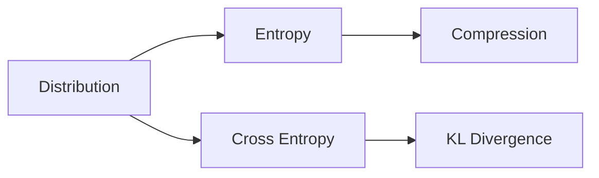

# 정보이론

> Math for CS 101 시리즈 (9/10)


## 이 글에서 다룰 문제

*분류기 손실 함수*, *zip 압축*, *통신 코드*, *언어 모델* 모두 *정보이론* 위에서 정의됩니다.

## 전체 흐름


## Before/After

**Before**: *모든 메시지* 동일 길이.

**After**: *자주 쓰는 것* 짧게, *드문 것* 길게.

## 미니 정보이론 키트

### 1단계 — 정보량

```python
import math

def info(p):
    return -math.log2(p)
```

### 2단계 — 엔트로피

```python
def entropy(probs):
    return sum(-p * math.log2(p) for p in probs if p > 0)
```

### 3단계 — 교차 엔트로피

```python
def cross_entropy(p, q):
    return sum(-pi * math.log2(qi) for pi, qi in zip(p, q) if qi > 0)
```

### 4단계 — KL 발산

```python
def kl(p, q):
    return cross_entropy(p, q) - entropy(p)
```

### 5단계 — 평균 부호 길이

```python
def avg_len(probs, lengths):
    return sum(p * L for p, L in zip(probs, lengths))
```

## 이 코드에서 주목할 점

- *log2* 단위는 *비트*.
- *KL* 은 *비대칭*.
- *교차 엔트로피* 는 *손실 함수*.

## 자주 하는 실수 5가지

1. ***log(0)* 처리 누락.**
2. ***KL* 을 *대칭* 으로 가정.**
3. ***엔트로피* 와 *교차 엔트로피* 혼동.**
4. ***확률 합* 이 *1* 아닌 입력.**
5. ***단위* (비트 vs 나트) 혼동.**

## 실무에서는 이렇게 쓰입니다

*분류기 손실*, *언어 모델 perplexity*, *zip/gzip*, *ML 정규화* 모두 *정보이론* 위에서 동작합니다.

## 체크리스트

- [ ] *확률 합* 검증.
- [ ] *log(0)* 보호.
- [ ] *단위* 명시.
- [ ] *KL* 의 *방향* 명시.

## 정리 및 다음 단계

다음 글은 *알고리즘과 수학* 종합 편입니다.

<!-- toc:begin -->
- [CS에 수학이 필요한 이유](./01-why-math-for-cs.md)
- [논리와 증명](./02-logic-and-proofs.md)
- [집합과 함수](./03-sets-and-functions.md)
- [그래프](./04-graphs.md)
- [조합](./05-combinatorics.md)
- [확률](./06-probability.md)
- [선형대수](./07-linear-algebra.md)
- [미분](./08-calculus.md)
- **정보이론 (현재 글)**
- 알고리즘과 수학 (예정)
<!-- toc:end -->

## 참고 자료

- [Information Theory - Stanford Encyclopedia](https://plato.stanford.edu/entries/information-theory/)
- [A Mathematical Theory of Communication - Shannon](https://people.math.harvard.edu/~ctm/home/text/others/shannon/entropy/entropy.pdf)
- [Elements of Information Theory - Cover and Thomas](https://www.wiley.com/en-us/Elements+of+Information+Theory%2C+2nd+Edition-p-9780471241959)
- [SciPy Stats Entropy Documentation](https://docs.scipy.org/doc/scipy/reference/generated/scipy.stats.entropy.html)
