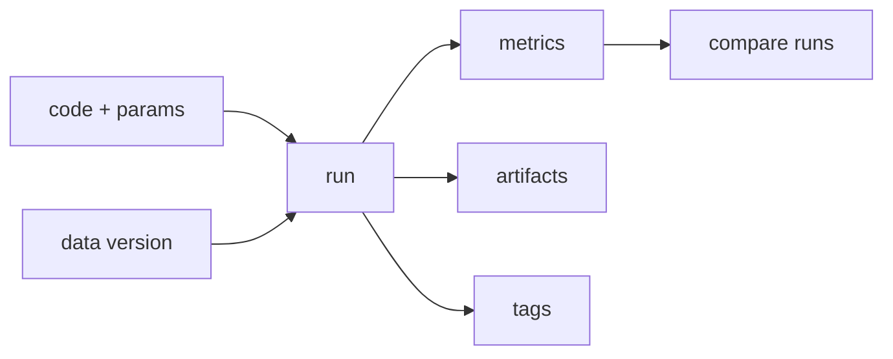

# 실험 관리

> MLOps 101 시리즈 (2/10)

<!-- a-grade-intro:begin -->

**핵심 질문**: *지난주 가장 좋았던 실험* 을 *오늘 다시 돌릴* 수 있나요?

> *실험 관리 는 *파라미터, 메트릭, 아티팩트, 환경* 을 *함께 기록* 해 *재현* 을 보장합니다.*

<!-- a-grade-intro:end -->

## 이 글에서 배울 것

- *실험 관리* 의 *4요소*
- *MLflow* 핵심 객체
- *Run* 과 *Experiment* 구조
- *비교/순위* 도구
- 흔한 함정 5가지

## 왜 중요한가

*노트북 폴더* 가 *진실의 출처* 가 되면 *팀 협업* 이 *깨집니다*. *실험 추적기* 는 *공유 메모리* 입니다.

## 개념 한눈에 보기



## 핵심 용어 정리

- **Experiment**: *목적별* 실험 *컨테이너*.
- **Run**: *한 번의 학습* 단위.
- **Param**: *고정된 입력* 값.
- **Metric**: *측정된 결과*.
- **Artifact**: *모델/플롯/로그* 같은 *파일*.

## Before/After

**Before**: *파일명 “v3_final2.pkl”* 의 *카오스*.

**After**: *runs 테이블* + *MLflow UI* 비교.

## 실습: 5단계 MLflow

### 1단계 — 설치 가정과 트래커 시작

```python
# pip install mlflow
import mlflow
mlflow.set_tracking_uri("file:./mlruns")
mlflow.set_experiment("demo")
```

### 2단계 — Run 기록

```python
from sklearn.datasets import make_classification
from sklearn.linear_model import LogisticRegression
X, y = make_classification(n_samples=500, random_state=0)

with mlflow.start_run():
    C = 1.0
    mlflow.log_param("C", C)
    m = LogisticRegression(C=C, max_iter=1000).fit(X, y)
    mlflow.log_metric("acc", m.score(X, y))
```

### 3단계 — 모델 아티팩트

```python
import pickle, os
os.makedirs("art", exist_ok=True)
with mlflow.start_run():
    m = LogisticRegression().fit(X, y)
    with open("art/model.pkl", "wb") as f:
        pickle.dump(m, f)
    mlflow.log_artifact("art/model.pkl")
```

### 4단계 — 여러 파라미터 스윕

```python
for C in [0.1, 1.0, 10.0]:
    with mlflow.start_run():
        mlflow.log_param("C", C)
        m = LogisticRegression(C=C, max_iter=1000).fit(X, y)
        mlflow.log_metric("acc", m.score(X, y))
```

### 5단계 — 비교 (코드)

```python
client = mlflow.tracking.MlflowClient()
exp = client.get_experiment_by_name("demo")
runs = client.search_runs(exp.experiment_id, order_by=["metrics.acc DESC"])
for r in runs[:3]:
    print(r.data.params, r.data.metrics)
```

## 이 코드에서 주목할 점

- *with* 블록이 *Run 경계*.
- *Param/Metric* 은 *키-값*.
- *Artifact* 는 *파일* 그대로 저장.

## 자주 하는 실수 5가지

1. ***성공한 Run* 만 기록.**
2. ***데이터 버전* 누락.**
3. ***Param/Metric* 키 이름 *불일치*.**
4. ***로컬 mlruns* 만 사용 → *공유 불가*.**
5. ***비교* 없이 *수동 결정*.**

## 실무에서는 이렇게 쓰입니다

*하이퍼파라미터 스윕* 과 *주간 리뷰* — *MLflow/W&B* 가 *공유 메모리* 역할.

## 시니어 엔지니어는 이렇게 생각합니다

- *모든 Run* 을 기록한다 (실패 포함).
- *데이터 버전* 도 *Param* 으로.
- *지표 키 이름* 을 *팀 표준* 으로.
- *원격 저장소* 를 *기본*.
- *Run 메타데이터* 가 *디버깅의 시작*.

## 체크리스트

- [ ] *모든 학습* 이 *Run* 으로 기록.
- [ ] *데이터/코드 버전* 포함.
- [ ] *공유 트래킹 서버* 사용.
- [ ] *비교 화면* 으로 *결정*.

## 연습 문제

1. *3 개 파라미터 조합* 을 스윕하고 *최고 Run* 을 출력하세요.
2. *데이터 해시* 를 *Param* 으로 추가하세요.
3. *Run 태그* 로 *목적* 을 표시하세요.

## 정리 및 다음 단계

실험 관리는 *팀의 단기 기억* 입니다. 다음 글은 *데이터 버전 관리* 로 *장기 기억* 을 다룹니다.

<!-- toc:begin -->
- [MLOps란 무엇인가?](./01-what-is-mlops.md)
- **실험 관리 (현재 글)**
- 데이터 버전 관리 (예정)
- 모델 학습 파이프라인 (예정)
- 모델 배포 (예정)
- 모델 모니터링 (예정)
- Data Drift와 Model Drift (예정)
- 재학습 (예정)
- Feature Store (예정)
- 운영 가능한 ML 시스템 (예정)
<!-- toc:end -->

## 참고 자료

- [MLflow — Tracking](https://mlflow.org/docs/latest/tracking.html)
- [Weights & Biases](https://docs.wandb.ai/)
- [Neptune.ai — Comparison](https://neptune.ai/blog/best-ml-experiment-tracking-tools)
- [Google — Reproducible ML](https://cloud.google.com/architecture/ml-on-gcp-best-practices)
