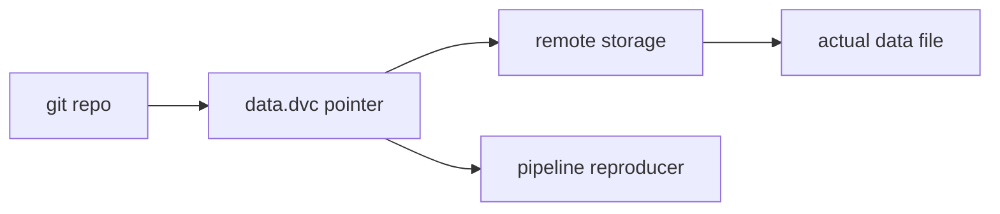

# 데이터 버전 관리

> MLOps 101 시리즈 (3/10)

<!-- a-grade-intro:begin -->

**핵심 질문**: *코드와 모델은 git* 으로 묶지만, *데이터* 는 *어디에* 두어야 할까요?

> *데이터 버전 관리 는 *대용량 파일* 을 *외부 저장소* 에 두고 *해시 포인터* 만 *git* 에 남기는 패턴입니다.*

<!-- a-grade-intro:end -->

## 이 글에서 배울 것

- *데이터 버전* 의 *왜* 와 *어떻게*
- *DVC* 와 *git-LFS* 의 *차이*
- *데이터 + 코드 + 모델* 동기화
- *재현* 을 위한 *해시* 사용
- 흔한 함정 5가지

## 왜 중요한가

*같은 코드* 라도 *다른 데이터* 면 *다른 모델* 이 나옵니다. *데이터 버전* 이 없으면 *재현 불가능*.

## 개념 한눈에 보기



## 핵심 용어 정리

- **DVC**: *Data Version Control*. *git* 위 *데이터/모델* 추적.
- **Pointer file**: *.dvc* 확장자. *해시 + 메타*.
- **Remote**: *S3/GCS/SSH/local* 저장소.
- **Stage**: *파이프라인 단계* (입력/출력/명령).
- **Repro**: *변경 단계만* 재실행.

## Before/After

**Before**: *data_v3_final.csv* 가 *팀원 PC 에만* 존재.

**After**: *git pull && dvc pull* 로 *어디서나* 동일한 데이터.

## 실습: 5단계 DVC 흐름

### 1단계 — 가짜 데이터 생성

```python
import pandas as pd
df = pd.DataFrame({"x": range(100), "y": [i % 2 for i in range(100)]})
df.to_csv("data.csv", index=False)
```

### 2단계 — DVC 초기화 (가정)

```bash
# pip install dvc
# git init && dvc init
# dvc add data.csv
# git add data.csv.dvc .gitignore
# git commit -m "track data v1"
```

### 3단계 — 해시 포인터 흉내

```python
import hashlib, json
h = hashlib.md5(open("data.csv", "rb").read()).hexdigest()
pointer = {"path": "data.csv", "md5": h}
with open("data.csv.ptr", "w") as f:
    json.dump(pointer, f, indent=2)
print(pointer)
```

### 4단계 — 파이프라인 단계

```python
from sklearn.linear_model import LogisticRegression
import pickle
df = pd.read_csv("data.csv")
m = LogisticRegression().fit(df[["x"]], df["y"])
with open("model.pkl", "wb") as f:
    pickle.dump(m, f)
```

### 5단계 — 입력 변경 → 재현

```python
df.loc[0, "y"] = 1 - df.loc[0, "y"]
df.to_csv("data.csv", index=False)
new_h = hashlib.md5(open("data.csv", "rb").read()).hexdigest()
print("changed:", new_h != h)
```

## 이 코드에서 주목할 점

- *해시 변경* 이 *재학습 트리거*.
- *Pointer 파일* 만 *git* 에 들어간다.
- *명령 + 입력 + 출력* 이 *파이프라인 단계*.

## 자주 하는 실수 5가지

1. ***대용량 데이터* 를 *git* 에 직접 commit.**
2. ***Remote* 미설정 → *동료 재현 불가*.**
3. ***데이터 변경* 을 *commit* 으로 기록 안 함.**
4. ***DVC stage* 의 *입출력* 누락.**
5. ***모델* 도 *DVC* 로 추적해야 함을 잊음.**

## 실무에서는 이렇게 쓰입니다

*비전 데이터셋* 이나 *대형 텍스트 코퍼스* — *git-LFS* 로는 한계, *DVC* 로 *S3 백엔드*.

## 시니어 엔지니어는 이렇게 생각합니다

- *git == 코드*, *DVC == 데이터 + 모델*.
- *Remote* 설정이 *기본*.
- *데이터/코드 버전* 을 *동시* 에 commit.
- *파이프라인* 으로 *해시 변경* 만 재실행.
- *작은 샘플* 은 *git* 에 직접도 OK.

## 체크리스트

- [ ] *데이터 파일* 이 *DVC/LFS* 로 추적된다.
- [ ] *Remote* 가 설정되어 있다.
- [ ] *모델* 도 추적된다.
- [ ] *재현 명령* 이 문서화된다.

## 연습 문제

1. *작은 CSV* 를 *DVC* 로 추적해 보세요.
2. *데이터를 변경* 하고 *해시 변화* 를 확인하세요.
3. *S3 remote* 를 *로컬 디렉토리* 로 흉내 내세요.

## 정리 및 다음 단계

데이터 버전이 *재현* 의 *전제* 입니다. 다음 글은 *학습 파이프라인* 으로 *자동화* 를 다룹니다.

<!-- toc:begin -->
- [MLOps란 무엇인가?](./01-what-is-mlops.md)
- [실험 관리](./02-experiment-tracking.md)
- **데이터 버전 관리 (현재 글)**
- 모델 학습 파이프라인 (예정)
- 모델 배포 (예정)
- 모델 모니터링 (예정)
- Data Drift와 Model Drift (예정)
- 재학습 (예정)
- Feature Store (예정)
- 운영 가능한 ML 시스템 (예정)
<!-- toc:end -->

## 참고 자료

- [DVC — Get Started](https://dvc.org/doc/start)
- [git-LFS](https://git-lfs.com/)
- [Pachyderm](https://www.pachyderm.com/)
- [Google — Data versioning](https://cloud.google.com/architecture/ml-on-gcp-best-practices)
