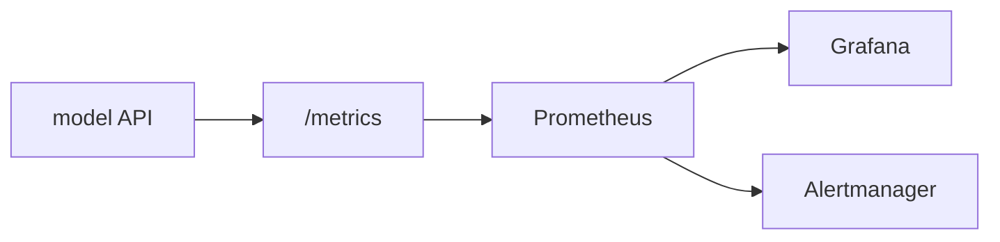

# 모델 모니터링

> MLOps 101 시리즈 (6/10)

<!-- a-grade-intro:begin -->

**핵심 질문**: *배포된 모델* 이 *조용히 망가지고 있는지* 를 *어떻게 감지* 할까요?

> *모델 모니터링 은 *운영 메트릭* 과 *예측 분포* 를 *지속 관찰* 해 *이상* 을 *조기* 에 알립니다.*

<!-- a-grade-intro:end -->

## 이 글에서 배울 것

- *3계층 모니터링* (시스템 / 모델 / 비즈니스)
- *Prometheus* 와 *Grafana* 의 역할
- *메트릭 vs 로그 vs 트레이스*
- *알림 규칙* 설계
- 흔한 함정 5가지

## 왜 중요한가

*정확도* 만 보면 *늦습니다*. *지연시간* / *에러율* / *입력 분포* 가 먼저 흔들립니다.

## 개념 한눈에 보기



## 핵심 용어 정리

- **Metric**: *수치 시계열*.
- **Log**: *이벤트 텍스트*.
- **Trace**: *요청 경로* 추적.
- **SLO**: *목표 수준*. 예) 99% < 200ms.
- **Alert**: *임계 초과 시* 알림.

## Before/After

**Before**: *사용자 신고* 로 *사고 인지*.

**After**: *알림* 이 *팀 채널* 로 자동.

## 실습: FastAPI에 Prometheus 메트릭 붙이기

### 1단계 — 의존성

```bash
pip install prometheus-client
```

### 2단계 — 카운터 + 히스토그램

```python
from prometheus_client import Counter, Histogram

REQS = Counter("predict_requests_total", "total predict requests")
LAT = Histogram("predict_latency_seconds", "predict latency")
```

### 3단계 — FastAPI 통합

```python
import time
from fastapi import FastAPI
from prometheus_client import make_asgi_app

app = FastAPI()
app.mount("/metrics", make_asgi_app())

@app.post("/predict")
def predict(x: float):
    start = time.time()
    REQS.inc()
    result = {"prediction": int(x > 0.5)}
    LAT.observe(time.time() - start)
    return result
```

### 4단계 — 예측 분포 메트릭

```python
PRED = Counter("predict_class_total", "predicted class", ["cls"])

def record(p: int):
    PRED.labels(cls=str(p)).inc()
```

### 5단계 — 알림 규칙 (Prometheus rule)

```yaml
groups:
  - name: model
    rules:
      - alert: HighLatency
        expr: histogram_quantile(0.99, rate(predict_latency_seconds_bucket[5m])) > 0.5
        for: 5m
        labels:
          severity: warning
```

## 이 코드에서 주목할 점

- *`/metrics` 엔드포인트* 는 *Prometheus* 가 *주기적* 으로 긁어감.
- *Histogram* 은 *분위수* 계산 가능.
- *Label* 로 *분류 분포* 추적.

## 자주 하는 실수 5가지

1. ***시스템 메트릭만* 보기 (CPU 만).**
2. ***예측 분포* 미수집 → *Drift 감지 불가*.**
3. ***알림이 너무 많음* → *알람 피로*.**
4. ***SLO* 정의 없음.**
5. ***대시보드* 없음.**

## 실무에서는 이렇게 쓰입니다

*결제 사기 모델* 은 *분당 1회* 메트릭 수집 + *임계 초과* 시 *온콜 호출*.

## 시니어 엔지니어는 이렇게 생각합니다

- *3계층* (시스템 / 모델 / 비즈니스) 모두 본다.
- *알림* 은 *행동 가능* 해야 한다.
- *대시보드* 는 *5초 안에 읽힌다*.
- *SLO* 는 *비즈니스 합의*.
- *런북* 이 *알림* 옆에 있다.

## 체크리스트

- [ ] `/metrics` 엔드포인트.
- [ ] *지연시간 + 에러율* 알림.
- [ ] *예측 분포* 카운터.
- [ ] *런북* 링크.

## 연습 문제

1. *에러율 > 1%* 알림 규칙을 작성하세요.
2. *입력 평균* 메트릭을 추가하는 코드를 쓰세요.
3. *Grafana 대시보드* 의 첫 화면 위젯 4개를 정의하세요.

## 정리 및 다음 단계

모니터링은 *Drift* 감지의 *전제* 입니다. 다음 글은 *Data Drift / Model Drift* 로 *예측 분포 변화* 를 다룹니다.

<!-- toc:begin -->
- [MLOps란 무엇인가?](./01-what-is-mlops.md)
- [실험 관리](./02-experiment-tracking.md)
- [데이터 버전 관리](./03-data-versioning.md)
- [모델 학습 파이프라인](./04-training-pipeline.md)
- [모델 배포](./05-model-deployment.md)
- **모델 모니터링 (현재 글)**
- Data Drift와 Model Drift (예정)
- 재학습 (예정)
- Feature Store (예정)
- 운영 가능한 ML 시스템 (예정)
<!-- toc:end -->

## 참고 자료

- [Prometheus 공식 문서](https://prometheus.io/docs/)
- [prometheus-client (Python)](https://github.com/prometheus/client_python)
- [Grafana 공식 문서](https://grafana.com/docs/)
- [Google SRE — SLO](https://sre.google/workbook/implementing-slos/)
