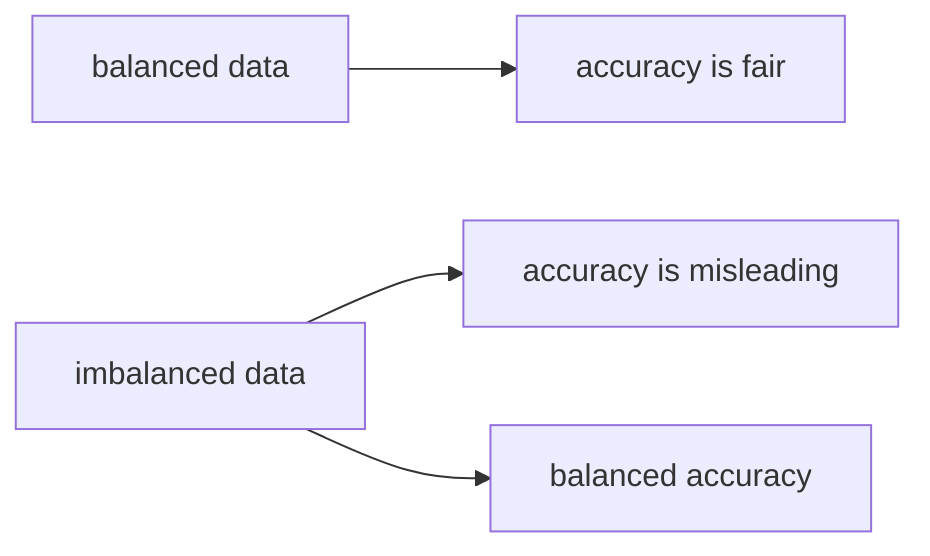

# Accuracy의 한계

> Model Evaluation 101 시리즈 (3/10)

<!-- a-grade-intro:begin -->

**핵심 질문**: *“정확도 95%”* 가 *항상 좋은 점수* 일까요?

> *Accuracy 는 *클래스 균형* 가정에서만 *공정* 한 지표입니다. *불균형* 에서는 *베이스라인* 과 *균형 정확도* 가 필요합니다.*

<!-- a-grade-intro:end -->

## 이 글에서 배울 것

- *Accuracy* 의 *수식과 의미*
- *베이스레이트* 와 *더미 분류기*
- *Balanced Accuracy* 의 직관
- *멀티클래스* 에서의 한계
- 흔한 함정 5가지

## 왜 중요한가

*비교 기준* 이 *Accuracy 한 줄* 이면 — *팀 전체* 가 *모르고 잘못된 결정* 을 합니다.

## 개념 한눈에 보기



## 핵심 용어 정리

- **Accuracy**: *(TP+TN)/N*.
- **Base rate**: *클래스 비율*.
- **Dummy classifier**: *상수/무작위* 예측기.
- **Balanced Accuracy**: *클래스별 재현율* 평균.
- **Top-k Accuracy**: *상위 k* 안에 정답.

## Before/After

**Before**: *“acc 95% 끝”*.

**After**: *baseline → balanced acc → 클래스별 분석*.

## 실습: 5단계 정확도 해부

### 1단계 — 불균형 데이터

```python
from sklearn.datasets import make_classification
X, y = make_classification(n_samples=1000, weights=[0.95, 0.05], random_state=0)
print("base rate:", y.mean())
```

### 2단계 — Dummy

```python
from sklearn.dummy import DummyClassifier
d = DummyClassifier(strategy="most_frequent").fit(X, y)
print("dummy acc:", d.score(X, y))
```

### 3단계 — 모델 학습

```python
from sklearn.model_selection import train_test_split
from sklearn.linear_model import LogisticRegression
Xtr, Xte, ytr, yte = train_test_split(X, y, test_size=0.2, stratify=y, random_state=42)
m = LogisticRegression(max_iter=1000).fit(Xtr, ytr)
print("acc:", m.score(Xte, yte))
```

### 4단계 — Balanced Accuracy

```python
from sklearn.metrics import balanced_accuracy_score
pred = m.predict(Xte)
print("bacc:", balanced_accuracy_score(yte, pred))
```

### 5단계 — 클래스별 점수

```python
from sklearn.metrics import classification_report
print(classification_report(yte, pred))
```

## 이 코드에서 주목할 점

- *Dummy 95%* 가 *베이스라인*.
- *Balanced Accuracy* 가 *진실* 에 더 가깝다.
- *클래스별* *recall* 이 *진짜 약점* 을 보여줌.

## 자주 하는 실수 5가지

1. ***Dummy* 비교 없이 *우월* 주장.**
2. ***Top-1 Accuracy* 만 *멀티클래스* 에 사용.**
3. ***Accuracy* 만 *불균형* 에 사용.**
4. ***리샘플링* 후 *Accuracy* 비교.**
5. ***리포트 표* 의 *작은 클래스* 무시.**

## 실무에서는 이렇게 쓰입니다

스팸/사기/희귀병 — *베이스레이트 < 5%* 인 곳에서 *Accuracy* 는 *언제나 함정*.

## 시니어 엔지니어는 이렇게 생각합니다

- *항상 Dummy 와 비교*.
- *불균형* → *Balanced Accuracy + PR-AUC*.
- *클래스별 분석* 이 *디버깅의 시작*.
- *Top-k* 가 *추천 시스템* 에 적합.
- *Accuracy* 는 *균형 데이터* 의 *마지막 보고용*.

## 체크리스트

- [ ] *Dummy* 와 비교한다.
- [ ] *Balanced Accuracy* 를 본다.
- [ ] *클래스별 recall* 을 본다.
- [ ] *Top-k* 가 적절한 문제에 사용.

## 연습 문제

1. *base rate 1%* 데이터에 *Dummy 와 모델* 정확도를 비교하세요.
2. *Balanced Accuracy* 가 *Accuracy 와 가장 다르게* 나오는 데이터를 만드세요.
3. *멀티클래스* 데이터에 *Top-3 Accuracy* 를 측정하세요.

## 정리 및 다음 단계

Accuracy 는 *전제* 가 깨지면 *무용지물* 입니다. 다음 글에서는 *Precision과 Recall* 로 *불균형 평가* 를 다룹니다.

<!-- toc:begin -->
- [모델 평가는 왜 어려운가?](./01-why-evaluation-is-hard.md)
- [train/validation/test](./02-train-val-test.md)
- **Accuracy의 한계 (현재 글)**
- Precision과 Recall (예정)
- F1 Score (예정)
- ROC와 AUC (예정)
- Calibration (예정)
- Cross Validation (예정)
- Error Analysis (예정)
- 평가 리포트 만들기 (예정)
<!-- toc:end -->

## 참고 자료

- [scikit-learn — Balanced accuracy](https://scikit-learn.org/stable/modules/generated/sklearn.metrics.balanced_accuracy_score.html)
- [scikit-learn — DummyClassifier](https://scikit-learn.org/stable/modules/generated/sklearn.dummy.DummyClassifier.html)
- [Wikipedia — Accuracy paradox](https://en.wikipedia.org/wiki/Accuracy_paradox)
- [Google — Classification metrics](https://developers.google.com/machine-learning/crash-course/classification/accuracy)
