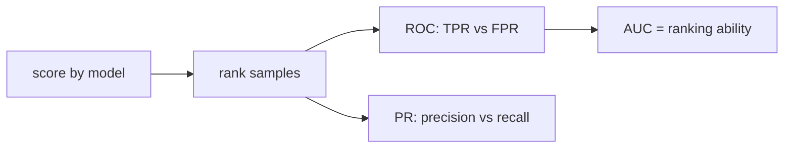

# ROC와 AUC

> Model Evaluation 101 시리즈 (6/10)

<!-- a-grade-intro:begin -->

**핵심 질문**: *임계값을 정하지 않고도* 모델의 *순위 능력* 을 평가할 수 있을까요?

> *ROC 는 *모든 임계값* 의 *TPR vs FPR* 곡선. AUC 는 *순위 능력* 의 *요약 점수* 입니다.*

<!-- a-grade-intro:end -->

## 이 글에서 배울 것

- *ROC 커브* 의 *축* 과 의미
- *AUC* 의 *확률적 해석*
- *PR 커브* 와 *언제 다르게 보이는가*
- *불균형* 에서의 *AUC 함정*
- 흔한 함정 5가지

## 왜 중요한가

*AUC* 는 *임계값 무관* 하므로 *모델 비교* 에 편리하지만, *비즈니스* 에서는 *특정 임계값* 의 성능이 더 중요합니다.

## 개념 한눈에 보기



## 핵심 용어 정리

- **TPR**: *Recall* 과 동일.
- **FPR**: *FP/(FP+TN)*.
- **ROC**: *임계값 변화* 에 따른 *TPR vs FPR*.
- **AUC-ROC**: *무작위 양성* 이 *무작위 음성* 보다 *높은 점수* 를 받을 확률.
- **AUC-PR**: *PR 커브 면적*. 불균형에 더 민감.

## Before/After

**Before**: *AUC 0.9 → 좋은 모델*.

**After**: *AUC 0.9 + 운영 임계값에서의 P/R + 불균형이면 PR-AUC*.

## 실습: 5단계 ROC/AUC

### 1단계 — 데이터와 모델

```python
from sklearn.datasets import make_classification
from sklearn.model_selection import train_test_split
from sklearn.linear_model import LogisticRegression
X, y = make_classification(n_samples=2000, weights=[0.9, 0.1], random_state=0)
Xtr, Xte, ytr, yte = train_test_split(X, y, stratify=y, random_state=42)
m = LogisticRegression(max_iter=1000).fit(Xtr, ytr)
proba = m.predict_proba(Xte)[:, 1]
```

### 2단계 — ROC 커브

```python
from sklearn.metrics import roc_curve
fpr, tpr, thr = roc_curve(yte, proba)
print("first 3 thresholds:", thr[:3])
```

### 3단계 — AUC

```python
from sklearn.metrics import roc_auc_score
print("AUC-ROC:", roc_auc_score(yte, proba))
```

### 4단계 — PR-AUC와 비교

```python
from sklearn.metrics import average_precision_score
print("AUC-PR:", average_precision_score(yte, proba))
```

### 5단계 — 운영 임계값 선택

```python
import numpy as np
target_fpr = 0.05
idx = np.searchsorted(fpr, target_fpr)
print("threshold for FPR<=0.05:", thr[idx], "TPR:", tpr[idx])
```

## 이 코드에서 주목할 점

- *AUC* 는 *순위 품질* — *분포* 에 *덜 민감*.
- *PR-AUC* 는 *불균형* 에 *민감* 해서 *현실적*.
- *운영 임계값* 은 *FPR 또는 Recall 제약* 으로 정한다.

## 자주 하는 실수 5가지

1. ***AUC* 만 보고 *불균형* 에 대해 *낙관*.**
2. ***ROC* 와 *PR* 를 *섞어* 비교.**
3. ***임계값* 없이 *배포* 결정.**
4. ***확률 보정* 없이 *임계값* 만 조정.**
5. ***AUC 0.5* 를 *항상 무작위* 로 단정.**

## 실무에서는 이렇게 쓰입니다

*위험 점수 모델* — *AUC* 로 *모델 선정*. *알람 시스템* — *고정 FPR* 에서 *TPR* 을 본다.

## 시니어 엔지니어는 이렇게 생각합니다

- *AUC* 는 *비교* 를 위한 *요약*.
- *불균형* 이면 *PR-AUC* 를 추가.
- *FPR 제약* 또는 *Recall 제약* 에서 *임계값* 을 고정.
- *시간에 따라* AUC 가 *드리프트* 하는지 본다.
- *클래스별 AUC* 도 본다.

## 체크리스트

- [ ] *AUC-ROC* 를 보고
- [ ] *AUC-PR* 도 본다.
- [ ] *운영 임계값* 을 명시한다.
- [ ] *드리프트* 를 모니터링한다.

## 연습 문제

1. *FPR <= 0.01* 에서 *TPR* 을 구하세요.
2. *불균형 데이터* 에 *AUC-ROC* 와 *AUC-PR* 차이를 보이세요.
3. *동일 AUC* 의 *두 모델* 이 *다른 임계값* 에서 *다른 결정* 을 내는 예시를 만드세요.

## 정리 및 다음 단계

ROC 와 AUC 는 *순위* 의 언어입니다. 다음 글은 *Calibration* 으로 *확률 자체* 의 신뢰성을 다룹니다.

<!-- toc:begin -->
- [모델 평가는 왜 어려운가?](./01-why-evaluation-is-hard.md)
- [train/validation/test](./02-train-val-test.md)
- [Accuracy의 한계](./03-limits-of-accuracy.md)
- [Precision과 Recall](./04-precision-and-recall.md)
- [F1 Score](./05-f1-score.md)
- **ROC와 AUC (현재 글)**
- Calibration (예정)
- Cross Validation (예정)
- Error Analysis (예정)
- 평가 리포트 만들기 (예정)
<!-- toc:end -->

## 참고 자료

- [scikit-learn — roc_curve](https://scikit-learn.org/stable/modules/generated/sklearn.metrics.roc_curve.html)
- [scikit-learn — roc_auc_score](https://scikit-learn.org/stable/modules/generated/sklearn.metrics.roc_auc_score.html)
- [Wikipedia — ROC curve](https://en.wikipedia.org/wiki/Receiver_operating_characteristic)
- [Google — ROC and AUC](https://developers.google.com/machine-learning/crash-course/classification/roc-and-auc)
